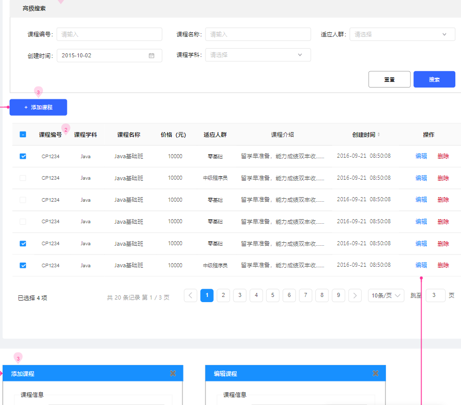
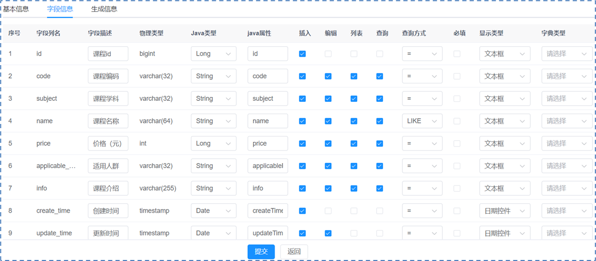
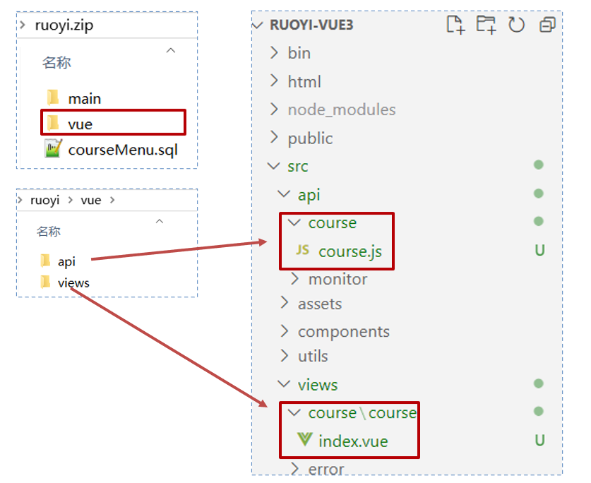
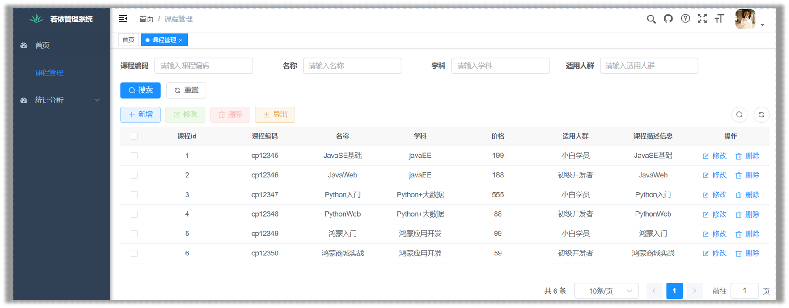
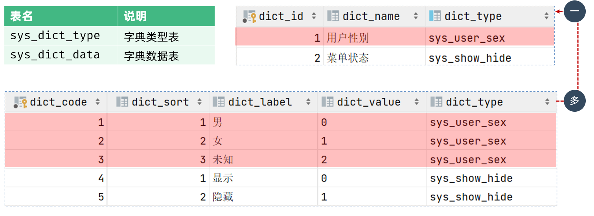
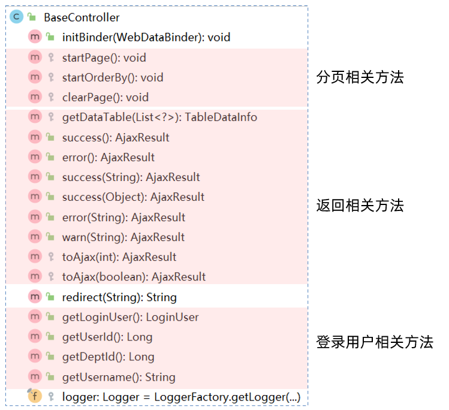
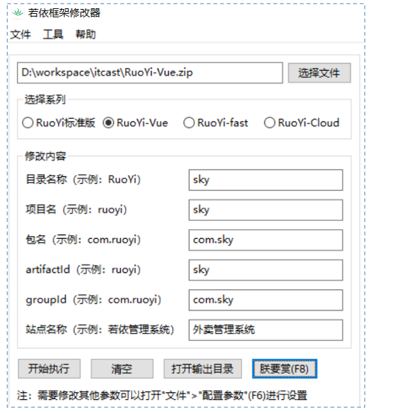

# 若依搭建

## 若依版本

### 官方

若依官方针对不同开发需求提供了多个版本的框架，每个版本都有其独特的特点和适用场景：

- **前后端混合版本**：RuoYi结合了SpringBoot和Bootstrap的前端开发框架，适合快速构建传统的Web应用程序，其中前端和后端代码在同一项目中协同工作。
- **前后端分离版本**：RuoYi-Vue利用SpringBoot作为后端开发框架，与Vue.js结合，实现了前后端分离的开发模式。这种架构有助于提高开发效率，前后端可以独立开发和部署，更适合现代化的Web应用开发。
- **微服务版本**：RuoYi-Cloud基于Spring Cloud & Alibaba微服务架构，为构建大型分布式系统提供了完整的解决方案。它支持服务发现、配置管理、负载均衡等微服务特性，适合需要高可扩展性和高可用性的企业级应用。
- **移动端版本**：RuoYi-App采用Uniapp进行开发，结合了Vue.js的优势，可以实现跨平台的移动端应用开发。一次编写，多端运行的能力使得它成为开发iOS和Android应用的理想选择。

 

这些版本的框架为开发者提供了多样化的选择，无论是传统的Web应用、现代化的前后端分离应用，还是复杂的微服务架构和跨平台的移动端应用，都能找到合适的若依框架版本来满足开发需求。

### 非官方

若依框架因其强大的功能和灵活性，吸引了众多第三方开发者基于其核心架构进行扩展和优化，从而形成了丰富的生态系统。

这些扩展不仅增强了若依框架的功能性，也满足了开发者在不同场景下的具体需求。例如：

- RuoYi-Vue3（前端升级Vue3 Element Plus Vite）
  - https://github.com/yangzongzhuan/RuoYi-Vue3
- RuoYi-Vue-Plus（后端集成Mybatis-Plus、Hutool、OSS存储、分布式锁等组件）
  - https://gitee.com/dromara/RuoYi-Vue-Plus

 

这些扩展版本的推出，使得若依框架能够更好地适应不同规模和类型的项目需求，从小型快速开发到大型企业级应用，都能提供相应的解决方案。开发者可以根据自己的具体需求选择合适的版本进行开发。

## RuoYi-Vue

lRuoYi-Vue版本，采用了前后端分离的单体架构设计：

软件环境：JDK、MySQL 、Redis 、Maven、Node

技术选型：Spring Boot、Spring Security、MyBatis、Jwt、Vue3、Element-Plus

官方地址：https://gitee.com/y_project/RuoYi-Vue

扩展地址：https://gitee.com/ys-gitee/RuoYi-Vue3

| **官方推荐**    | **课程版本**     |
| --------------- | ---------------- |
| JDK  >= 1.8     | JDK  11          |
| Mysql  >= 5.7.0 | MySQL  8         |
| Redis  >= 3.0   | Redis  5（Win）  |
| Maven  >= 3.0   | Maven  3.6       |
| Node  >= 12     | Node  16（Vue3） |

> 为了确保教学活动的顺利进行，建议所有学生在开始前安装并配置好这些软件的版本。
>
> 如果学生在安装或配置过程中遇到问题，可以联系播妞获取帮助，播妞将提供详细的安装文档和安装包，

## 运行后端项目

### 初始化项目

#### Git下载

通过idea克隆若依源码，仓库地址：https://gitee.com/y_project/RuoYi-Vue.git

   


#### Maven构建

使用idea打开项目后，等待环境检查（主要是Maven下载项目依赖）

 


### MySQL相关

#### 导入sql

1、创建数据库`create schema ry-vue;`

2、执行下图的sql脚本文件，完成导入

 

3、导入后`ry-vue`库内置30张表

 

#### 配置信息

在`ruoyi-admin`模块下，编辑`resources`目录下的`application-druid.yml`，修改数据库连接

```yaml
# 数据源配置
spring:
    datasource:
        type: com.alibaba.druid.pool.DruidDataSource
        driverClassName: com.mysql.cj.jdbc.Driver
        druid:
            # 主库数据源
            master:
                url: 数据库地址
                username: 数据库账号
                password: 数据库密码
```

 


### Redis相关

#### 启动

在redis解压目录下，执行`redis-server.exe redis.windows.conf`启动

 

#### 配置信息

在`ruoyi-admin`模块下，`resources`目录下的`application.yml`，可以设置redis密码等相关信息

 

### 项目运行

在`ruoyi-admin`模块下，运行`com.ruoyi.RuoYiApplication.java`，出现如下图表示启动成功

 


后端运行成功可以通过([http://localhost:8080 )访问，但是不会出现静态页面，可以继续参考下面步骤部署前端，然后通过前端地址来访问。

 


## 运行前端项目

### 初始化项目

进入开发目录下，使用vscode命令`code `打开项目

  ```shell
  # 克隆vue3项目
  git clone https://gitee.com/ys-gitee/RuoYi-Vue3.git
  
  # 通过vscode打开项目
  code ./RuoYi-Vue3
  ```


### 项目运行

在vscode终端中输入以下命令：

```shell
# 安装依赖
npm install

# 建议不要直接使用 cnpm 安装依赖，会有各种诡异的 bug。可以通过如下操作解决 npm 下载速度慢的问题
npm install --registry=https://registry.npmmirror.com

# 启动服务
npm run dev
```

 

打开浏览器，输入：([http://localhost:80) 默认账户/密码 `admin/admin123`）若能正确展示登录页面，并能成功登录，菜单及页面展示正常，则表明环境搭建成功

 

# 入门案例

在若依项目成功搭建之后，深入了解其代码生成器功能是掌握框架的重要一环。

接下来，我们将利用若依框架的代码生成器实现CRM系统中的**课程管理**功能，这将使我们能够实际体验并掌握如何在项目中有效使用这一工具。

## 功能需求

> 实现CRM系统中的课程管理功能，涵盖增加、删除、修改和查询课程信息的完整前后端代码。
>
> 原型地址：https://app.mockplus.cn/run/prototype/_lwaPYSV9Ue6/byFT7QUzmCqJ/2AadzZnerRIDo?cps=collapse&isShare=true

 


## 步骤分析

1、准备课程表结构和数据sql文件，导入到数据库中

2、登录系统（系统工具 -> 代码生成 -> 导入课程表）

3、代码生成列表中找到课程表（可预览、编辑、同步、删除生成配置）

4、点击生成代码会得到一个`ruoyi.zip`

5、执行sql文件导入菜单，按照包内目录结构复制到自己的项目中即可


## 代码生成

### 提供课程表

准备课程表结构和数据sql文件，导入到数据库中

 

### 系统导入

登录系统（系统工具 -> 代码生成 -> 导入课程表）

 

### 配置代码

代码生成列表中找到课程表（可预览、编辑、同步、删除生成配置）

    


### 点击生成

点击生成代码，得到一个`ruoyi.zip`

   

解压后得到：后端代码、前端代码、菜单sql

  

## 代码导入

### 导入课程菜单

执行sql脚本，导入菜单数据

 

### 导入后端代码

将生成的后端代码和mappep文件，导入`ruoyi-admin`模块中 

 

> 注意：如果导入后的代码重启后没生效，可以通过maven先clean再启动

### 导入前端代码

将生成的前端代码，导入`ruoyi-ui`模块中

   

## 访问测试

代码生成器默认生成的**课程管理**模块在**系统工具**菜单下，打开测试CRUD功能

   


# 功能详解

我们将对若依的通用功能进行详解。本章内容分为三个重点部分：

## 系统管理

### 权限系统

#### 演示

若依提供了企业级通用权限系统，我们这里拿CRM系统先给大家演示下：

地址：https://huike-crm.itheima.net/

- demo账号（超级管理员），可以查看所有功能菜单

- zhangsan账号（市场专员），可以查看线索管理菜单

- yueyue账号（销售专员），可以查看商机、合同等菜单

 

#### RBAC

lRBAC（基于角色的访问控制）是一种广泛使用的访问控制模型，通过角色来分配和管理用户的菜单权限。

 

#### 表关系

 

 

#### 案例

创建新用户小智并关联课研人员角色，仅限课程管理和统计分析菜单访问。

 

实现步骤：

①创建菜单

②创建角色，并分配权限

③创建用户，并关联角色

 

### 数据字典

#### 介绍

若依内置的数据字典，用于维护系统中常见的静态数据。例如：性别、状态…

 

功能包括：字典类型管理、字典数据管理

  


#### 表关系

 

#### 案例

将课程管理的学科字段改为数据字典维护。

 

实现步骤：

①添加字典类型和数据

 

②修改代码生成信息

 

③下载代码，导入前端

 

### 参数设置

参数设置：对系统中的参数进行动态维护。

 

关闭登录验证码


### 通知公告

RuoYi的通知公告功能提供了一个方便的方式来发布和管理通知、公告和新闻等信息。管理员可以创建、编辑和删除通知（支持富文本编辑和附件上传）。

系统将信息发送给指定的用户、部门或角色。用户可以通过系统界面或电子邮件接收通知，从而确保信息及时传达（这部分需要自己开发）。

通知公告功能有助于组织内部沟通和信息传递，提高了工作效率和信息共享。

 

### 日志管理

登录日志

- 记录用户的登录信息，包括登录时间和地点（IP地址）。
- 帮助管理员监控登录行为，及时发现任何可疑的登录尝试。
- 同样提供搜索和筛选功能，方便查找特定用户的登录历史。

 

操作日志

- 记录用户在系统中的所有操作，如查看、修改数据等。
- 帮助管理员检查谁做了什么，以及何时做的，确保数据准确无误。
- 可以快速搜索和找到特定的操作记录，便于管理和审查。

 

## 系统监控

### 监控相关

若依提供了一些列强大的监控工具，能够帮助开发者和运维快速了解应用程序的性能状态。

 

1. **在线用户**：
   - 管理员可以看到当前谁在系统里，他们什么时候登录的，从哪里登录的，属于哪个部门。
   - 如果有人没权限还赖着不走，管理员可以一键让他们下线，保证系统的安全。
2. **数据监控**：
   - 管理员可以实时看到系统的各项指标，比如资源使用情况，数据库状态等。
   - 通过图表可以直观地看出系统是否健康，如果出现问题，系统会发出警报。
3. **服务监控**：
   - 管理员可以监控系统中各个服务是否正常运行，以及它们的性能指标。
   - 如果服务出现问题，系统会立即通知管理员，并通过仪表板展示，方便管理员快速了解情况。
4. **缓存监控**：
   - 管理员可以监控系统的缓存使用情况，比如缓存是否经常被用到，缓存的大小等。
   - 系统还可以自动清理缓存，保持数据的新鲜度，如果缓存有问题，也会发出警报。

### 定时任务

#### 介绍

若依为定时任务功能提供方便友好的web界面，实现动态管理任务。

 

#### 案例

每间隔5秒，控制台输出系统时间。

 

实现步骤：

①创建任务类
 

②添加任务规则

 

- 任务名称：自定义，如：定时查询任务状态
- 任务分组：根据字典`sys_job_group`配置，可自行进行配置
- 调用目标字符串：设置后台任务方法名称参数
- 执行表达式：可查询官方`cron`表达式介绍
- 执行策略：定时任务自定义执行策略
- 并发执行：是否需要多个任务间同时执行

③启动任务

  

## 系统工具

### 表单构建

#### 介绍

- 允许用户通过拖放等可视化操作创建表单，比如用来收集数据的表格或调查问卷。
- 可以自定义表单的各个部分，比如添加不同的输入项和设置验证规则，无需编写代码。
- 提供了导出数据、导入数据、分享表单和设置权限的功能，方便数据管理和共享。

 


#### 案例

通过表单构建工具，单独制作一个添加课程的表单页面。

 

实现步骤：

①制作表单并导出


②复制到前端工程
 

③创建动态菜单

 

### 代码生成

- 自动化工具，可以快速生成项目中常用的代码，如数据库操作类、后端控制器、前端页面等。
- 支持根据数据库的表结构反向生成代码，减少手动编写的工作量。
- 提供三种生成模板：单表、 <span style='color:red'>树表</span>、主子表（一对多），可以生成适用于Spring Boot、MyBatis等流行框架的代码，提高开发效率和代码质量。
- 树表是一种展示层级数据的表格，能展开折叠，清晰呈现父子关系，便于管理。

 

代码生成配置主表实现细节：

 


### 系统接口

- Swagger，能够自动生成 API 的同步在线文档，并提供Web界面进行接口调用和测试。

 


# 项目结构

在功能的讲解过程中，涉及的前后端项目的结构和配置文件，我们还比较陌生，为了更好的使用若依进行项目开发，所以接下来，我们开始进入项目结构这部分内容的学习

## 后端结构

```java
com.ruoyi
├── ruoyi-admin      // 后台服务模块
│       └── web                           // 内置功能的表现层
│       └── RuoYiApplication              // 若依项目启动类    
├── ruoyi-common     // 通用工具模块
│       └── annotation                    // 自定义注解
│       └── config                        // 全局配置
│       └── constant                      // 通用常量
│       └── core                          // 核心控制
│       └── enums                         // 通用枚举
│       └── exception                     // 通用异常
│       └── filter                        // 过滤器处理
│       └── utils                         // 通用类处理
│       └── xss                           // 自定义xss校验
├── ruoyi-framework  // 框架核心模块
│       └── aspectj                       // AOP配置
│       └── config                        // 系统配置
│       └── datasource                    // 多数据源配置 
│       └── interceptor                   // 拦截器
│       └── manager                       // 异步处理
│       └── security                      // 权限控制
│       └── web                           // 前端控制
├── ruoyi-generator  // 代码生成模块（可移除）              
├── ruoyi-quartz     // 定时任务模块（可移除）          
├── ruoyi-system     // 系统代码模块
│       └── domain                        // 系统代码的实体类
│       └── mapper                        // 系统代码的持久层
│       └── service                       // 系统代码的业务层
```

 

## 项目中配置

项目中的配置文件都在ruoyi-admin模块下，如下图：

  

- i18n：国际化处理
- META-INF：存储了项目的元信息（*描述数据的数据*），无需修改
- mybatis：mybatis相关的配置信息
- application.yml：项目中的核心配置
- application-druid.yml：数据库连接配置
- banner.txt：默认的banner图标信息，项目启动，控制台打印显示
- logback.xml：日志配置

最主要的两个配置文件：application.yml

```yaml
# 项目相关配置
ruoyi:
  # 名称
  name: RuoYi
  # 版本
  version: 3.8.7
  # 版权年份
  copyrightYear: 2024
  # 文件路径 示例（ Windows配置D:/ruoyi/uploadPath，Linux配置 /home/ruoyi/uploadPath）
  profile: D:/ruoyi/uploadPath
  # 获取ip地址开关
  addressEnabled: false
  # 验证码类型 math 数字计算 char 字符验证
  captchaType: math

# 开发环境配置
server:
  # 服务器的HTTP端口，默认为8080
  port: 8080
  servlet:
    # 应用的访问路径
    context-path: /
  tomcat:
    # tomcat的URI编码
    uri-encoding: UTF-8
    # 连接数满后的排队数，默认为100
    accept-count: 1000
    threads:
      # tomcat最大线程数，默认为200
      max: 800
      # Tomcat启动初始化的线程数，默认值10
      min-spare: 100

# 日志配置
logging:
  level:
    com.ruoyi: debug
    org.springframework: warn

# 用户配置
user:
  password:
    # 密码最大错误次数
    maxRetryCount: 5
    # 密码锁定时间（默认10分钟）
    lockTime: 10

# Spring配置
spring:
  # 资源信息
  messages:
    # 国际化资源文件路径
    basename: i18n/messages
  profiles:
    active: druid
  # 文件上传
  servlet:
    multipart:
      # 单个文件大小
      max-file-size: 10MB
      # 设置总上传的文件大小
      max-request-size: 20MB
  # 服务模块
  devtools:
    restart:
      # 热部署开关
      enabled: true
  # redis 配置
  redis:
    # 地址
    host: localhost
    # 端口，默认为6379
    port: 6379
    # 数据库索引
    database: 0
    # 密码
    password: 123456
    # 连接超时时间
    timeout: 10s
    lettuce:
      pool:
        # 连接池中的最小空闲连接
        min-idle: 0
        # 连接池中的最大空闲连接
        max-idle: 8
        # 连接池的最大数据库连接数
        max-active: 8
        # #连接池最大阻塞等待时间（使用负值表示没有限制）
        max-wait: -1ms

# token配置
token:
  # 令牌自定义标识
  header: Authorization
  # 令牌密钥
  secret: abcdefghijklmnopqrstuvwxyz
  # 令牌有效期（默认30分钟）
  expireTime: 30

# MyBatis配置
mybatis:
  # 搜索指定包别名
  typeAliasesPackage: com.ruoyi.**.domain
  # 配置mapper的扫描，找到所有的mapper.xml映射文件
  mapperLocations: classpath*:mapper/**/*Mapper.xml
  # 加载全局的配置文件
  configLocation: classpath:mybatis/mybatis-config.xml

# PageHelper分页插件
pagehelper:
  helperDialect: mysql
  supportMethodsArguments: true
  params: count=countSql

# Swagger配置
swagger:
  # 是否开启swagger
  enabled: true
  # 请求前缀
  pathMapping: /dev-api

# 防止XSS攻击
xss:
  # 过滤开关
  enabled: true
  # 排除链接（多个用逗号分隔）
  excludes: /system/notice
  # 匹配链接
  urlPatterns: /system/*,/monitor/*,/tool/*
```


## 模块依赖关系

各个模块之间的依赖关系：

  


## 前端结构

```js
ruoyi-vue3
├── bin                        // 执行脚本
├── html                       // IE低版本提示页
├── node_modules               // 第三方依赖库
├── public                     // 公共资源
│   ├── favicon.ico            // favicon图标
├── src                        // 源代码
│   ├── api                    // 所有请求
│   ├── assets                 // 静态资源
│   ├── components             // 全局公用组件
│   ├── directive              // 全局指令
│   ├── layout                 // 布局
│   ├── plugins                // 通用插件
│   ├── router                 // 路由配置
│   ├── store                  // 状态管理
│   ├── utils                  // 全局公用方法
│   ├── views                  // 视图组件
│   ├── App.vue                // 入口组件
│   ├── main.js                // 入口文件
│   ├── permission.js          // 权限管理
│   └── settings.js            // 系统配置
├── vite                       // 构建工具
├── .env.development           // 开发环境配置
├── .env.production            // 生产环境配置
├── .env.staging               // 测试环境配置
├── .gitignore                 // git 忽略项
├── index.html                 // 入口页面
├── package.json               // 项目配置文件（相当于pom.xml）
└── vue.config.js              // Vue项目的配置信息（相当于application.yml）
```

 

## 表结构介绍

`ruoyi-vue`数据库设计包含了多个表结构，用于支持系统的各种功能模块。

这些表可以根据它们的功能和用途进行分类，以便在后期使用时能够快速定位和理解。以下是对这些表结构的分类和简要说明：

 

 


# 源码阅读

本章我们将围绕入门案例生成的课程管理进行讲解，包含前后端代码的分析，以及前后端代码交互的流程，通过这部分的学习，不仅能让我们掌握若依的基础业务逻辑，在此基础上还能为我们日后的定制开发提供强有力的支撑。

## 前端代码分析

找到src/views/course/course/index.vue文件，护理项目的前端代码已经添加了详细的注释，如下：

```vue
<template>
  <div class="app-container">

    <!-- 搜索表单 start -->
    <el-form :model="queryParams" ref="queryRef" :inline="true" v-show="showSearch" label-width="68px">   
      <el-form-item label="课程编码" prop="code">
        <el-input
          v-model="queryParams.code"
          placeholder="请输入课程编码"
          clearable
          @keyup.enter="handleQuery"
        />
      </el-form-item>
      <el-form-item label="课程学科" prop="subject">
        <el-select v-model="queryParams.subject" placeholder="请选择课程学科" clearable>
          <el-option
            v-for="dict in course_subject"
            :key="dict.value"
            :label="dict.label"
            :value="dict.value"
          />
        </el-select>
      </el-form-item>
      <el-form-item label="课程名称" prop="name">
        <el-input
          v-model="queryParams.name"
          placeholder="请输入课程名称"
          clearable
          @keyup.enter="handleQuery"
        />
      </el-form-item>
      <el-form-item label="适用人群" prop="applicablePerson">
        <el-input
          v-model="queryParams.applicablePerson"
          placeholder="请输入适用人群"
          clearable
          @keyup.enter="handleQuery"
        />
      </el-form-item>
      <el-form-item>
        <el-button type="primary" icon="Search" @click="handleQuery">搜索</el-button>
        <el-button icon="Refresh" @click="resetQuery">重置</el-button>
      </el-form-item>
    </el-form>
    <!-- 搜索表单 end -->

    <!-- 按钮区域 start -->
    <el-row :gutter="10" class="mb8">
      <el-col :span="1.5">
        <el-button
          type="primary"
          plain
          icon="Plus"
          @click="handleAdd"
          v-hasPermi="['course:course:add']"
        >新增</el-button>
      </el-col>
      <el-col :span="1.5">
        <el-button
          type="success"
          plain
          icon="Edit"
          :disabled="single"
          @click="handleUpdate"
          v-hasPermi="['course:course:edit']"
        >修改</el-button>
      </el-col>
      <el-col :span="1.5">
        <el-button
          type="danger"
          plain
          icon="Delete"
          :disabled="multiple"
          @click="handleDelete"
          v-hasPermi="['course:course:remove']"
        >删除</el-button>
      </el-col>
      <el-col :span="1.5">
        <el-button
          type="warning"
          plain
          icon="Download"
          @click="handleExport"
          v-hasPermi="['course:course:export']"
        >导出</el-button>
      </el-col>
      <right-toolbar v-model:showSearch="showSearch" @queryTable="getList"></right-toolbar>
    </el-row>
    <!-- 按钮区域end -->

    <!-- 数据展示表格 start -->
    <el-table v-loading="loading" :data="courseList" @selection-change="handleSelectionChange"> 
      <el-table-column type="selection" width="55" align="center" />
      <el-table-column label="课程id" align="center" prop="id" />
      <el-table-column label="课程编码" align="center" prop="code" />
      <el-table-column label="课程学科" align="center" prop="subject">
        <template #default="scope">
          <dict-tag :options="course_subject" :value="scope.row.subject"/>
        </template>
      </el-table-column>
      <el-table-column label="课程名称" align="center" prop="name" />
      <el-table-column label="价格" align="center" prop="price" />
      <el-table-column label="适用人群" align="center" prop="applicablePerson" />
      <el-table-column label="课程介绍" align="center" prop="info" />
      <el-table-column label="操作" align="center" class-name="small-padding fixed-width">
        <template #default="scope">
          <el-button link type="primary" icon="Edit" @click="handleUpdate(scope.row)" v-hasPermi="['course:course:edit']">修改</el-button>
          <el-button link type="primary" icon="Delete" @click="handleDelete(scope.row)" v-hasPermi="['course:course:remove']">删除</el-button>
        </template>
      </el-table-column>
    </el-table>
    <!-- 数据展示表格 end -->
    
    <!-- 分页区域 start -->
    <pagination
      v-show="total>0"
      :total="total"
      v-model:page="queryParams.pageNum"
      v-model:limit="queryParams.pageSize"
      @pagination="getList"
    />
    <!-- 分页区域 end -->

    <!-- 添加或修改课程管理对话框 -->
    <el-dialog :title="title" v-model="open" width="500px" append-to-body>
      <el-form ref="courseRef" :model="form" :rules="rules" label-width="80px">
        <el-form-item label="课程编码" prop="code">
          <el-input v-model="form.code" placeholder="请输入课程编码" />
        </el-form-item>
        <el-form-item label="课程学科" prop="subject">
          <el-select v-model="form.subject" placeholder="请选择课程学科">
            <el-option
              v-for="dict in course_subject"
              :key="dict.value"
              :label="dict.label"
              :value="dict.value"
            ></el-option>
          </el-select>
        </el-form-item>
        <el-form-item label="课程名称" prop="name">
          <el-input v-model="form.name" placeholder="请输入课程名称" />
        </el-form-item>
        <el-form-item label="价格" prop="price">
          <el-input v-model="form.price" placeholder="请输入价格" />
        </el-form-item>
        <el-form-item label="适用人群" prop="applicablePerson">
          <el-input v-model="form.applicablePerson" placeholder="请输入适用人群" />
        </el-form-item>
        <el-form-item label="课程介绍" prop="info">
          <el-input v-model="form.info" placeholder="请输入课程介绍" />
        </el-form-item>
      </el-form>
      <template #footer>
        <div class="dialog-footer">
          <el-button type="primary" @click="submitForm">确 定</el-button>
          <el-button @click="cancel">取 消</el-button>
        </div>
      </template>
    </el-dialog>
  </div>
</template>

<script setup name="Course">


// 引入后端api接口
import { listCourse, getCourse, delCourse, addCourse, updateCourse } from "@/api/course/course";
// 获取当前实例代理对象，用于访问组件数据、方法
const { proxy } = getCurrentInstance();
// 获取课程学科的数据字典
const { course_subject } = proxy.useDict('course_subject');
// 列表数据
const courseList = ref([]);
// 是否显示弹框
const open = ref(false);
// 是否显示加载状态
const loading = ref(true);
// 是否显示搜索栏
const showSearch = ref(true);
// 复选框，被选中id的数组
const ids = ref([]);
// 复选框，是否单选，用于高亮修改、删除按钮
const single = ref(true);
// 复选框，是否多选，仅高亮删除按钮
const multiple = ref(true);
// 总（记录）条数
const total = ref(0);
// 用于区分新增、修改对话框标题
const title = ref("");
// 定义reactive响应式对象
const data = reactive({
  // 新增或修改表单数据
  form: {},
  // 搜索条件参数
  queryParams: {
    pageNum: 1,
    pageSize: 10,
    code: null,
    subject: null,
    name: null,
    applicablePerson: null,
  },
  // 表单校验规则
  rules: {
    code: [
      { required: true, message: "课程编码不能为空", trigger: "blur" }
    ],
    subject: [
      { required: true, message: "课程学科不能为空", trigger: "change" }
    ],
    name: [
      { required: true, message: "课程名称不能为空", trigger: "blur" }
    ],
    price: [
      { required: true, message: "价格不能为空", trigger: "blur" }
    ],
    applicablePerson: [
      { required: true, message: "适用人群不能为空", trigger: "blur" }
    ],
    info: [
      { required: true, message: "课程介绍不能为空", trigger: "blur" }
    ],
  }
});
// 将data对象的三个属性，转换为ref响应式对象
const { queryParams, form, rules } = toRefs(data);

/** 查询课程管理列表 */
function getList() {
  loading.value = true;
  listCourse(queryParams.value).then(response => {
    courseList.value = response.rows;
    total.value = response.total;
    loading.value = false;
  });
}

// 取消按钮
function cancel() {
  open.value = false;
  reset();
}

// 表单重置
function reset() {
  form.value = {
    id: null,
    code: null,
    subject: null,
    name: null,
    price: null,
    applicablePerson: null,
    info: null,
    createTime: null,
    updateTime: null
  };
  proxy.resetForm("courseRef");
}

/** 搜索按钮操作 */
function handleQuery() {
  queryParams.value.pageNum = 1;
  getList();
}

/** 重置按钮操作 */
function resetQuery() {
  proxy.resetForm("queryRef");
  handleQuery();
}

// 多选框选中数据
function handleSelectionChange(selection) {
  ids.value = selection.map(item => item.id);
  single.value = selection.length != 1;
  multiple.value = !selection.length;
}

/** 新增按钮操作 */
function handleAdd() {
  reset();
  open.value = true;
  title.value = "添加课程管理";
}

/** 修改按钮操作 */
function handleUpdate(row) {
  reset();
  const _id = row.id || ids.value
  getCourse(_id).then(response => {
    form.value = response.data;
    open.value = true;
    title.value = "修改课程管理";
  });
}

/** 提交按钮 */
function submitForm() {
  proxy.$refs["courseRef"].validate(valid => {
    if (valid) {
      if (form.value.id != null) {
        updateCourse(form.value).then(response => {
          proxy.$modal.msgSuccess("修改成功");
          open.value = false;
          getList();
        });
      } else {
        addCourse(form.value).then(response => {
          proxy.$modal.msgSuccess("新增成功");
          open.value = false;
          getList();
        });
      }
    }
  });
}

/** 删除按钮操作 */
function handleDelete(row) {
  const _ids = row.id || ids.value;
  proxy.$modal.confirm('是否确认删除课程管理编号为"' + _ids + '"的数据项？').then(function() {
    return delCourse(_ids);
  }).then(() => {
    getList();
    proxy.$modal.msgSuccess("删除成功");
  }).catch(() => {});
}

/** 导出按钮操作 */
function handleExport() {
  proxy.download('course/course/export', { 
    ...queryParams.value
  }, `course_${new Date().getTime()}.xlsx`)
}

// 页面加载时执行-查询课程管理列表
getList();
</script>
```

## 后端代码分析

### CourseController

ruoyi-admin模块下找到这个类：com.ruoyi.web.controller.course.CourseController里面有5个对应的方法接口，详细代码如下：

```java
package com.sky.course.controller;

import com.sky.common.annotation.Log;
import com.sky.common.core.controller.BaseController;
import com.sky.common.core.domain.AjaxResult;
import com.sky.common.core.page.TableDataInfo;
import com.sky.common.enums.BusinessType;
import com.sky.common.utils.poi.ExcelUtil;
import com.sky.course.domain.Course;
import com.sky.course.service.ICourseService;
import org.springframework.beans.factory.annotation.Autowired;
import org.springframework.security.access.prepost.PreAuthorize;
import org.springframework.web.bind.annotation.*;

import javax.servlet.http.HttpServletResponse;
import java.util.List;

/**
 * 课程管理Controller
 *
 * @author itheima
 */
@RestController
@RequestMapping("/course/course")
public class CourseController extends BaseController
{
    @Autowired
    private ICourseService courseService;

    /**
     * 查询课程管理列表
     */
    @PreAuthorize("@ss.hasPermi('course:course:list')")
    @GetMapping("/list")
    public TableDataInfo list(Course course)
    {
        //1. 开启分页
        startPage();
        //2. 查询课程列表
        List<Course> list = courseService.selectCourseList(course);
        //3. 返回表格分页数据对象
        return getDataTable(list);
    }

    /**
     * 导出课程管理列表
     */
    @PreAuthorize("@ss.hasPermi('course:course:export')")
    @Log(title = "课程管理", businessType = BusinessType.EXPORT)
    @PostMapping("/export")
    public void export(HttpServletResponse response, Course course)
    {
        List<Course> list = courseService.selectCourseList(course);
        ExcelUtil<Course> util = new ExcelUtil<Course>(Course.class);
        util.exportExcel(response, list, "课程管理数据");
    }

    /**
     * 获取课程管理详细信息
     */
    @PreAuthorize("@ss.hasPermi('course:course:query')")
    @GetMapping(value = "/{id}")
    public AjaxResult getInfo(@PathVariable("id") Long id)
    {
        return success(courseService.selectCourseById(id));
    }

    /**
     * 新增课程管理
     */
    @PreAuthorize("@ss.hasPermi('course:course:add')")
    @Log(title = "课程管理", businessType = BusinessType.INSERT)
    @PostMapping
    public AjaxResult add(@RequestBody Course course)
    {
        return toAjax(courseService.insertCourse(course));
    }

    /**
     * 修改课程管理
     */
    @PreAuthorize("@ss.hasPermi('course:course:edit')")
    @Log(title = "课程管理", businessType = BusinessType.UPDATE)
    @PutMapping
    public AjaxResult edit(@RequestBody Course course)
    {
        return toAjax(courseService.updateCourse(course));
    }

    /**
     * 删除课程管理
     */
    @PreAuthorize("@ss.hasPermi('course:course:remove')")
    @Log(title = "课程管理", businessType = BusinessType.DELETE)
	@DeleteMapping("/{ids}")
    public AjaxResult remove(@PathVariable Long[] ids)
    {
        return toAjax(courseService.deleteCourseByIds(ids));
    }
}
```

### BaseController

Controller继承了BaseController，其中BaseController详细定义如下图：

 


### TableDataInfo

分页查询统一返回对象：表格分页数据对象

 


### AjaxResult

增删改查统一返回对象：操作消息提醒

 

### BaseEntity

所有实体类默认继承的BaseEntity基类

 


### 权限注解

@PreAuthorize 注解是 Spring Security 框架中用来做权限检查的。

它在运行方法前先验证权限，权限够就放行，不够就拦截。

 


权限控制流程图

  


## 前后端交互流程

查询课程管理列表

### 接口文档

 


### 跨域

在前端开发中，跨域是一个常见的问题，特别是在使用Vue框架进行开发时。跨域是指在浏览器中发送的AJAX请求的目标地址与当前页面的地址不在同一个域下，这会导致浏览器的同源策略产生限制，从而阻止了跨域请求的发送。然而，我们可以通过代理服务器来解决这个问题。

 

代理服务器是位于客户端和目标服务器之间的一台服务器，它接收客户端发送的请求，并将请求转发给目标服务器。通过在代理服务器上进行请求转发，可以绕过浏览器的同源策略限制，从而实现跨域请求。

在vue.config.js文件中添加以下内容：

  


# 二次开发

接下来我们将利用这些知识，实现外卖管理系统的业务功能开发，本章培养的是大家如何基于若依进行二次开发的技能，所以这里我们拿其中一个菜品管理功能给同学们进行讲解

## 模块定制

### 若依框架修改器

若依框架修改器是一个可以一键修改RuoYi框架包名、项目名等的工具。

地址：https://gitee.com/lpf_project/RuoYi-MT/releases

资料中已提供，将项目打成压缩包，直接修改即可：

 

 

### 新建业务模块

#### 新建子模块

在`sky`父工程下创建`sky-merchant`子模块，在`pom.xml`中导入核心模块依赖

 


#### 版本锁定

在`RuoYi-Vue`父工程`pom.xml`中进行版本锁定

  


#### 添加模块依赖

在`ruoyi-admin`模块`pom.xml`中添加模块依赖

  


## 菜品管理

利用若依代码生成器（主子表模板），生成菜品管理的前后端代码。

  

### 代码生成

①准备SQL并导入数据库

 

②配置代码生成信息

 

③下载代码并导入项目

 

### 升级改造

#### 页面组件

找到src/views/merchant/dish/index.vue文件，改造菜品查询列表和口味列表，如下：

```vue
<template>
  <div class="app-container">
    <el-form :model="queryParams" ref="queryRef" :inline="true" v-show="showSearch" label-width="68px">
      <el-form-item label="菜品名称" prop="name">
        <el-input
          v-model="queryParams.name"
          placeholder="请输入菜品名称"
          clearable
          @keyup.enter="handleQuery"
        />
      </el-form-item>
      <el-form-item label="售卖状态" prop="status">
        <el-select v-model="queryParams.status" placeholder="请选择售卖状态" clearable>
          <el-option
            v-for="dict in dish_status"
            :key="dict.value"
            :label="dict.label"
            :value="dict.value"
          />
        </el-select>
      </el-form-item>
      <el-form-item>
        <el-button type="primary" icon="Search" @click="handleQuery">搜索</el-button>
        <el-button icon="Refresh" @click="resetQuery">重置</el-button>
      </el-form-item>
    </el-form>

    <el-row :gutter="10" class="mb8">
      <el-col :span="1.5">
        <el-button
          type="primary"
          plain
          icon="Plus"
          @click="handleAdd"
          v-hasPermi="['merchant:dish:add']"
        >新增</el-button>
      </el-col>
      <el-col :span="1.5">
        <el-button
          type="success"
          plain
          icon="Edit"
          :disabled="single"
          @click="handleUpdate"
          v-hasPermi="['merchant:dish:edit']"
        >修改</el-button>
      </el-col>
      <el-col :span="1.5">
        <el-button
          type="danger"
          plain
          icon="Delete"
          :disabled="multiple"
          @click="handleDelete"
          v-hasPermi="['merchant:dish:remove']"
        >删除</el-button>
      </el-col>
      <el-col :span="1.5">
        <el-button
          type="warning"
          plain
          icon="Download"
          @click="handleExport"
          v-hasPermi="['merchant:dish:export']"
        >导出</el-button>
      </el-col>
      <right-toolbar v-model:showSearch="showSearch" @queryTable="getList"></right-toolbar>
    </el-row>

    <el-table v-loading="loading" :data="dishList" @selection-change="handleSelectionChange">
      <el-table-column type="selection" width="55" align="center" />
      <!-- <el-table-column label="主键" align="center" prop="id" /> -->
      <el-table-column label="菜品名称" align="center" prop="name" />
      <!-- <el-table-column label="售价" align="center" prop="price" /> -->
      <el-table-column label="售价" align="center">
      <template #default="{ row }">
        <span>￥{{ row.price }}</span>
      </template>
    </el-table-column>
      <el-table-column label="图片" align="center" prop="image" width="100">
        <template #default="scope">
          <image-preview :src="scope.row.image" :width="50" :height="50"/>
        </template>
      </el-table-column>
      <el-table-column label="售卖状态" align="center" prop="status">
        <template #default="scope">
          <dict-tag :options="dish_status" :value="scope.row.status"/>
        </template>
      </el-table-column>
      <el-table-column label="更新时间" align="center" prop="updateTime" width="180">
        <template #default="scope">
         <span>{{ parseTime(scope.row.updateTime, '{y}-{m}-{d} {h}:{i}:{s}') }}</span>
        </template>
      </el-table-column>
      <el-table-column label="操作" align="center" class-name="small-padding fixed-width">
        <template #default="scope">
          <el-button link type="primary" icon="Edit" @click="handleUpdate(scope.row)" v-hasPermi="['merchant:dish:edit']">修改</el-button>
          <el-button link type="primary" icon="Delete" @click="handleDelete(scope.row)" v-hasPermi="['merchant:dish:remove']">删除</el-button>
        </template>
      </el-table-column>
    </el-table>
    
    <pagination
      v-show="total>0"
      :total="total"
      v-model:page="queryParams.pageNum"
      v-model:limit="queryParams.pageSize"
      @pagination="getList"
    />

    <!-- 添加或修改菜品管理对话框 -->
    <el-dialog :title="title" v-model="open" width="600px" append-to-body>
      <el-form ref="dishRef" :model="form" :rules="rules" label-width="80px">
        <el-form-item label="菜品名称" prop="name">
          <el-input v-model="form.name" placeholder="请输入菜品名称" />
        </el-form-item>
        <el-form-item label="售价" prop="price">
          <el-input v-model="form.price" placeholder="请输入售价" />
        </el-form-item>
        <el-form-item label="图片" prop="image">
          <image-upload v-model="form.image"/>
        </el-form-item>
        <el-form-item label="描述信息" prop="description">
          <el-input v-model="form.description" placeholder="请输入描述信息" />
        </el-form-item>
        <el-form-item label="售卖状态" prop="status">
          <el-select v-model="form.status" placeholder="请选择售卖状态">
            <el-option
              v-for="dict in dish_status"
              :key="dict.value"
              :label="dict.label"
              :value="parseInt(dict.value)"
            ></el-option>
          </el-select>
        </el-form-item>
        <el-divider content-position="center">菜品口味关系信息</el-divider>
        <el-row :gutter="10" class="mb8">
          <el-col :span="1.5">
            <el-button type="primary" icon="Plus" @click="handleAddDishFlavor">添加</el-button>
          </el-col>
          <el-col :span="1.5">
            <el-button type="danger" icon="Delete" @click="handleDeleteDishFlavor">删除</el-button>
          </el-col>
        </el-row>
        <el-table :data="dishFlavorList" :row-class-name="rowDishFlavorIndex" @selection-change="handleDishFlavorSelectionChange" ref="dishFlavor">
          <el-table-column type="selection" width="50" align="center" />
          <el-table-column label="序号" align="center" prop="index" width="50"/>
          <el-table-column label="口味名称" prop="name" width="150">
            <template #default="scope">
              <!-- <el-input v-model="scope.row.name" placeholder="请输入口味名称" /> -->
              <el-select v-model="scope.row.name" placeholder="请选择口味名称"
              @change="changeFlavorName(scope.row)" >
                <el-option
                  v-for="dishFlavor in dishFlavorListSelect"
                  :key="dishFlavor.name"
                  :label="dishFlavor.name"
                  :value="dishFlavor.name"
                />
              </el-select>
            </template>
          </el-table-column>
          <el-table-column label="口味列表" prop="value" width="350">
            <template #default="scope">
              <!-- <el-input v-model="scope.row.value" placeholder="请输入口味列表" /> -->
              <el-select v-model="scope.row.value" placeholder="请选择口味列表" multiple
              @focus="focusFlavorName(scope.row)" style="width: 90%;">
                <el-option
                  v-for="value in checkValueList"
                  :key="value"
                  :label="value"
                  :value="value"
                />
              </el-select>
            </template>
          </el-table-column>
        </el-table>
      </el-form>
      <template #footer>
        <div class="dialog-footer">
          <el-button type="primary" @click="submitForm">确 定</el-button>
          <el-button @click="cancel">取 消</el-button>
        </div>
      </template>
    </el-dialog>
  </div>
</template>

<script setup name="Dish">
import { listDish, getDish, delDish, addDish, updateDish } from "@/api/merchant/dish";
import { ref } from "vue";

const { proxy } = getCurrentInstance();
const { dish_status } = proxy.useDict('dish_status');

const dishList = ref([]);
const dishFlavorList = ref([]);
const open = ref(false);
const loading = ref(true);
const showSearch = ref(true);
const ids = ref([]);
const checkedDishFlavor = ref([]);
const single = ref(true);
const multiple = ref(true);
const total = ref(0);
const title = ref("");

const data = reactive({
  form: {},
  queryParams: {
    pageNum: 1,
    pageSize: 10,
    name: null,
    status: null,
  },
  rules: {
    name: [
      { required: true, message: "菜品名称不能为空", trigger: "blur" }
    ],
    price: [
      { required: true, message: "售价不能为空", trigger: "blur" }
    ],
    image: [
      { required: true, message: "图片不能为空", trigger: "blur" }
    ],
    status: [
      { required: true, message: "售卖状态不能为空", trigger: "change" }
    ],
  }
});

const { queryParams, form, rules } = toRefs(data);
//-----------------------------
// 定义口味名称和口味列表静态数据
const dishFlavorListSelect=ref([
  {name:"辣度",value:["不辣","微辣","中辣","重辣"]},
  {name:"忌口",value:["不要葱","不要蒜","不要香菜","不要辣"]},
  {name:"甜味",value:["无糖","少糖","半糖","多糖"]}
]);
// 存储当前选中口味列表数组
const checkValueList=ref([]);
// 定义改变口味名称时更新当前选中的口味列表
function changeFlavorName(row){
  // 清空当前行value
  row.value=[];
  // 根据选中name去查找静态数据的value
  checkValueList.value=dishFlavorListSelect.value.find(item=>item.name==row.name).value;
}
// 定义口味列表获取焦点时更新当前选中的口味列表
function focusFlavorName(row){
  // 根据选中name去查找静态数据的value
  checkValueList.value=dishFlavorListSelect.value.find(item=>item.name==row.name).value;
}

//-----------------------------
/** 查询菜品管理列表 */
function getList() {
  loading.value = true;
  listDish(queryParams.value).then(response => {
    dishList.value = response.rows;
    total.value = response.total;
    loading.value = false;
  });
}

// 取消按钮
function cancel() {
  open.value = false;
  reset();
}

// 表单重置
function reset() {
  form.value = {
    id: null,
    name: null,
    price: null,
    image: null,
    description: null,
    status: null,
    createTime: null,
    updateTime: null
  };
  dishFlavorList.value = [];
  proxy.resetForm("dishRef");
}

/** 搜索按钮操作 */
function handleQuery() {
  queryParams.value.pageNum = 1;
  getList();
}

/** 重置按钮操作 */
function resetQuery() {
  proxy.resetForm("queryRef");
  handleQuery();
}

// 多选框选中数据
function handleSelectionChange(selection) {
  ids.value = selection.map(item => item.id);
  single.value = selection.length != 1;
  multiple.value = !selection.length;
}

/** 新增按钮操作 */
function handleAdd() {
  reset();
  open.value = true;
  title.value = "添加菜品管理";
}

/** 修改按钮操作 */
function handleUpdate(row) {
  reset();
  const _id = row.id || ids.value
  getDish(_id).then(response => {
    form.value = response.data;
    dishFlavorList.value = response.data.dishFlavorList;
    // 将口味列表value字符串转为json数组
    if(dishFlavorList.value!=null){
      dishFlavorList.value.forEach(item => {
      item.value = JSON.parse(item.value);
    });
    }


    open.value = true;
    title.value = "修改菜品管理";
  });
}

/** 提交按钮 */
function submitForm() {
  proxy.$refs["dishRef"].validate(valid => {
    if (valid) {
      form.value.dishFlavorList = dishFlavorList.value;
      // 将口味列表中value通过JSON工具类转为字符串
      if(form.value.dishFlavorList!=null){
        form.value.dishFlavorList.forEach(item=>{
        item.value = JSON.stringify(item.value)
      })
      }

    
      if (form.value.id != null) {
        updateDish(form.value).then(response => {
          proxy.$modal.msgSuccess("修改成功");
          open.value = false;
          getList();
        });
      } else {
        addDish(form.value).then(response => {
          proxy.$modal.msgSuccess("新增成功");
          open.value = false;
          getList();
        });
      }
    }
  });
}

/** 删除按钮操作 */
function handleDelete(row) {
  const _ids = row.id || ids.value;
  proxy.$modal.confirm('是否确认删除菜品管理编号为"' + _ids + '"的数据项？').then(function() {
    return delDish(_ids);
  }).then(() => {
    getList();
    proxy.$modal.msgSuccess("删除成功");
  }).catch(() => {});
}

/** 菜品口味关系序号 */
function rowDishFlavorIndex({ row, rowIndex }) {
  row.index = rowIndex + 1;
}

/** 菜品口味关系添加按钮操作 */
function handleAddDishFlavor() {
  let obj = {};
  obj.name = "";
  obj.value = "";
  dishFlavorList.value.push(obj);
}

/** 菜品口味关系删除按钮操作 */
function handleDeleteDishFlavor() {
  if (checkedDishFlavor.value.length == 0) {
    proxy.$modal.msgError("请先选择要删除的菜品口味关系数据");
  } else {
    const dishFlavors = dishFlavorList.value;
    const checkedDishFlavors = checkedDishFlavor.value;
    dishFlavorList.value = dishFlavors.filter(function(item) {
      return checkedDishFlavors.indexOf(item.index) == -1
    });
  }
}

/** 复选框选中数据 */
function handleDishFlavorSelectionChange(selection) {
  checkedDishFlavor.value = selection.map(item => item.index)
}

/** 导出按钮操作 */
function handleExport() {
  proxy.download('merchant/dish/export', {
    ...queryParams.value
  }, `dish_${new Date().getTime()}.xlsx`)
}

getList();
</script>
```

#### 图片上传组件

由于之前的图片访问是本地的路径和服务，需要发起请求才能获取图片，现在我们使用了OSS，图片可直接访问，无需再次访问后端服务，所以前端的图片访问逻辑我们需要修改

- 修改文件位置：src/components/imageUpload/index.vue
- 如果图片路径是以http开头的，则不走后台服务访问，直接访问OSS，之前的不变，如下图

 

## 页面调整

如果使用若依框架项目做为脚手架，那么我们肯定需要在页面显示中，符合自己公司或者项目的标识才行，需要更换的地方很多，我们依次来解决它

- 浏览器标签页logo标识、标题
- 系统页面中的logo标识、标题
- 去除源码地址 & 文档地址
- 主题风格和菜单图标
- 登录名称及背景图

   

 

### 浏览器标签页icon、标题

找到资料中的logo图标，替换前端项目中的public文件夹，删除原有的favicon.ico，把新拷贝过来的logo更名为favicon.ico即可

 

找到根目录下的index.html文件，把title更换为自己想要的内容即可

 

### 系统页面中的logo、标题

找到资料中的logo文件，替换 src/assets/logo/logo.png文件

 

若依的系统页面标题引用的是开发环境的配置，我们只需要修改开发的环境的VITE_APP_TITLE属性即可

 

### 去除源码 & 文档

 

### 主题和自定义图标

在目前的前端项目中，已经提供了非常便利的操作方式，可以切换主题的风格

操作：点击右上角的头像，可以找到**布局设置，**如下操作

 

在前端代码中也有对应的操作，更好主题风格文件位置：src/setting.js

 

更换主题颜色文件位置：src/store/modules/settings.js

 


访问阿里巴巴矢量图库，搜索图标：https://www.iconfont.cn/search/index?searchType=icon&q=%E8%8F%9C%E5%93%81%E7%AE%A1%E7%90%86

 

将下载好的图标复制到src/assets/icons/svg目录下，就可以给指定菜单设置图标了

 

### 登录页面中标题、背景图

登录名称和背景图，我们可以直接找到登录的组件进行修改即可

组件位置：src/views/login.vue

 

 