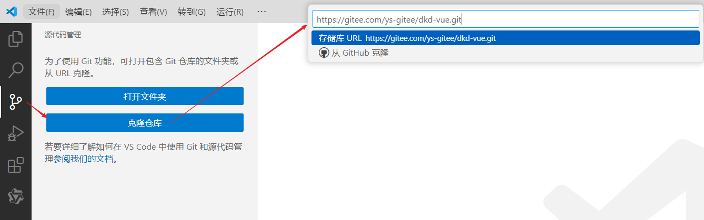
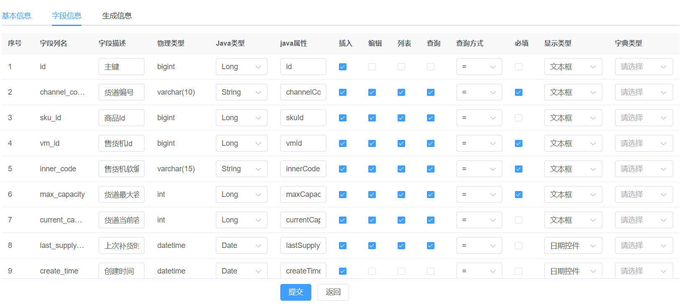
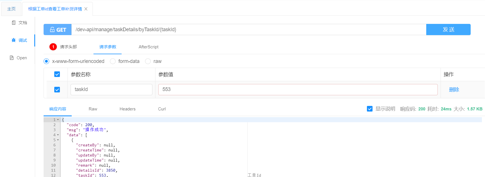

#    项目介绍

## 售货机简介

> 帝可得是一个基于`物联网`概念下的`智能售货机运营管理系统`

### 物联网

物联网（IoT：Internet of Things）简单来说，就是让各种物品通过互联网连接起来，实现信息的交换和通信。

这个概念听起来可能有点抽象，但我们可以把它想象成一个超级大的社交网络。不过，这个网络里的成员不是人类，而是各种物品。比如，你的冰箱、洗衣机、甚至是你的汽车，它们都可以通过互联网互相交流信息，就像是它们自己在聊天一样。

物联网的神奇之处在于，它能够让这些物品变得更加“聪明”。它们能够感知周围的环境，并且能够根据情况自动做出反应。举个例子，如果你的家里安装了智能家居系统，当你下班回家的路上，家里的空调就能提前开启，自动调整到你喜欢的温度，让你一回到家就能感受到舒适的环境。

总的来说将现实物体赋予感知、通信和智能化的能力，为人们提供更加智能化和便利的生活和工作环境

应用场景：智能家居、共享充电中、智能售货机

### 售货机

近年来，无接触式智能售货机逐渐成为年轻消费者的首选购物方式。这些设备不仅在公园、地铁站和商场等公共场所广泛分布，为顾客提供了极大的购物便利，而且由于其运营成本低廉和较高的利润空间，被众多电商企业视为新兴的蓝海市场。

与传统售货机相比，智能售货机的优势在于其`自我管理能力`，表现如下：

- **物联网技术**：像是售货机的顺风耳和千里眼。不管售货机在哪，管理人员都能通过电脑或手机知道它的状态，比如哪些商品快卖完了，哪些需要补货。
- **智能分析与推荐**：智能售货机就像有一个隐形的聪明脑袋，它能分析顾客的喜好，推荐那些可能让你心动的商品。就像有一个贴心的小助手，总能帮你找到最想要的东西。
- **人员设备绑定管理**：每个售货机都有自己的专属“保镖”，一旦售货机出现问题，这些“保镖”就能立刻出现，迅速解决问题，让售货机始终保持最佳状态。
- **移动支付支持**：现在谁还带现金出门呢？智能售货机支持各种移动支付方式，一扫即付，既方便又安全，让购物体验更加流畅。
- **线上线下融合（OMO）**：智能售货机还能把线上和线下完美结合起来，顾客可以在线上浏览商品，然后直接在售货机上购买，或者在售货机上看到喜欢的商品后，直接在线上下单。

智能售货机，不仅仅是一个自动售货的机器，它更像是一个智能的、能够自我管理和自我优化的系统。它让运营更高效，让购物体验更个性化，同时也为零售行业带来了创新和发展。

## 售货机术语

**区域管理**： 为了更高效地进行经营管理，公司将运营范围划分为若干个逻辑区域。这些区域的划分基于业务需求，可能与地理上的行政区域有所区别，以确保更合理的资源分配和更高效的运营管理。
 

**点位选择**： 点位指的是智能售货机的具体放置位置。选择点位时，我们会考虑人流量、目标顾客群体、可见度以及便利性等因素，以最大化售货机的使用效率和顾客的购买体验。

 

**售货机功能**： 智能售货机就像是一个自动的小店，里面摆满了各种商品。顾客想要什么，直接在机器上选，然后机器就会把商品送到他们手中，就像是一个自动化的仓库。


**货道设计**：售货机里面的货道，你可以想象成超市里的那种货架。每一层都有好几个位置可以放商品，这样就能放很多种不同的商品，而且每一层都能放很多，这样顾客的选择就会更多。

   


## 角色与功能

一个完整的售货机系统由五端五角色组成：

1. 管理员：对基础数据（区域、点位、设备、货道、商品等）进行管理，创建工单指派运维或运营人员，查看订单，查看各种统计报表。

2. 运维人员：投放设备、撤除设备、维修设备。

3. 运营人员：补货。

4. 合作商：仅提供点位，坐收渔翁之利。
5. 消费者:  在小程序或屏幕端下单购买商品。

 


## 业务流程

整个工程中，课程里会对主要核心的业务进行实现，主要包含下面的业务流程：

（1）**平台管理员**：主要作用有基础数据的管理和创建工单排除员工完成维修或补货。

（2）**运营人员**：主要作用是处理运营工单业务（补货等操作）

（3）**运维人员**：主要作用是处理运维工单业务（设备维修等操作）

（4）**消费者**：供C端用户使用。消费者扫描售货机上的二维码可以打开此端。主要作用是完成在售货机的购物操作。

 

### 平台管理员

 

 

上图中的简要流程：

①：平台管理人员登录到系统管理后台系统

②：创建区域数据

③：创建区域下点位数据

④：添加运维/运营人员

⑤：创建售货机信息

⑥：设置售货机点位信息

⑦：创建运维投放工单，由运维人员开始投放设备（安装设备）

⑧：设置售卖的商品信息

⑨：创建运营补货工单，由运营人员开始投放商品信息

### 运维人员

 

上图中的简要流程：

①：运维人员通过App登录运营系统

②：在App对派送过来的工单进行处理

③：接受工单后在指定的投放点安装售货机

④：拒绝工单该运维人员的工单结束

### 运营人员

 

上图中的简要流程：

①：运营人员通过App登录运营系统

②：在App对派送过来的工单进行处理

③：接受工单后在指定的售货机的商品进行补货

④：拒绝工单该运维人员的工单结束

### 消费者

 

上图中的简要流程：

方式一：

①：用户通过售货机二维码进行购买商品

②：扫码后在手机端微信小程序选择商品

③：支付成功后在售货机取货

方式二：

①：用户在售货机上选择商品

②：在选择商品后扫码支付商品的二维码

③：支付成功后在售货机取货

## 产品原型

帝可得项目点击链接立即查看 https://codesign.qq.com/s/426304924036117


## 库表设计

系统后台基础数据表关系说明：

 

一个区域可以有多个点位

一个点位可以有多个售货机

一个售货机有多个货道

多个货道可以放置同一样商品

一个商品类型下有多个商品

一个售货机类型下有多个售货机

一个合作商有多个点位

合作商和区域之间没有关系，因为合作商拥有的多个点位可以分布在不同的区域

每个区域下有多个运维和运营人员，他们来负责这个区域下的设备的运维和运营


# 初始AI

## AIGC

AI：即人工智能，是计算机科学体系下的一个学科，是指通过计算机系统模拟人类智力的一种技术。 

简单地说，AI是一种模拟人类智能的技术，它通过机器学习、深度学习等算法，使计算机具备对数据分析、理解、推理和决策的能力。

我们可以把“人工智能”想象成一个聪明的机器人小伙伴，它不仅会自动学习，还能像人的大脑一样思考和决策。在常生活中，它可以帮助我们解决诸多问题，例如在出门前预测当天的天气状况、通过分析交通路况推荐汽车的最佳行驶路线等。


AIGC（AI Generated Content）：AIGC是AI领域的一个应用分支，专注于利用AI技术自动生成内容，包括文本，代码，图片，音频，视频。

  

AI大模型：通常指的是具有大量参数的深度学习模型，经过大量数据训练，具备复杂计算能力的人工智能系统，它们能够执行多种高级任务，其中包括内容生成。

  


常见的通用大模型产品：

| 国家 | 对话产品           | 大模型         | 链接                           |
| ---- | ------------------ | -------------- | ------------------------------ |
| 美国 | OpenAI ChatGPT     | GPT-3.5、GPT-4 | https://chat.openai.com/       |
| 美国 | Microsoft Copilot  | GPT-4 和未知   | https://copilot.microsoft.com/ |
| 美国 | Google Bard        | Gemini         | https://bard.google.com/       |
| 中国 | 百度文心一言       | 文心4.0        | https://yiyan.baidu.com/       |
| 中国 | 讯飞星火           | 星火3.5        | https://xinghuo.xfyun.cn/      |
| 中国 | 智谱清言           | GLM-4          | https://chatglm.cn/            |
| 中国 | 月之暗面 Kimi Chat | Moonshot       | https://kimi.moonshot.cn/      |
| 中国 | MiniMax星野        | abab6          | https://www.xingyeai.com/      |
| 中国 | 通义干问           | Qwen-Max       | https://tongyi.aliyun.com/     |

## 提示工程

### 什么是Prompt?

提示（Prompt）是我们对大模型提出的问题。

举一个最简单的例子，很多同学在第一次使用AI时，都会问AI"你是谁"，"你是谁"这个问题便是prompt。

 


### 为什么学？ 

在与AI交流时，我们常常发现直接提问可能得不到满意的答案。

但如果我们换一种方式提问，或者提供一些额外的上下文信息，AI的表现就会大大提升。

 

同一个问题使用不同的prompt可能会获得不同的答案，怎么调教出一个聪明的AI助手呢？

这时候，提示工程就派上用场了。通过精心设计的提示，我们可以引导AI模型，让它的输出更加准确、相关和有用。


### 什么是提示工程？

提示工程（Prompt Engineering）也被称为上下文提示，它涉及到设计和优化输入文本，也就是Prompt，来引导AI模型生成预期的输出。

简单来说，就像是给AI出一个好问题，让它给我们一个满意的答案。

  


### Prompt的组成

- **角色**：给 AI 定义一个最匹配任务的角色，比如：「你是一位软件工程师」「你是一位小学老师」
- **指示**：对任务进行描述
- **上下文**：给出与任务相关的其它背景信息（尤其在多轮交互中）
- **例子**：必要时给出举例，[实践证明其对输出正确性有帮助]
- **输入**：任务的输入信息；在提示词中明确的标识出输入
- **输出**：输出的格式描述，以便后继模块自动解析模型的输出结果，比如（JSON、Java）

> 先定义角色，其实就是在**开头把问题域收窄**，减少二义性。

**案例：**

```markdown
角色：你是一位专业的博客作者。

指示：撰写一篇关于最新AI技术发展的文章。

上下文：文章应该涵盖AI技术的当前状态和未来趋势。

例子：可以引用最近的AI技术突破和行业专家的见解。

输入：当前AI技术的相关信息和数据。

输出：一篇结构清晰、观点鲜明的文章草稿。
```


```markdown
角色：你是一位资深的Java开发工程师。

指示：编写一个Java函数，该函数接收两个整数参数，并返回它们的和。

上下文：这个函数将被用于一个简单的数学应用程序，该程序帮助学生练习基本的算术运算。

例子：如果你调用函数 `addNumbers(3, 5)`，它应该返回 `8`。

输入：两个整数参数，分别为 `int a` 和 `int b`。

输出：返回这两个整数的和，类型为 `int`。
```


### 常见的编程相关的Prompt

#### 表结构

```markdown
你是一个软件工程师，帮我生成MySQL的表结构
需求如下：
	1，课程管理表，表名tb_course，字段有主键id、课程编码、课程学科、课程名称、课程价格、适用人群、课程介绍
其他要求：
    1，每个表中都有创建时间(create_time)、修改时间(date_time)、创建人(create_by)、修改人(update_by)、备注(remark)这些字段
    2，每个表的主键都是自增的
    3，课程价格是整型、课程编码是字符串
    4，请为每个字段都添加上comment
    5，帮我给生成的表中插入一些IT课程示例数据
        课程学科：Java、人工智能、大数据
        适用人群：小白学员、中级程序员
```


#### 生成数据库说明文档

```markdown
你是一个软件工程师，现在要根据数据库的sql脚本，编写数据库说明文档，sql脚本如下：
CREATE TABLE `tb_course` (
    `id` INT AUTO_INCREMENT COMMENT '主键ID',
    `course_code` VARCHAR(255) NOT NULL COMMENT '课程编码',
    `course_subject` VARCHAR(100) NOT NULL COMMENT '课程学科',
    `course_name` VARCHAR(255) NOT NULL COMMENT '课程名称',
    `course_price` INT COMMENT '课程价格',
    `target_audience` VARCHAR(100) COMMENT '适用人群',
    `course_introduction` TEXT COMMENT '课程介绍',
    `create_time` DATETIME COMMENT '创建时间',
    `update_time` DATETIME COMMENT '修改时间',
    `create_by` VARCHAR(64) COMMENT '创建人',
    `update_by` VARCHAR(64) COMMENT '修改人',
    `remark` VARCHAR(255) COMMENT '备注',
    PRIMARY KEY (`id`)
) ENGINE=InnoDB DEFAULT CHARSET=utf8mb4 COMMENT='课程管理表';

输出要求是：
	1，每个表以及每个表的字段都要详细说明，包括，字段名称、类型、作用
	2，使用markdown的输出格式，字段的描述需要使用表格展示
	3，如果表之间有关系，需要描述清楚表之间的关系
```

#### 生成代码

代码生成算是比较常规的方案，用的也比较多，分为了几种情况

- 给出表生成代码（项目中常见）
  - 给出表结构的ddl，可以输出这个表的增删改查的所有代码
  - 给出表结构的dll，可以输出增删改查的接口文档
- 补全代码
  - 例1-给出实体类，帮助编写getter、setter、toString、构造方法等等
  - 例2-给出一个controller，帮助编写swagger注解等
- 提取结构（无含金量，费时间的编程）
  - 例1-根据接口文档提取dto类或者vo类

#### 生成代码流程图

有一些比较复杂的业务流程，往往需要画出流程图，现在就可以使用ai协助我们画流程图

```java
你是一个软件工程师，为了方便理解代码执行流程，需要给出代码执行的流程图，代码如下：
    // 创建工单
    @Transactional
    @Override
    public int insertTaskDto(TaskDto taskDto) {
    //1. 查询售货机是否存在
    VendingMachine vm = vendingMachineService.selectVendingMachineByInnerCode(taskDto.getInnerCode());
    if (vm == null) {
        throw new ServiceException("设备不存在");
    }
    //2. 校验售货机状态与工单类型是否相符
    checkCreateTask(vm.getVmStatus(), taskDto.getProductTypeId());
    //3. 校验这台设备是否有未完成的同类型工单，如果存在则不能创建
    hasTask(taskDto.getInnerCode(), taskDto.getProductTypeId());
    //4. 校验员工是否存在
    Emp emp = empService.selectEmpById(taskDto.getUserId());
    if (emp == null) {
        throw new ServiceException("员工不存在");
    }
    // 5. 校验非同区域下的工作人员不能接受工单
    if (emp.getRegionId() != vm.getRegionId()) {
        throw new ServiceException("非同区域下的工作人员不能接受工单");
    }
    //6. 保存工单信息
    Task task = new Task();
    BeanUtil.copyProperties(taskDto, task);// 属性赋值
    task.setCreateTime(DateUtils.getNowDate());// 创建时间
    task.setTaskCode(generateTaskCode());// 工单编号 202405150001
    task.setTaskStatus(DkdContants.TASK_STATUS_CREATE);// 创建工单
    task.setAddr(vm.getAddr());
    task.setRegionId(vm.getRegionId());
    task.setUserName(emp.getUserName());
    int taskResult = taskMapper.insertTask(task);
    //7. 如果是补货工单，向工单明细表插入记录
    if (task.getProductTypeId() == DkdContants.TASK_TYPE_SUPPLY) {
        if (CollUtil.isEmpty(taskDto.getDetails())) {
            throw new ServiceException("补货工单明细不能为空");
        }
        List<TaskDetails> taskDetailsList = taskDto.getDetails().stream().map(details -> {
            TaskDetails taskDetails = BeanUtil.copyProperties(details, TaskDetails.class);
            taskDetails.setTaskId(task.getTaskId());
            return taskDetails;
        }).collect(Collectors.toList());
        taskDetailsService.insertBatch(taskDetailsList);
    }

    return taskResult;
}

输出：请使用mermaid语言来描述这个方法的流程
```


# 项目搭建

## 搭建后端项目

### 初始化项目

#### Git下载

通过idea克隆源码，仓库地址：https://gitee.com/ys-gitee/dkd-parent.git 

 

#### Maven构建

使用idea打开项目后，等待环境检查（主要是Maven下载项目依赖）

 

### MySQL相关

#### 导入sql

1、创建数据库`create schema dkd;`

2、执行下图的sql脚本文件，完成导入

  


#### 配置信息

在`dkd-admin`模块下，编辑`resources`目录下的`application-druid.yml`，修改数据库连接

 

### Redis相关

#### 启动

在redis解压目录下，编辑`redis.windows.conf`配置文件，设置redis密码

> 设置Redis密码是为了增强数据安全性、防止未授权访问和保护关键信息，从而确保应用程序的稳定性和合规性。

 

在redis解压目录下，执行`redis-server.exe redis.windows.conf`启动

 

#### 配置信息

在`dkd-admin`模块下，`resources`目录下的`application.yml`，设置redis密码等相关信息 

 

### 项目运行

在`dkd-admin`模块下，运行`com.ruoyi.DkdApplication.java`，出现如下图表示启动成功

 

后端运行成功可以通过([http://localhost:8080 )访问，但是不会出现静态页面，可以继续参考下面步骤部署前端，然后通过前端地址来访问。

## 搭建前端项目

### 初始化项目

通过vscode克隆源码，仓库地址：https://gitee.com/ys-gitee/dkd-vue.git

 

### 安装依赖

```shell
# 安装依赖
npm install
```

 

### 项目运行

```shell
# 启动服务
npm run dev
```

 


打开浏览器，输入：([http://localhost:80) 默认账户/密码 `admin/admin123`）若能正确展示登录页面，并能成功登录，菜单及页面展示正常，表明环境搭建成功


# 点位管理

## 需求说明

**业务场景**： 假设我们的公司现在有一个宏伟的计划——在北京发展业务。首先，我们需要确定几个有潜力的区域，这些区域可能是人流量大、消费能力高的商业区或居民区。然后，我们要与这些区域内的潜在合作商进行洽谈，比如商场、写字楼、学校等地方的管理者或所有者。

一旦我们与合作商达成协议，确定了合作的细节和点位，我们就可以安排工作人员去投放智能售货机了。这些点位将成为我们智能售货机的“家”，为消费者提供便捷的购买服务。


点位管理主要涉及到三个功能模块，业务流程如下：

1. **登录系统**：后台管理人员登录后台系统
2. **新增区域**: 后台管理人员可以添加区域范围，区域范围与运维/运维人员挂钩，区域下可关联点位。
3. **新增合作商**: 管理人员可以添加合作商，合作商与点位进行关联。
4. **新增区域点位**: 后台管理人员可以在特定区域内新增点位，这些点位是放置智能售货机的具体位置。


 


## 库表设计

```markdown
你是一位软件工程师，帮我生成MySQL的表结构
需求如下：
1，区域表，表名tb_region，字段有主键id、区域名称
2，合作商表，表名tb_partner，字段有主键id、合作商名称、联系人、联系电话、分成比例（int类型）、账号、密码
3，点位表，表名tb_node，字段有主键id、点位名称、详细地址、商圈类型（int类型）
其他要求：
1，每张表中都有创建时间(create_time)、修改时间(date_time)、创建人(create_by)、修改人(update_by)、备注(remark)这些字段
2，每张表的主键都是自增的
3，区域与点位是一对多的关系，合作商与点位是一对多的关系，请用字段表示出来，并建立外键约束
4，请为所有字段都添加上comment
5，帮我给生成的表中插入一些北京城市相关区域、点位、合作商的测试数据
```

```sql
CREATE TABLE `tb_region` (
  `id` INT AUTO_INCREMENT COMMENT '主键id' PRIMARY KEY,
  `region_name` VARCHAR(255) NOT NULL COMMENT '区域名称',
  `create_time` TIMESTAMP DEFAULT CURRENT_TIMESTAMP COMMENT '创建时间',
  `update_time` TIMESTAMP DEFAULT CURRENT_TIMESTAMP ON UPDATE CURRENT_TIMESTAMP COMMENT '修改时间',
  `create_by` VARCHAR(64) COMMENT '创建人',
  `update_by` VARCHAR(64) COMMENT '修改人',
  `remark` TEXT COMMENT '备注'
) ENGINE=InnoDB DEFAULT CHARSET=utf8mb4 COMMENT='区域表';

-- 插入测试数据
INSERT INTO `tb_region` (`region_name`,`remark`) VALUES ('北京市朝阳区','北京市朝阳区'), ('北京市海淀区','北京市海淀区'), ('北京市东城区','北京市东城区');

CREATE TABLE `tb_partner` (
  `id` INT AUTO_INCREMENT COMMENT '主键id' PRIMARY KEY,
  `partner_name` VARCHAR(255) NOT NULL COMMENT '合作商名称',
  `contact_person` VARCHAR(64) COMMENT '联系人',
  `contact_phone` VARCHAR(15) COMMENT '联系电话',
  `profit_ratio` INT COMMENT '分成比例',
  `account` VARCHAR(64) COMMENT '账号',
  `password` VARCHAR(64) COMMENT '密码',
  `create_time` TIMESTAMP DEFAULT CURRENT_TIMESTAMP COMMENT '创建时间',
  `update_time` TIMESTAMP DEFAULT CURRENT_TIMESTAMP ON UPDATE CURRENT_TIMESTAMP COMMENT '修改时间',
  `create_by` VARCHAR(64) COMMENT '创建人',
  `update_by` VARCHAR(64) COMMENT '修改人',
  `remark` TEXT COMMENT '备注'
) ENGINE=InnoDB DEFAULT CHARSET=utf8mb4 COMMENT='合作商表';

-- 插入测试数据
INSERT INTO `tb_partner` (`partner_name`, `contact_person`, `contact_phone`, `profit_ratio`, `account`, `password`) VALUES
('合作商A', '张三', '13800138000', 30, 'a001', 'pwdA'),
('合作商B', '李四', '13912345678', 25, 'b002', 'pwdB');

CREATE TABLE `tb_node` (
  `id` INT AUTO_INCREMENT COMMENT '主键id' PRIMARY KEY,
  `node_name` VARCHAR(255) NOT NULL COMMENT '点位名称',
  `address` VARCHAR(255) NOT NULL COMMENT '详细地址',
  `business_type` INT COMMENT '商圈类型',
  `region_id` INT COMMENT '区域ID',
  `partner_id` INT COMMENT '合作商ID',
  `create_time` TIMESTAMP DEFAULT CURRENT_TIMESTAMP COMMENT '创建时间',
  `update_time` TIMESTAMP DEFAULT CURRENT_TIMESTAMP ON UPDATE CURRENT_TIMESTAMP COMMENT '修改时间',
  `create_by` VARCHAR(64) COMMENT '创建人',
  `update_by` VARCHAR(64) COMMENT '修改人',
  `remark` TEXT COMMENT '备注',
  FOREIGN KEY (`region_id`) REFERENCES `tb_region`(`id`) ON DELETE CASCADE ON UPDATE CASCADE,
  FOREIGN KEY (`partner_id`) REFERENCES `tb_partner`(`id`) ON DELETE CASCADE ON UPDATE CASCADE
) ENGINE=InnoDB DEFAULT CHARSET=utf8mb4 COMMENT='点位表';


-- 插入测试数据
-- 假设区域ID为1对应'北京市朝阳区'，合作商ID为1对应'合作商A'
INSERT INTO `tb_node` (`node_name`, `address`, `business_type`, `region_id`, `partner_id`) VALUES
('三里屯点位', '北京市朝阳区三里屯路', 1, 1, 1),
('五道口点位', '北京市海淀区五道口', 2, 2, 2);
```


对于点位管理数据模型，下面是示意图：

- 关系字段：region_id、partner_id

- 数据字典：business_type  

    

## 生成基础代码

### 需求

使用若依代码生成器，生成区域管理、合作商管理、点位管理前后端基础代码，并导入到项目中：


### 步骤

#### ①创建目录菜单

创建点位管理目录菜单

   

#### ②添加数据字典

先创建`商圈`的字典类型

  

 

再创建`商圈`的字典数据

 

  

#### ③配置代码生成信息

导入三张表

 


配置合作商表（参考原型）

 

  

    

配置区域表（参考原型）

 

    

  

配置点位表（参考原型）

 

   

 

#### ④下载代码并导入项目

选中三张表生成下载

 

解压`ruoyi.zip`得到前后端代码和动态菜单sql

 

代码导入

  

调整二级菜单显示顺序

 


## 区域管理改造

### 基础页面

#### 需求

参考页面原型，完成基础布局展示改造

 

#### 代码实现

在region/index.vue视图组件中修改

```vue
<!-- 区域列表 -->
<el-table v-loading="loading" :data="regionList" @selection-change="handleSelectionChange">
    <el-table-column type="selection" width="55" align="center" />
    <el-table-column label="序号" type="index" width="50" align="center" prop="id" />
    <el-table-column label="区域名称" align="center" prop="regionName" />
    <el-table-column label="备注说明" align="center" prop="remark" />
    <el-table-column label="操作" align="center" class-name="small-padding fixed-width">
        <template #default="scope">
		<el-button link type="primary"  @click="handleUpdate(scope.row)" v-hasPermi="['manage:region:edit']">修改</el-button>
		<el-button link type="primary"  @click="handleDelete(scope.row)" v-hasPermi="['manage:region:remove']">删除</el-button>
        </template>
    </el-table-column>
</el-table>
```


### 区域列表

#### 需求

在区域列表查询中，需要显示每个区域的点位数

 


#### 实现思路

实现此功能也有多种方案：

**（1）同步存储：**在区域表中有点位数的字段，当点位发生变化时，同步区域表中的点位数。

- 优点：由于是单表查询操作，查询列表效率最高。
- 缺点：需要在点位增删改时修改区域表中的数据，有额外的开销，数据也可能不一致。

**（2）关联查询：**编写关联查询语句，在mapper 层封装。

- 优点：实时查询，数据100%正确，不需要单独维护。
- 缺点：SQL语句较复杂，如果数据量大，性能比较低。

区域和点位表，记录个数都不是很多，所以我们采用关联查询这种方案。

 

#### SQL

SQL查询：先聚合统计每个区域的点位数，然后与区域表进行关联查询

```sql
-- 传统模式
-- 1.先聚合统计每个区域下的点位数
-- 确定查询表 tb_node
-- 确定分组字段 region_id
select region_id,count(*) as node_count from tb_node group by region_id;
-- 2.然后与区域表进行关联查询
select r.id,r.region_name,r.remark,ifnull(n.node_count,0) as node_count from tb_region r
    left join (select region_id,count(*) as node_count from tb_node group by region_id) n on r.id=n.region_id;

-- AI辅助编程模式
-- 查询区域表所有的信息,需要显示每个区域的点位数
SELECT r.*, COUNT(n.id) AS node_count FROM tb_region r LEFT JOIN tb_node n ON r.id = n.region_id GROUP BY r.id;
```

#### RegionVo

根据接口文档和sql创建RegionVo

 

#### RegionMapper

```java
/**
 * 查询区域管理列表
 * @param region
 * @return RegionVo集合
 */
public List<RegionVo> selectRegionVoList(Region region);
```

#### RegionMapper.xml

```xml
<select id="selectRegionVoList" resultType="com.dkd.manage.domain.vo.RegionVo">
select r.id,r.region_name,r.remark,ifnull(n.node_count,0) as node_count from tb_region r
    left join (select region_id,count(*) as node_count from tb_node group by region_id) n on r.id=n.region_id
    <where>
       <if test="regionName != null  and regionName != ''"> and r.region_name like concat('%', #{regionName}, '%')</if>
    </where>
</select>
```

#### mybatis-config.xml

 

#### IRegionService

```java
/**
 * 查询区域管理列表
 * @param region
 * @return RegionVo集合
 */
public List<RegionVo> selectRegionVoList(Region region);
```

#### RegionServiceImpl

```java
/**
 * 查询区域管理列表
 * @param region
 * @return RegionVo集合
 */
@Override
public List<RegionVo> selectRegionVoList(Region region) {
    return regionMapper.selectRegionVoList(region);
}
```

#### RegionController

```java
/**
 * 查询区域管理列表
 */
@PreAuthorize("@ss.hasPermi('manage:region:list')")
@GetMapping("/list")
public TableDataInfo list(Region region)
{
    startPage();
    List<RegionVo> voList = regionService.selectRegionVoList(region);
    return getDataTable(voList);
}
```

#### region/index.vue

```vue
<!-- 区域列表 -->
<el-table v-loading="loading" :data="regionList" @selection-change="handleSelectionChange">
  <el-table-column type="selection" width="55" align="center" />
  <el-table-column label="序号" type="index" width="50" align="center" prop="id" />
  <el-table-column label="区域名称" align="center" prop="regionName" />
  <el-table-column label="点位数" align="center" prop="nodeCount" />
  <el-table-column label="备注说明" align="center" prop="remark" />
  <el-table-column label="操作" align="center" class-name="small-padding fixed-width">
    <template #default="scope">
      <el-button link type="primary"  @click="handleUpdate(scope.row)" v-hasPermi="['manage:region:edit']">修改</el-button>
      <el-button link type="primary"  @click="handleDelete(scope.row)" v-hasPermi="['manage:region:remove']">删除</el-button>
    </template>
  </el-table-column>
</el-table>
```


## 合作商管理改造

### 基础页面

####  需求

参考页面原型，完成基础布局展示改造

 


#### 代码实现

在partner/index.vue视图组件中

```vue
<!-- 搜索区域 -->
<el-form :model="queryParams" ref="queryRef" :inline="true" v-show="showSearch" label-width="90px">
    <el-form-item label="合作商名称" prop="name">
        <el-input
                  v-model="queryParams.partnerName" placeholder="请输入合作商名称"
                  clearable @keyup.enter="handleQuery"/>
    </el-form-item>
    <el-form-item>
        <el-button type="primary" icon="Search" @click="handleQuery">搜索</el-button>
        <el-button icon="Refresh" @click="resetQuery">重置</el-button>
    </el-form-item>
</el-form>


<!-- 合作商列表 -->
<el-table v-loading="loading" :data="partnerList" @selection-change="handleSelectionChange">
  <el-table-column type="selection" width="55" align="center" />
  <el-table-column label="序号" type="index" width="50" align="center" prop="id" />
  <el-table-column label="合作商名称" align="center" prop="partnerName" />
  <el-table-column label="账号" align="center" prop="account" />
  <el-table-column label="分成比例" align="center" prop="profitRatio" >
    <template #default="scope">{{scope.row.profitRatio}}%</template>
  </el-table-column>
  <el-table-column label="联系人" align="center" prop="contactPerson" />
  <el-table-column label="联系电话" align="center" prop="contactPhone" />
  <el-table-column label="操作" align="center" class-name="small-padding fixed-width">
    <template #default="scope">
      <el-button link type="primary"  @click="handleUpdate(scope.row)" v-hasPermi="['manage:partner:edit']">修改</el-button>
      <el-button link type="primary"  @click="handleDelete(scope.row)" v-hasPermi="['manage:partner:remove']">删除</el-button>
    </template>
  </el-table-column>
</el-table>

<!-- 添加或修改合作商管理对话框 -->
<el-dialog :title="title" v-model="open" width="500px" append-to-body>
  <el-form ref="partnerRef" :model="form" :rules="rules" label-width="100px">
    <el-form-item label="合作商名称" prop="partnerName">
      <el-input v-model="form.partnerName" placeholder="请输入合作商名称" />
    </el-form-item>
    <el-form-item label="联系人" prop="contactPerson">
      <el-input v-model="form.contactPerson" placeholder="请输入联系人" />
    </el-form-item>
    <el-form-item label="联系电话" prop="contactPhone">
      <el-input v-model="form.contactPhone" placeholder="请输入联系电话" />
    </el-form-item>
    <el-form-item label="创建时间" prop="contactPhone" v-if="form.id!=null">
      {{form.createTime}}
    </el-form-item>
    <el-form-item label="分成比例" prop="profitRatio">
      <el-input v-model="form.profitRatio" placeholder="请输入分成比例" />
    </el-form-item>
    <el-form-item label="账号" prop="account" v-if="form.id==null">
      <el-input v-model="form.account" placeholder="请输入账号" />
    </el-form-item>
    <el-form-item label="密码" prop="password" v-if="form.id==null">
      <el-input v-model="form.password" type="password" placeholder="请输入密码" />
    </el-form-item>
  </el-form>
  <template #footer>
    <div class="dialog-footer">
      <el-button type="primary" @click="submitForm">确 定</el-button>
      <el-button @click="cancel">取 消</el-button>
    </div>
  </template>
</el-dialog>
</div>
</template>
```

在PartnerServiceImpl的新增方法中修改

```java
/**
 * 新增合作商
 *
 * @param partner 合作商
 * @return 结果
 */
@Override
public int insertPartner(Partner partner) {
    // 使用SecurityUtil工具类，对密码加密
    partner.setPassword(SecurityUtils.encryptPassword(partner.getPassword()));
    partner.setCreateTime(DateUtils.getNowDate());
    return partnerMapper.insertPartner(partner);
}
```


### 查看详情

在partner/index.vue视图组件中

```vue
<el-button link type="primary" @click="getPartnerInfo(scope.row)" v-hasPermi="['manage:partner:query']">查看详情</el-button>


<!-- 查看合作商详情 -->
<el-dialog title="合作商详情" v-model="partnerInfoOpen" width="500px" append-to-body>
    <el-row>
        <el-col :span="12">合作商名称：{{ form.partnerName }}</el-col>
        <el-col :span="12">联系人：{{ form.contactPerson }}</el-col>
    </el-row>
    <el-row>
        <el-col :span="12">联系电话：{{ form.contactPhone }}</el-col>
        <el-col :span="12">分成比例：{{ form.profitRatio }}%</el-col>
    </el-row>
</el-dialog>

<script>
    /* 查看合作商详情 */
    const partnerInfoOpen = ref(false);
    function getPartnerInfo(row) {
        reset();
        const _id = row.id;
        getPartner(_id).then(response => {
            form.value = response.data;
            partnerInfoOpen.value = true;
        });
    }
</script>
```


```vue
<!-- 查看合作商详情对话框 -->
<el-dialog title="合作商详情" v-model="partnerInfoOpen" width="500px" append-to-body>
    <!-- 使用el-descriptions组件以卡片形式展示信息，更加整洁 -->
    <el-descriptions :column="2" border>
        <el-descriptions-item label="合作商名称">{{ form.partnerName }}</el-descriptions-item>
        <el-descriptions-item label="联系人">{{ form.contactPerson }}</el-descriptions-item>
        <el-descriptions-item label="联系电话">{{ form.contactPhone }}</el-descriptions-item>
        <el-descriptions-item label="分成比例">{{ form.profitRatio }}%</el-descriptions-item>
    </el-descriptions>
</el-dialog>
```


### 合作商列表

#### 实现思路

与区域列表实现方式相同。

   

#### SQL

SQL查询：先聚合统计每个合作商的点位数，然后与合作商表进行关联查询

```sql
-- 传统模式
-- 1.先聚合统计每个合作商的点位数
-- 确定查询的表 tb_node
-- 确定分组字段 partner_id
SELECT partner_id, COUNT(1) AS node_count from tb_node group by partner_id;
-- 2.然后与合作商表进行关联查询
select tp.*,ifnull(tn.node_count,0) from tb_partner tp
left join (SELECT partner_id, COUNT(1) AS node_count from tb_node group by partner_id) tn on tn.partner_id = tp.id;
```


```sql
-- AI辅助编程模式
-- 你是一个软件开发工程师，现在要根据数据库的sql脚本，查询并显示合作商表所有的字段信息,同时显示每个合作商的点位数，sql脚本如下
create table tb_node
(
    id            int auto_increment comment '主键id'
        primary key,
    node_name     varchar(255)                        not null comment '点位名称',
    address       varchar(255)                        not null comment '详细地址',
    business_type int                                 null comment '商圈类型',
    region_id     int                                 null comment '区域ID',
    partner_id    int                                 null comment '合作商ID',
    create_time   timestamp default CURRENT_TIMESTAMP null comment '创建时间',
    update_time   timestamp default CURRENT_TIMESTAMP null on update CURRENT_TIMESTAMP comment '修改时间',
    create_by     varchar(64)                         null comment '创建人',
    update_by     varchar(64)                         null comment '修改人',
    remark        text                                null comment '备注',
    constraint tb_node_ibfk_1
        foreign key (region_id) references tb_region (id)
            on update cascade on delete cascade,
    constraint tb_node_ibfk_2
        foreign key (partner_id) references tb_partner (id)
            on update cascade on delete cascade
)
    comment '点位表';
    
create table tb_partner
(
    id             int auto_increment comment '主键id'
        primary key,
    partner_name   varchar(255)                        not null comment '合作商名称',
    contact_person varchar(64)                         null comment '联系人',
    contact_phone  varchar(15)                         null comment '联系电话',
    profit_ratio   int                                 null comment '分成比例',
    account        varchar(64)                         null comment '账号',
    password       varchar(64)                         null comment '密码',
    create_time    timestamp default CURRENT_TIMESTAMP null comment '创建时间',
    update_time    timestamp default CURRENT_TIMESTAMP null on update CURRENT_TIMESTAMP comment '修改时间',
    create_by      varchar(64)                         null comment '创建人',
    update_by      varchar(64)                         null comment '修改人',
    remark         text                                null comment '备注'
)
    comment '合作商表';
```


#### PartnerVo

根据接口文档和sql创建PartnerVo

  

#### PartnerMapper

```java
/**
 * 查询合作商管理列表
 * @param partner
 * @return partnerVo集合
 */
public List<PartnerVo> selectPartnerVoList(Partner partner);
```

#### PartnerMapper.xml

```xml
<select id="selectPartnerVoList" resultType="com.dkd.manage.domain.vo.PartnerVo">
    SELECT p.*, COUNT(n.id) AS node_count FROM tb_partner p
    LEFT JOIN tb_node n ON p.id = n.partner_id
    <where>
        <if test="partnerName != null  and partnerName != ''">and partner_name like concat('%', #{partnerName},'%')
        </if>
    </where>
    GROUP BY p.id
</select>
```

#### IPartnerService

```java
/**
 * 查询合作商管理列表
 * @param partner
 * @return partnerVo集合
 */
public List<PartnerVo> selectPartnerVoList(Partner partner);
```

#### PartnerServiceImpl

```java
/**
 * 查询合作商管理列表
 * @param partner
 * @return partnerVo集合
 */
@Override
public List<PartnerVo> selectPartnerVoList(Partner partner) {
    return partnerMapper.selectPartnerVoList(partner);
}
```

#### PartnerController

```java
/**
 * 查询合作商管理列表
 */
@PreAuthorize("@ss.hasPermi('manage:partner:list')")
@GetMapping("/list")
public TableDataInfo list(Partner partner) {
    startPage();
    List<PartnerVo> voList = partnerService.selectPartnerVoList(partner);
    return getDataTable(voList);
}
```

#### region/index.vue

```vue
<!-- 合作商列表 -->
<el-table v-loading="loading" :data="partnerList" @selection-change="handleSelectionChange">
    <el-table-column type="selection" width="55" align="center" />
    <el-table-column label="序号" type="index" width="50" align="center" prop="id" />
    <el-table-column label="合作商名称" align="center" prop="partnerName" />
    <el-table-column label="点位数" align="center" prop="nodeCount" />
    <el-table-column label="账号" align="center" prop="account" />
    <el-table-column label="分成比例" align="center" prop="profitRatio" >
        <template #default="scope">{{ scope.row.profitRatio }}%</template>
    </el-table-column>
    <el-table-column label="联系人" align="center" prop="contactPerson" />
    <el-table-column label="联系电话" align="center" prop="contactPhone" />
    <el-table-column label="操作" align="center" class-name="small-padding fixed-width">
        <template #default="scope">
            <el-button link type="primary"  @click="getParnterInfo(scope.row)" v-hasPermi="['manage:partner:query']">查看详情</el-button>
            <el-button link type="primary"  @click="handleUpdate(scope.row)" v-hasPermi="['manage:partner:edit']">修改</el-button>
            <el-button link type="primary"  @click="handleDelete(scope.row)" v-hasPermi="['manage:partner:remove']">删除</el-button>
        </template>
    </el-table-column>
</el-table>
```


### 重置密码

#### 后端部分

在PartnerController中

```java
/**
 * 重置合作商密码
 */
@PreAuthorize("@ss.hasPermi('manage:partner:edit')")
@Log(title = "重置合作商密码", businessType = BusinessType.UPDATE)
@PutMapping("/resetPwd/{id}")
public AjaxResult resetpwd(@PathVariable Long id) {//1. 接收参数
    //2. 创建合作商对象
    Partner partner = new Partner();
    partner.setId(id);// 设置id
    partner.setPassword(SecurityUtils.encryptPassword("123456"));// 设置加密后的初始密码
    //3. 调用service更新密码
    return toAjax(partnerService.updatePartner(partner));
}
```

#### 前端部分

在manage/partner.js请求api中

```js
// 重置合作商密码
export function resetPartnerPwd(id){
  return request({
    url: '/manage/partner/resetPwd/' + id,
    method: 'put'
  })
}
```


在partner/index.vue视图组件中

```vue
<el-table-column label="操作" align="center" class-name="small-padding fixed-width" width="300px">
    <template #default="scope">
		<el-button link type="primary" @click="resetPwd(scope.row)" v-hasPermi="['manage:partner:edit']">重置密码</el-button>
    </template>
</el-table-column>

<script>
    import { listPartner, getPartner, delPartner, addPartner, updatePartner,resetPartnerPwd } from "@/api/manage/partner";
    /* 重置合作商密码 */
    function resetPwd(row) {
        proxy.$modal.confirm('你确定要重置该合作商密码吗？').then(function () {
            return resetPartnerPwd(row.id);
        }).then(() => {
            proxy.$modal.msgSuccess("重置成功");
        }).catch(() => { });
    }
</script>
```


## 点位管理改造

### 基础页面

#### 需求

参考页面原型，完成基础布局展示改造


#### 代码实现

在node/index.vue视图组件中

```vue
<!-- 搜索区域 -->
<el-form :model="queryParams" ref="queryRef" :inline="true" v-show="showSearch" label-width="68px">
    <el-form-item label="点位名称" prop="nodeName">
        <el-input v-model="queryParams.nodeName" placeholder="请输入点位名称" clearable @keyup.enter="handleQuery" />
    </el-form-item>
    <el-form-item label="区域搜索" prop="regionId">
        <!-- <el-input v-model="queryParams.regionId" placeholder="请输入区域ID" clearable @keyup.enter="handleQuery" /> -->
        <el-select v-model="queryParams.regionId" placeholder="请选择区域" clearable>
            <el-option v-for="item in regionList" :key="item.id" :label="item.regionName" :value="item.id"></el-option>
        </el-select>
    </el-form-item>
    <el-form-item>
        <el-button type="primary" icon="Search" @click="handleQuery">搜索</el-button>
        <el-button icon="Refresh" @click="resetQuery">重置</el-button>
    </el-form-item>
</el-form>

<!-- 点位列表 -->
<el-table v-loading="loading" :data="nodeList" @selection-change="handleSelectionChange">
    <el-table-column type="selection" width="55" align="center" />
    <el-table-column label="序号" type="index" width="50" align="center" prop="id" />
    <el-table-column label="点位名称" align="center" prop="nodeName" />
    <el-table-column label="区域ID" align="center" prop="regionId" />
    <el-table-column label="商圈类型" align="center" prop="businessType">
        <template #default="scope">
<dict-tag :options="business_type" :value="scope.row.businessType" />
        </template>
    </el-table-column>
    <el-table-column label="合作商ID" align="center" prop="partnerId" />
    <el-table-column label="详细地址" align="center" prop="address" show-overflow-tooltip/>
    <el-table-column label="操作" align="center" class-name="small-padding fixed-width">
        <template #default="scope">
<el-button link type="primary" icon="Edit" @click="handleUpdate(scope.row)" v-hasPermi="['manage:node:edit']">修改</el-button>
<el-button link type="primary" icon="Delete" @click="handleDelete(scope.row)" v-hasPermi="['manage:node:remove']">删除</el-button>
        </template>
    </el-table-column>
</el-table>

<!-- 添加或修改点位管理对话框 -->
<el-dialog :title="title" v-model="open" width="500px" append-to-body>
  <el-form ref="nodeRef" :model="form" :rules="rules" label-width="100px">
    <el-form-item label="点位名称" prop="nodeName">
      <el-input v-model="form.nodeName" placeholder="请输入点位名称" />
    </el-form-item>
    <el-form-item label="所在区域" prop="regionId">
      <!-- <el-input v-model="form.regionId" placeholder="请输入区域ID" /> -->
        <el-select v-model="form.regionId" placeholder="请选择区域" clearable>
        <el-option v-for="item in regionList" :key="item.id" :label="item.regionName" :value="item.id"></el-option>
      </el-select>
    </el-form-item>
    <el-form-item label="商圈类型" prop="businessType">
      <el-select v-model="form.businessType" placeholder="请选择商圈类型">
        <el-option v-for="dict in business_type" :key="dict.value" :label="dict.label"
          :value="parseInt(dict.value)"></el-option>
      </el-select>
    </el-form-item>
    <el-form-item label="归属合作商" prop="partnerId">
      <!-- <el-input v-model="form.partnerId" placeholder="请输入合作商ID" /> -->
        <el-select v-model="form.partnerId" placeholder="请选择合作商" clearable>
        <el-option v-for="item in partnerList" :key="item.id" :label="item.partnerName" :value="item.id"></el-option>
      </el-select>
    </el-form-item>
    <el-form-item label="详细地址" prop="address">
      <el-input type="textarea" v-model="form.address" placeholder="请输入详细地址" />
    </el-form-item>
  </el-form>
  <template #footer>
    <div class="dialog-footer">
      <el-button type="primary" @click="submitForm">确 定</el-button>
      <el-button @click="cancel">取 消</el-button>
    </div>
  </template>
</el-dialog>

<script setup name="Node">
    import { listPartner } from "@/api/manage/partner";
    import { listRegion } from "@/api/manage/region";
    import { loadAllParams } from "@/api/page";

    /* 查询所有的条件对象 */
    /* const loadAllParams = reactive({
      pageNum: 1,
      pageSize: 10000,
    }); */

    /* 查询合作商列表  */
    const partnerList = ref([]);
    function getPartnerList() {
        listPartner(loadAllParams).then(response => {
            partnerList.value = response.rows;
        });
    }
    getPartnerList();
    /* 查询区域列表 */
    const regionList = ref([]);
    function getRegionList() {
        listRegion(loadAllParams).then(response => {
            regionList.value = response.rows;
        });
    }
    getRegionList();    

</script>
```

在api/page.js中，抽取一个查询所有的条件

```js
export const loadAllParams = reactive({
  pageNum: 1,
  pageSize: 10000,
});
```


### 点位列表

#### 需求

在区域详情中，需要显示每个点位的设备数

 

在点位列表查询中，会关联显示区域、商圈等信息

 


#### 实现思路

**关联查询**：对于设备数量的统计，我们需要执行关联查询，在mapper 层封装。

**关联实体**：对于区域和合作商的数据，我们会采用Mybatis提供的嵌套查询功能。

MyBatis 嵌套查询就是将原来多表查询中的联合查询语句拆成单个表的查询，再使用mybatis的语法嵌套在一 起，通过定义`resultMap`和`sql`语句中的`association`或`collection`元素来实现嵌套查询。

  

导入资料中`dkd.sql`业务表到开发数据库中

  


#### SQL

```sql
-- AI辅助编程模式
-- 你是一个软件开发工程师，现在要根据数据库的sql脚本，查询并显示点位表所有的字段信息,同时显示每个点位的设备数量，sql脚本如下：
create table tb_node
(
    id            int auto_increment comment '主键id'
        primary key,
    node_name     varchar(255)                        not null comment '点位名称',
    address       varchar(255)                        not null comment '详细地址',
    business_type int                                 null comment '商圈类型',
    region_id     int                                 null comment '区域ID',
    partner_id    int                                 null comment '合作商ID',
    create_time   timestamp default CURRENT_TIMESTAMP null comment '创建时间',
    update_time   timestamp default CURRENT_TIMESTAMP null on update CURRENT_TIMESTAMP comment '修改时间',
    create_by     varchar(64)                         null comment '创建人',
    update_by     varchar(64)                         null comment '修改人',
    remark        text                                null comment '备注',
    constraint tb_node_ibfk_1
        foreign key (region_id) references tb_region (id)
            on update cascade on delete cascade,
    constraint tb_node_ibfk_2
        foreign key (partner_id) references tb_partner (id)
            on update cascade on delete cascade
)
    comment '点位表';
    
create table tb_vending_machine
(
    id                   bigint auto_increment comment '主键'
        primary key,
    inner_code           varchar(15) default '000'                 null comment '设备编号',
    channel_max_capacity int                                       null comment '设备容量',
    node_id              int                                       not null comment '点位Id',
    addr                 varchar(100)                              null comment '详细地址',
    last_supply_time     datetime    default '2000-01-01 00:00:00' not null comment '上次补货时间',
    business_type        int                                       not null comment '商圈类型',
    region_id            int                                       not null comment '区域Id',
    partner_id           int                                       not null comment '合作商Id',
    vm_type_id           int         default 0                     not null comment '设备型号',
    vm_status            int         default 0                     not null comment '设备状态，0:未投放;1-运营;3-撤机',
    running_status       varchar(100)                              null comment '运行状态',
    longitudes           double      default 0                     null comment '经度',
    latitude             double      default 0                     null comment '维度',
    client_id            varchar(50)                               null comment '客户端连接Id,做emq认证用',
    policy_id            bigint                                    null comment '策略id',
    create_time          timestamp   default CURRENT_TIMESTAMP     not null comment '创建时间',
    update_time          timestamp   default CURRENT_TIMESTAMP     null comment '修改时间',
    constraint vendingmachine_VmId_uindex
        unique (inner_code),
    constraint tb_vending_machine_ibfk_1
        foreign key (vm_type_id) references tb_vm_type (id),
    constraint tb_vending_machine_ibfk_2
        foreign key (node_id) references tb_node (id),
    constraint tb_vending_machine_ibfk_3
        foreign key (policy_id) references tb_policy (policy_id)
)
    comment '设备表';
```


```sql
-- 查询并显示点位表所有的字段信息,同时显示每个点位的设备数量
SELECT
    n.id,
    n.node_name,
    n.address,
    n.business_type,
    n.region_id,
    n.partner_id,
    n.create_time,
    n.update_time,
    n.create_by,
    n.update_by,
    n.remark,
    COUNT(v.id) AS vm_count
FROM
    tb_node n
LEFT JOIN
    tb_vending_machine v ON n.id = v.node_id
GROUP BY
    n.id;

-- 根据区域id查询区域信息
select * from tb_region where id=1;
-- 根据合作商id查询合作商信息
select * from tb_partner where id=1;
```


#### NodeVo

```java
@Data
public class NodeVo extends Node {

    // 设备数量
    private int vmCount;

    // 区域
    private Region region;

    // 合作商
    private Partner partner;
}
```


#### NodeMapper

```java
/**
 * 查询点位管理列表
 * @param node
 * @return NodeVo集合
 */
public List<NodeVo> selectNodeVoList(Node node);
```


#### NodeMapper.xml

```xml
<resultMap type="NodeVo" id="NodeVoResult">
    <result property="id"    column="id"    />
    <result property="nodeName"    column="node_name"    />
    <result property="address"    column="address"    />
    <result property="businessType"    column="business_type"    />
    <result property="regionId"    column="region_id"    />
    <result property="partnerId"    column="partner_id"    />
    <result property="createTime"    column="create_time"    />
    <result property="updateTime"    column="update_time"    />
    <result property="createBy"    column="create_by"    />
    <result property="updateBy"    column="update_by"    />
    <result property="remark"    column="remark"    />
    <result property="vmCount"    column="vm_count"    />
   <association property="region" javaType="Region" column="region_id" select="com.dkd.manage.mapper.RegionMapper.selectRegionById"/>
   <association property="partner" javaType="Partner" column="partner_id" select="com.dkd.manage.mapper.PartnerMapper.selectPartnerById"/>
</resultMap>

<select id="selectNodeVoList" resultMap="NodeVoResult">
    SELECT
    n.id,
    n.node_name,
    n.address,
    n.business_type,
    n.region_id,
    n.partner_id,
    n.create_time,
    n.update_time,
    n.create_by,
    n.update_by,
    n.remark,
    COUNT(v.id) AS vm_count
    FROM
    tb_node n
    LEFT JOIN
    tb_vending_machine v ON n.id = v.node_id
    <where>
        <if test="nodeName != null  and nodeName != ''"> and n.node_name like concat('%', #{nodeName}, '%')</if>
        <if test="regionId != null "> and n.region_id = #{regionId}</if>
        <if test="partnerId != null "> and n.partner_id = #{partnerId}</if>
    </where>
    GROUP BY
    n.id
</select>
```


#### NodeService

```java
/**
 * 查询点位管理列表
 * @param node
 * @return NodeVo集合
 */
public List<NodeVo> selectNodeVoList(Node node);
```


#### NodeServiceImpl

```java
/**
 * 查询点位管理列表
 *
 * @param node
 * @return NodeVo集合
 */
@Override
public List<NodeVo> selectNodeVoList(Node node) {
    return nodeMapper.selectNodeVoList(node);
}
```


#### NodeController

```java
/**
 * 查询点位管理列表
 */
@PreAuthorize("@ss.hasPermi('manage:node:list')")
@GetMapping("/list")
public TableDataInfo list(Node node)
{
    startPage();
    List<NodeVo> voList = nodeService.selectNodeVoList(node);
    return getDataTable(voList);
}
```


#### node/index.vue

```vue
<!-- 点位列表 -->
<el-table v-loading="loading" :data="nodeList" @selection-change="handleSelectionChange">
  <el-table-column type="selection" width="55" align="center" />
  <el-table-column label="序号" type="index" width="50" align="center" prop="id" />
  <el-table-column label="点位名称" align="center" prop="nodeName" />
  <el-table-column label="所在区域" align="center" prop="region.regionName" />
  <el-table-column label="商圈类型" align="center" prop="businessType">
    <template #default="scope">
      <dict-tag :options="business_type" :value="scope.row.businessType" />
    </template>
  </el-table-column>
  <el-table-column label="合作商" align="center" prop="partner.partnerName" />
  <el-table-column label="详细地址" align="center" prop="address" show-overflow-tooltip="true"/>
  <el-table-column label="操作" align="center" class-name="small-padding fixed-width">
    <template #default="scope">
      <el-button link type="primary" icon="Edit" @click="handleUpdate(scope.row)" v-hasPermi="['manage:node:edit']">修改</el-button>
      <el-button link type="primary" icon="Delete" @click="handleDelete(scope.row)" v-hasPermi="['manage:node:remove']">删除</el-button>
    </template>
  </el-table-column>
</el-table>
```


## 区域查看详情

在region/index.vue视图组件中修改

```vue
<el-button link type="primary" @click="getRegionInfo(scope.row)" v-hasPermi="['manage:node:list']">查看详情</el-button>

<!-- 查看详情对话框 -->
<el-dialog title="区域详情" v-model="regionInfoOpen" width="500px" append-to-body>
    <el-form-item label="区域名称" prop="regionName">
        <el-input v-model="form.regionName" disabled />
    </el-form-item>
    <label>包含点位：</label>
    <el-table :data="nodeList">
        <el-table-column label="序号" type="index" width="50" align="center" />
        <el-table-column label="点位名称" align="center" prop="nodeName" />
        <el-table-column label="设备数量" align="center" prop="vmCount" />
    </el-table>
</el-dialog>

<script>
    import { listNode } from "@/api/manage/node";
    import { loadAllParams } from "@/api/page";
    
    /* 查看详情按钮操作 */
    const nodeList = ref([]);
    const regionInfoOpen = ref(false);
    function getRegionInfo(row) {
        // 查询区域信息
        reset();
        const _id = row.id
        getRegion(_id).then(response => {
            form.value = response.data;
        });
        // 查询点位列表
        loadAllParams.regionId = row.id;
        listNode(loadAllParams).then(response => {
            nodeList.value = response.rows;
        });
        regionInfoOpen.value = true;
</script>
```


## 数据完整性

现在我们要思考一个问题，当我们删除区域或合作商数据时，与之关联的点位数据该如何处理？

 

在默认情况下，由于我们在创建点位表时通过AI设置了外键约束，并配置了级联删除操作，所以删除区域或合作商会导致其关联的点位数据一并被删除。从技术角度来看，这是符合数据库的外键约束规则的。

但是，从业务角度来看，这种做法可能不太合适。想象一下，如果一个区域下有多个点位，一次误操作就可能导致所有的点位数据及其关联的设备信息被一并删除，这显然是我们不愿意看到的。

因此，我们需要对级联操作进行修改，将其改为限制删除。这样，当尝试删除一个区域或合作商时，如果它下面还有关联的点位数据，数据库将不会允许删除操作，并会给出错误提示。

 

**CASCADE（级联操作）:**当父表中的某行记录被删除或更新时，与其关联的所有子表中的匹配行也会自动被删除或更新。这种方式适用于希望保持数据一致性的场景，即父记录不存在时，相关的子记录也应该被移除。

**SET NULL（设为空）:**若父表中的记录被删除或更新，子表中对应的外键字段会被设置为NULL。选择此选项的前提是子表的外键列允许为NULL值。这适用于那些子记录不再需要明确关联到任何父记录的情况。

**RESTRICT（限制）:**在尝试删除或更新父表中的记录之前，数据库首先检查是否有相关联的子记录存在。如果有，则拒绝执行删除或更新操作，以防止意外丢失数据或破坏数据关系的完整性。这是一种保守策略，确保数据间的引用完整性。

**NO ACTION（无操作）:**在标准SQL中，NO ACTION是一个关键字，它要求数据库在父表记录被删除或更新前，检查是否会影响子表中的相关记录。在MySQL中，NO ACTION的行为与RESTRICT相同，即如果子表中有匹配的行，则禁止执行父表的删除或更新操作。这意味着如果存在依赖关系，操作将被阻止，从而保护数据的参照完整性。


修改完毕后，如果你尝试进行删除操作，会发现数据库的完整性约束生效了，它会阻止删除操作并给出错误提示。但是，这个错误提示信息可能对于用户来说不够友好，可能会让用户感到困惑。

 

`SQLIntegrityConstraintViolationException`是Java中的一个异常类，这个类通常用于表示SQL数据库操作中的完整性约束违反异常

例如：外键约束、唯一约束等。当数据库操作违反了这些约束时，就会抛出这个异常。

这个错误是由于外键约束导致的。它表明在删除或更新父表的行时，存在外键约束，子表中的相关行会受到影响。

是因为在删除tb_region表中的行时，tb_node表中的region_id外键约束会阻止操作。

如果你在使用Spring框架进行数据库操作，可能会先遇到DataIntegrityViolationException，它是对SQLIntegrityConstraintViolationException的一个更高层次的抽象，旨在提供一种更加面向应用的错误表示。

而SQLIntegrityConstraintViolationException是更底层的异常，直接来源于数据库驱动，包含更多底层数据库相关的细节。

在实际开发中，推荐捕获并处理DataIntegrityViolationException，因为它更符合Spring应用的异常处理模式，同时也可以通过其内部的cause（原因）属性来获取具体的SQLIntegrityConstraintViolationException，进而获取详细的错误信息。


为了提升用户体验，我们可以使用Spring Boot框架的全局异常处理器来捕获这些错误信息，并返回更友好的提示信息给用户。这样，当用户遇到这种情况时，他们将收到一个清晰、易懂的提示，告知他们操作无法完成的原因。

> 修改全局异常处理器，添加以下内容

 

```java
/**
 * 数据完整性异常
 */
@ExceptionHandler(DataIntegrityViolationException.class)
public AjaxResult handelDataIntegrityViolationException(DataIntegrityViolationException e) {

    if (e.getMessage().contains("foreign")) {

        return AjaxResult.error("无法删除，有其他数据引用");
    }
    return AjaxResult.error("您的操作违反了数据库中的完整性约束");
}
```


# 人员管理

## 需求说明

人员管理业务流程如下：

1. **登录系统：** 首先，后台管理人员需要登录到帝可得后台管理系统中。
2. **新增工作人员：** 登录系统后，管理人员可以新增工作人员，包括姓名、联系方式等信息。
3. **关联角色：** 确定此员工是运维人员还是运营人员，这将影响他们的职责和权限。
4. **关联区域：** 确定员工负责的区域范围，确保工作人员能够高效地完成区域内的设备安装、维修、商品补货等工作。


对于人员和其他管理数据，下面是示意图：

- 关系字段：role_id、region_id
- 数据字典：status（1启用、0停用）
- 冗余字段：region_name、role_code、role_name

  

## 生成基础代码

### 需求

使用若依代码生成器，生成人员列表前后端基础代码，并导入到项目中：

 

### 步骤

#### ①创建目录菜单

创建人员管理目录菜单

 

#### ②添加数据字典

先创建`员工状态`的字典类型

 

 

再创建`员工状态`的字典数据

 

 

#### ③配置代码生成信息

导入二张表

 

配置员工表（参考原型）

 

    

  

配置角色表（无原型）

 

 

 

#### ④下载代码并导入项目

选中二张表生成下载

 

解压`ruoyi.zip`得到前后端代码和动态菜单sql

> 注意：角色动态菜单sql和视图组件不需要导入

   

代码导入

  

## 人员列表改造

### 基础页面

#### 需求

参考页面原型，完成基础布局展示改造

  

#### 代码实现

在emp/index.vue视图组件中修改

```vue
<!-- 搜索区域 -->
<el-form :model="queryParams" ref="queryRef" :inline="true" v-show="showSearch" label-width="68px">
    <el-form-item label="人员名称" prop="userName">
        <el-input v-model="queryParams.userName" placeholder="请输入人员名称" clearable @keyup.enter="handleQuery" />
    </el-form-item>
    <el-form-item>
        <el-button type="primary" icon="Search" @click="handleQuery">搜索</el-button>
        <el-button icon="Refresh" @click="resetQuery">重置</el-button>
    </el-form-item>
</el-form>

<!-- 人员列表 -->
<el-table v-loading="loading" :data="empList" @selection-change="handleSelectionChange">
    <el-table-column type="selection" width="55" align="center" />
    <el-table-column label="序号" type="index" width="80" align="center" prop="id" />
    <el-table-column label="人员名称" align="center" prop="userName" />
    <el-table-column label="归属区域" align="center" prop="regionName" />
    <el-table-column label="角色" align="center" prop="roleName" />
    <el-table-column label="联系电话" align="center" prop="mobile" />
    <el-table-column label="操作" align="center" class-name="small-padding fixed-width">
        <template #default="scope">
			<el-button link type="primary"  @click="handleUpdate(scope.row)" v-hasPermi="['manage:emp:edit']">修改</el-button>
			<el-button link type="primary"  @click="handleDelete(scope.row)" v-hasPermi="['manage:emp:remove']">删除</el-button>
        </template>
    </el-table-column>
</el-table>

<!-- 添加或修改人员列表对话框 -->
<el-dialog :title="title" v-model="open" width="500px" append-to-body>
  <el-form ref="empRef" :model="form" :rules="rules" label-width="80px">
    <el-form-item label="员工名称" prop="userName">
      <el-input v-model="form.userName" placeholder="请输入员工名称" />
    </el-form-item>
    <el-form-item label="角色" prop="roleId">
      <!-- <el-input v-model="form.roleId" placeholder="请输入角色id" /> -->
      <el-select v-model="form.roleId" placeholder="请选择角色">
        <el-option v-for="item in roleList" :key="item.roleId" :label="item.roleName" :value="item.roleId" />
      </el-select>
    </el-form-item>
    <el-form-item label="联系电话" prop="mobile">
      <el-input v-model="form.mobile" placeholder="请输入联系电话" />
    </el-form-item>
    <el-form-item label="创建时间" prop="createTime" v-if="form.id!=null">
      {{form.createTime }}
    </el-form-item>
    <el-form-item label="负责区域" prop="regionId">
      <!-- <el-input v-model="form.regionId" placeholder="请输入所属区域Id" /> -->
      <el-select v-model="form.regionId" placeholder="请选择所属区域">
        <el-option v-for="item in regionList" :key="item.id" :label="item.regionName" :value="item.id" />
      </el-select>
    </el-form-item>
    <el-form-item label="员工头像" prop="image">
      <image-upload v-model="form.image" />
    </el-form-item>
    <el-form-item label="是否启用" prop="status">
      <el-radio-group v-model="form.status">
        <el-radio v-for="dict in emp_status" :key="dict.value"
          :label="parseInt(dict.value)">{{ dict.label }}</el-radio>
      </el-radio-group>
    </el-form-item>
  </el-form>
  <template #footer>
    <div class="dialog-footer">
      <el-button type="primary" @click="submitForm">确 定</el-button>
      <el-button @click="cancel">取 消</el-button>
    </div>
  </template>
</el-dialog>

<script>
    import { listRegion } from "@/api/manage/region";
    import { listRole } from "@/api/manage/role";
    import { loadAllParams } from "@/api/page";

    // 查询角色列表
    const roleList = ref([]);
    function getRoleList() {
        listRole(loadAllParams).then(response => {
            roleList.value = response.rows;
        });
    }
    // 查询区域列表
    const regionList = ref([]);
    function getRegionList() {
        listRegion(loadAllParams).then(response => {
            regionList.value = response.rows;
        });
    }
    getRegionList();
    getRoleList();
</script>
```


在EmpServiceImpl中新增和修改时，补充区域名称和角色信息

```java
@Autowired
private RegionMapper regionMapper;

@Autowired
private RoleMapper roleMapper;

/**
 * 新增人员列表
 *
 * @param emp 人员列表
 * @return 结果
 */
@Override
public int insertEmp(Emp emp)
{
    // 补充区域名称
    emp.setRegionName(regionMapper.selectRegionById(emp.getRegionId()).getRegionName());
    // 补充角色信息
    Role role = roleMapper.selectRoleByRoleId(emp.getRoleId());
    emp.setRoleName(role.getRoleName());
    emp.setRoleCode(role.getRoleCode());
    emp.setCreateTime(DateUtils.getNowDate());
    return empMapper.insertEmp(emp);
}

/**
 * 修改人员列表
 *
 * @param emp 人员列表
 * @return 结果
 */
@Override
public int updateEmp(Emp emp)
{
    // 补充区域名称
    emp.setRegionName(regionMapper.selectRegionById(emp.getRegionId()).getRegionName());
    // 补充角色信息
    Role role = roleMapper.selectRoleByRoleId(emp.getRoleId());
    emp.setRoleName(role.getRoleName());
    emp.setRoleCode(role.getRoleCode());
    emp.setUpdateTime(DateUtils.getNowDate());
    return empMapper.updateEmp(emp);
}
```


### 同步存储

#### 实现思路

实现此功能方案：

**同步存储：**在员工表中有区域名称的冗余字段，在更新区域表的同时，同步更新员工表中区域名称。

- 优点：由于是单表查询操作，查询列表效率最高。
- 缺点：需要在区域修改时修改员工表中的数据，有额外的开销，数据也可能不一致。

 

#### sql

```sql
-- 根据区域id修改区域名称
update tb_emp set region_name='北京市奥体中心' where region_id=5
```

#### EmpMapper

```java
/**
 * 根据区域id修改区域名称
 * @param regionName
 * @param regionId
 * @return 结果
 */
@Update("update tb_emp set region_name=#{regionName} where region_id=#{regionId}")
int updateByRegionId(@Param("regionName") String regionName, @Param("regionId") Long regionId);
```

#### RegionServiceImpl

```java
@Autowired
private EmpMapper empMapper;

/**
 * 修改区域管理
 *
 * @param region 区域管理
 * @return 结果
 */
@Transactional(rollbackFor = Exception.class)
@Override
public int updateRegion(Region region)
{
    // 先更新区域信息
    region.setUpdateTime(DateUtils.getNowDate());
    int result = regionMapper.updateRegion(region);

    // 同步更新员工表区域名称
    empMapper.updateByRegionId(region.getRegionName(),region.getId());
    return result;
}
```


## 文件存储

### 本地存储

问题分析说明：
 在若依框架目前的实现中，是把图片存储到了服务器本地的目录，通过服务进行访问，这样做存储的是比较省事，但是缺点也有很多：

- 硬件与网络要求：服务器通常需要高性能的硬件和稳定的网络环境，以保证文件传输的效率和稳定性。这可能会增加硬件和网络资源的成本和维护难度。
- 管理难度：服务器目录需要管理员进行配置和管理，包括权限设置、备份策略等。如果管理不善或配置不当，可能会引发一些安全问题和性能问题。
- 性能瓶颈：如果服务器处理能力不足或网络带宽不够，可能会导致性能瓶颈，影响文件上传、下载和访问的速度。
- 单点故障风险：服务器故障可能导致所有存储在其上的文件无法访问，尽管可以通过备份和冗余措施来降低这种风险，但单点故障的风险仍然存在。


为了解决上述问题呢，通常有两种解决方案：

- 自己搭建存储服务器，如：fastDFS 、MinIO
- 使用现成的云服务，如：阿里云，腾讯云，华为云


### 阿里云OSS

#### 介绍

阿里云对象存储OSS（Object Storage Service），是一款海量、安全、低成本、高可靠的云存储服务。使用OSS，您可以通过网络随时存储和调用包括文本、图片、音频和视频等在内的各种文件。

  


在我们使用了阿里云OSS对象存储服务之后，我们的项目当中如果涉及到文件上传这样的业务，在前端进行文件上传并请求到服务端时，在服务器本地磁盘当中就不需要再来存储文件了。我们直接将接收到的文件上传到oss，由 oss帮我们存储和管理，同时阿里云的oss存储服务还保障了我们所存储内容的安全可靠。

 


第三方服务使用的通用思路，我们做一个简单介绍之后，接下来我们就来介绍一下我们当前要使用的阿里云oss对象存储服务具体的使用步骤。


> Bucket：存储空间是用户用于存储对象（Object，就是文件）的容器，所有的对象都必须隶属于某个存储空间。
>
> SDK：Software Development Kit 的缩写，软件开发工具包，包括辅助软件开发的依赖（jar包）、代码示例等，都可以叫做SDK。
>
> 简单说，sdk中包含了我们使用第三方云服务时所需要的依赖，以及一些示例代码。我们可以参照sdk所提供的示例代码就可以完成入门程序。


#### 账号准备

下面我们根据之前介绍的使用步骤，完成准备工作：

1. 注册阿里云账户（**注册完成后需要实名认证**）

   https://account.aliyun.com/login/login.htm?oauth_callback=https%3A%2F%2Fwww.aliyun.com%2F

    

   

2. 注册完账号之后，就可以登录阿里云

     

#### 开通OSS云服务

1). 通过控制台找到对象存储OSS服务

 

   

​	如果是第一次访问，还需要开通对象存储服务OSS 

  

​			 

2). 开通OSS服务之后，就可以进入到阿里云对象存储的控制台

   


3). 点击左侧的 "Bucket列表"，创建一个Bucket

   

 


#### 配置AK & SK

1). 创建AccessKey

点击 "AccessKey管理"，进入到管理页面。

 


点击 "AccessKey"。

 

 


2).  配置AK & SK

以**管理员身份**打开CMD命令行，执行如下命令，配置系统的环境变量。

```shell
set OSS_ACCESS_KEY_ID=LTAI5tXXXXXXXXXXXXXXXXXXXXM8TP
set OSS_ACCESS_KEY_SECRET=UzMcJXXXXXXXXXXXXXXXXXXXXdabTNafi
```

<span style='color:red; font-size: 25px; font-weight:800'> 注意：将上述的ACCESS_KEY_ID  与 ACCESS_KEY_SECRET 的值一定一定一定一定一定一定要替换成自己的 。</span>


执行如下命令，让更改生效。

```shell
setx OSS_ACCESS_KEY_ID "%OSS_ACCESS_KEY_ID%"
setx OSS_ACCESS_KEY_SECRET "%OSS_ACCESS_KEY_SECRET%"
```


执行如下命令，验证环境变量是否生效。

```shell
echo %OSS_ACCESS_KEY_ID%
echo %OSS_ACCESS_KEY_SECRET%
```


#### 入门

阿里云oss 对象存储服务的准备工作我们已经完成了，接下来我们就来完成第二步操作：参照官方所提供的sdk示例来编写入门程序。

首先我们需要来打开阿里云OSS的官方文档，在官方文档中找到 SDK 的示例代码：

 


> 如果是在实际开发当中，我们是需要从前往后仔细的去阅读这一份文档的，但是由于现在是教学，我们就只挑重点的去看。有兴趣的同学大家下来也可以自己去看一下这份官方文档。

 

 


参照官方提供的SDK，改造一下，即可实现文件上传功能：

~~~java
package com.dkd.common.test;

import com.aliyun.oss.ClientException;
import com.aliyun.oss.OSS;
import com.aliyun.oss.common.auth.*;
import com.aliyun.oss.OSSClientBuilder;
import com.aliyun.oss.OSSException;
import com.aliyun.oss.model.PutObjectRequest;
import com.aliyun.oss.model.PutObjectResult;
import java.io.FileInputStream;
import java.io.InputStream;

public class Demo {

    public static void main(String[] args) throws Exception {
        // Endpoint以华东1（杭州）为例，其它Region请按实际情况填写。
        String endpoint = "https://oss-cn-beijing.aliyuncs.com";
        // 从环境变量中获取访问凭证。运行本代码示例之前，请确保已设置环境变量OSS_ACCESS_KEY_ID和OSS_ACCESS_KEY_SECRET。
        EnvironmentVariableCredentialsProvider credentialsProvider = CredentialsProviderFactory.newEnvironmentVariableCredentialsProvider();
        // 填写Bucket名称，例如examplebucket。
        String bucketName = "dkd-itheima";
        // 填写Object完整路径，完整路径中不能包含Bucket名称，例如exampledir/exampleobject.txt。
        String objectName = "gao.png";
        // 填写本地文件的完整路径，例如D:\\localpath\\examplefile.txt。
        // 如果未指定本地路径，则默认从示例程序所属项目对应本地路径中上传文件流。
        String filePath= "E:\\temp\\upload\\gao.png";

        // 创建OSSClient实例。
        OSS ossClient = new OSSClientBuilder().build(endpoint, credentialsProvider);

        try {
            InputStream inputStream = new FileInputStream(filePath);
            // 创建PutObjectRequest对象。
            PutObjectRequest putObjectRequest = new PutObjectRequest(bucketName, objectName, inputStream);
            // 创建PutObject请求。
            PutObjectResult result = ossClient.putObject(putObjectRequest);
        } catch (OSSException oe) {
            System.out.println("Caught an OSSException, which means your request made it to OSS, "
                    + "but was rejected with an error response for some reason.");
            System.out.println("Error Message:" + oe.getErrorMessage());
            System.out.println("Error Code:" + oe.getErrorCode());
            System.out.println("Request ID:" + oe.getRequestId());
            System.out.println("Host ID:" + oe.getHostId());
        } catch (ClientException ce) {
            System.out.println("Caught an ClientException, which means the client encountered "
                    + "a serious internal problem while trying to communicate with OSS, "
                    + "such as not being able to access the network.");
            System.out.println("Error Message:" + ce.getMessage());
        } finally {
            if (ossClient != null) {
                ossClient.shutdown();
            }
        }
    }
}
~~~

> 在以上代码中，需要替换的内容为：
>
> - endpoint：阿里云OSS中的bucket对应的域名
>
> - bucketName：Bucket名称
> - objectName：对象名称，在Bucket中存储的对象的名称
> - filePath：文件路径

运行以上程序后，会把本地的文件上传到阿里云OSS服务器上。


### x-file-storage

#### 介绍

 

官方地址：https://x-file-storage.xuyanwu.cn/#/

一行代码将文件存储到本地、FTP、SFTP、WebDAV、阿里云 OSS、华为云 OBS、七牛云 Kodo、腾讯云 COS、百度云 BOS、又拍云 USS、MinIO、 Amazon S3、GoogleCloud Storage、FastDFS、 Azure Blob Storage、Cloudflare R2、金山云 KS3、美团云 MSS、京东云 OSS、天翼云 OOS、移动 云EOS、沃云 OSS、 网易数帆 NOS、Ucloud US3、青云 QingStor、平安云 OBS、首云 OSS、IBM COS、其它兼容 S3 协议的存储平台。


#### 集成

1）在dkd-common的pom.xml中引入依赖

```xml
<!-- 文件上传-->
<dependency>
    <groupId>org.dromara.x-file-storage</groupId>
    <artifactId>x-file-storage-spring</artifactId>
    <version>2.1.0</version>
</dependency>
<!-- 阿里云oss-->
<dependency>
    <groupId>com.aliyun.oss</groupId>
    <artifactId>aliyun-sdk-oss</artifactId>
    <version>3.16.1</version>
</dependency>
```


2）在dkd-admin的`application.yml` 配置文件中先添加以下基础配置，再添加对应平台的配置

```yaml
# 文件上传
dromara:
  x-file-storage: #文件存储配置
    default-platform: aliyun-oss-1 #默认使用的存储平台
    thumbnail-suffix: ".min.jpg" #缩略图后缀，例如【.min.jpg】【.png】
    #对应平台的配置写在这里，注意缩进要对齐
    aliyun-oss:
      - platform: aliyun-oss-1 # 存储平台标识
        enable-storage: true  # 启用存储
        access-key: ??
        secret-key: ??
        end-point: ??
        bucket-name: ??
        domain: ?? # 访问域名，注意“/”结尾，例如：https://abc.oss-cn-shanghai.aliyuncs.com/
        base-path: dkd-images/ # 基础路径
```


3）在dkd-admin的启动类上加上`@EnableFileStorage`注解

```java
@EnableFileStorage
@SpringBootApplication(exclude = { DataSourceAutoConfiguration.class })
public class DkdApplication
{
    public static void main(String[] args)
    {
        // System.setProperty("spring.devtools.restart.enabled", "false");
        SpringApplication.run(DkdApplication.class, args);
        System.out.println("(♥◠‿◠)ﾉﾞ  帝可得启动成功   ლ(´ڡ`ლ)ﾞ");
    }
}
```


4）修改若依默认上传图片代码

找到ruoyi-admin模块中的com.ruoyi.web.controller.common.**CommonController类**，修改单个文件上传的方法

```java
@Autowired
private FileStorageService fileStorageService;//注入实列

/**
  * 通用上传请求（单个）
*/
@PostMapping("/upload")
public AjaxResult uploadFile(MultipartFile file) throws Exception {

    try {
        // 指定oss保存文件路径
        String objectName = LocalDate.now().format(DateTimeFormatter.ofPattern("yyyy/MM/dd")) + "/";
        // 上传图片，成功返回文件信息
        FileInfo fileInfo = fileStorageService.of(file).setPath(objectName).upload();
        // 设置返回结果
        AjaxResult ajax = AjaxResult.success();
        ajax.put("url", fileInfo.getUrl());
        ajax.put("fileName", fileInfo.getUrl());  //注意：这里的值要改为url，前端访问的地址,需要文件的地址 而不是文件名称
        ajax.put("newFileName", fileInfo.getUrl());
        ajax.put("originalFilename", file.getOriginalFilename());
        return ajax;
    } catch (Exception e) {
        return AjaxResult.error(e.getMessage());
    }
}
```

5）联调测试，重启后台程序，前端上传图片操作，**F12**抓包工具查看效果：

 


# 设备管理

## 需求说明

 

点位管理主要涉及到三个功能模块，业务流程如下：

1. **新增设备类型**: 允许管理员定义新的售货机型号，包括其规格和容量。
2. **新增设备**: 在新的设备类型定义后，系统应允许添加新的售货机实例，并将它们分配到特定的点位。
3. **新增货道**: 对于每个新添加的设备，系统应支持定义新的货道，后期用于关联相应的商品SKU。


对于设备和其他管理数据，下面是示意图：

- 关系字段：vm_type_id、node_id、vm_id
- 数据字典：vm_status（0未投放、1运营、3撤机）
- 冗余字段：addr、business_type、region_id、partner_id（简化查询接口、提高查询效率）

    


## 生成基础代码

### 需求

使用若依代码生成器，生成设备类型、设备、货道前后端基础代码，并导入到项目中：

 


### 步骤

#### ①创建目录菜单

创建设备管理目录菜单

     

#### ②添加数据字典

先创建`设备状态`的字典类型

  

  

再创建`设备状态`的字典数据

  

   

#### ③配置代码生成信息

导入三张表

   


配置设备类型表（参考原型）

  

   

 

     

配置设备表（参考原型）

  

    

 

配置货道表（无原型）

 

 

 

#### ④下载代码并导入项目

选中三张表生成下载

   

解压`ruoyi.zip`得到前后端代码和动态菜单sql

> 注意：货道动态菜单sql和前端不需要导入

   

代码导入

  

调整二级菜单显示顺序（设备状态稍后完成）

 


## 设备类型改造

### 基础页面

#### 需求

参考页面原型，完成基础布局展示改造

  


#### 代码实现

在vmType/index.vue视图组件中修改

```vue
<!-- 查询条件 -->
<el-form :model="queryParams" ref="queryRef" :inline="true" v-show="showSearch" label-width="68px">
    <el-form-item label="型号名称" prop="name">
        <el-input  v-model="queryParams.name" placeholder="请输入型号名称" clearable  @keyup.enter="handleQuery"/>
    </el-form-item>
    <el-form-item>
        <el-button type="primary" icon="Search" @click="handleQuery">搜索</el-button>
        <el-button icon="Refresh" @click="resetQuery">重置</el-button>
    </el-form-item>
</el-form>

<!-- 列表展示 -->
<el-table v-loading="loading" :data="vmTypeList" @selection-change="handleSelectionChange">
    <el-table-column type="selection" width="55" align="center" />
    <el-table-column label="型号名称" align="center" prop="name" />
    <el-table-column label="型号编码" align="center" prop="model" />
    <el-table-column label="设备图片" align="center" prop="image" width="100">
        <template #default="scope">
<image-preview :src="scope.row.image" :width="50" :height="50"/>
        </template>
    </el-table-column>
    <el-table-column label="货道行" align="center" prop="vmRow" />
    <el-table-column label="货道列" align="center" prop="vmCol" />
    <el-table-column label="设备容量" align="center" prop="channelMaxCapacity" />
    <el-table-column label="操作" align="center" class-name="small-padding fixed-width">
        <template #default="scope">
		<el-button link type="primary" @click="handleUpdate(scope.row)" v-hasPermi="['manage:vmType:edit']">修改</el-button>
		<el-button link type="primary" @click="handleDelete(scope.row)" v-hasPermi="['manage:vmType:remove']">删除</el-button>
        </template>
    </el-table-column>
</el-table>

<!-- 添加或修改设备类型管理对话框 -->
<el-dialog :title="title" v-model="open" width="500px" append-to-body>
    <el-form ref="vmTypeRef" :model="form" :rules="rules" label-width="80px">
        <el-form-item label="型号名称" prop="name">
            <el-input v-model="form.name" placeholder="请输入型号名称" />
        </el-form-item>
        <el-form-item label="型号编码" prop="model">
            <el-input v-model="form.model" placeholder="请输入型号编码" />
        </el-form-item>
        <el-form-item label="货道数" prop="vmRow">
            <el-input-number v-model="form.vmRow" placeholder="请输入"  :min="1" :max="10"/>行&nbsp;&nbsp;
            <el-input-number v-model="form.vmCol" placeholder="请输入"  :min="1" :max="10"/>列
        </el-form-item>
        <el-form-item label="货道容量" prop="channelMaxCapacity">
            <el-input-number v-model="form.channelMaxCapacity" placeholder="请输入"  :min="1" :max="10"/>个
        </el-form-item>
        <el-form-item label="设备图片" prop="image">
            <image-upload v-model="form.image"/>
        </el-form-item>
    </el-form>
    <template #footer>
        <div class="dialog-footer">
            <el-button type="primary" @click="submitForm">确 定</el-button>
            <el-button @click="cancel">取 消</el-button>
        </div>
    </template>
</el-dialog>
```


## 设备管理改造

### 基础页面

#### 需求

参考页面原型，完成基础布局展示改造

 

#### 代码实现

刷新设备表数据

```sql
update tb_vending_machine set partner_id=2 where id=80;
update tb_vending_machine set addr=(select address from tb_node where id = 1) where node_id=1;
update tb_vending_machine set addr=(select address from tb_node where id = 2) where node_id=2;
```


在vm/index.vue视图组件中修改

```vue
<!-- 查询条件 -->
<el-form :model="queryParams" ref="queryRef" :inline="true" v-show="showSearch" label-width="68px">
    <el-form-item label="设备编号" prop="innerCode">
        <el-input v-model="queryParams.innerCode" placeholder="请输入设备编号" clearable @keyup.enter="handleQuery" />
    </el-form-item>
    <el-form-item>
        <el-button type="primary" icon="Search" @click="handleQuery">搜索</el-button>
        <el-button icon="Refresh" @click="resetQuery">重置</el-button>
    </el-form-item>
</el-form>

<!-- 列表展示 -->
<el-table v-loading="loading" :data="vmList" @selection-change="handleSelectionChange">
  <el-table-column type="selection" width="55" align="center" />
  <el-table-column label="设备编号" align="center" prop="innerCode" />
  <el-table-column label="设备型号" align="center" prop="vmTypeId" >
    <template #default="scope">
      <div v-for="item in vmTypeList" :key="item.id">
        <span v-if="item.id==scope.row.vmTypeId">{{ item.name }}</span>
      </div>
    </template>
  </el-table-column>
  <el-table-column label="详细地址" align="center" prop="addr" />
  <el-table-column label="合作商" align="center" prop="partnerId" >
    <template #default="scope">
      <div v-for="item in partnerList" :key="item.id">
        <span v-if="item.id==scope.row.partnerId">{{ item.partnerName }}</span>
      </div>
    </template>
  </el-table-column>
  <el-table-column label="设备状态" align="center" prop="vmStatus">
    <template #default="scope">
      <dict-tag :options="vm_status" :value="scope.row.vmStatus" />
    </template>
  </el-table-column>
  <el-table-column label="操作" align="center" class-name="small-padding fixed-width">
    <template #default="scope">
      <el-button link type="primary" @click="handleUpdate(scope.row)" v-hasPermi="['manage:vm:edit']">修改</el-button>
    </template>
  </el-table-column>
</el-table>

<!-- 添加或修改设备管理对话框 -->
<el-dialog :title="title" v-model="open" width="500px" append-to-body>
  <el-form ref="vmRef" :model="form" :rules="rules" label-width="80px">
    <el-form-item label="设备编号">
      <span>{{ form.innerCode == null ? '系统自动生成' : form.innerCode }}</span>
    </el-form-item>
    <el-form-item label="供货时间" v-if="form.innerCode != null">
      <span>{{ parseTime(form.lastSupplyTime, '{y}-{m}-{d} {h}:{i}:{s}') }}</span>
    </el-form-item>
    <el-form-item label="设备类型" v-if="form.innerCode != null">
      <div v-for="item in vmTypeList" :key="item.id">
        <span v-if="form.vmTypeId == item.id">{{ item.name }}</span>
      </div>
    </el-form-item>
    <el-form-item label="设备容量" v-if="form.innerCode != null">
      <span>{{ form.channelMaxCapacity }}</span>
    </el-form-item>
    <el-form-item label="选择型号" prop="vmTypeId" v-if="form.innerCode == null">
      <!-- <el-input v-model="form.vmTypeId" placeholder="请输入设备型号" /> -->
      <el-select v-model="form.vmTypeId" placeholder="请选择设备型号" style="width: 100%">
        <el-option v-for="item in vmTypeList" :key="item.id" :label="item.name" :value="item.id" />
      </el-select>
    </el-form-item>
    <el-form-item label="选择点位" prop="nodeId">
      <!-- <el-input v-model="form.nodeId" placeholder="请输入点位Id" /> -->
      <el-select v-model="form.nodeId" placeholder="请选择点位" style="width: 100%">
        <el-option v-for="item in nodeList" :key="item.id" :label="item.nodeName" :value="item.id" />
      </el-select>
    </el-form-item>
    <el-form-item label="合作商" v-if="form.innerCode != null">
      <div v-for="item in partnerList" :key="item.id">
        <span v-if="form.partnerId == item.id">{{ item.partnerName }}</span>
      </div>
    </el-form-item>
    <el-form-item label="所属区域" v-if="form.innerCode != null">
      <div v-for="item in regionList" :key="item.id">
        <span v-if="form.regionId == item.id">{{ item.regionName }}</span>
      </div>
    </el-form-item>
    <el-form-item label="设备地址" v-if="form.innerCode != null">
        <span>{{ form.addr }}</span>
    </el-form-item>
  </el-form>
  <template #footer>
    <div class="dialog-footer">
      <el-button type="primary" @click="submitForm">确 定</el-button>
      <el-button @click="cancel">取 消</el-button>
    </div>
  </template>
</el-dialog>

<script setup name="Vm">
import { listVmType } from "@/api/manage/vmType";
import { listPartner } from "@/api/manage/partner";
import { loadAllParams } from '@/api/page';
import { listNode } from '@/api/manage/node';
import { listRegion } from "@/api/manage/region";
    
/* 查询设备类型列表 */
const vmTypeList = ref([]);
function getVmTypeList() {
  listVmType(loadAllParams).then((response) => {
    vmTypeList.value = response.rows;
  });
}
/* 查询合作商列表 */
const partnerList = ref([]);
function getPartnerList() {
  listPartner(loadAllParams).then((response) => {
    partnerList.value = response.rows;
  });
}
/* 查询点位列表 */
const nodeList = ref([]);
function getNodeList() {
  listNode(loadAllParams).then((response) => {
    nodeList.value = response.rows;
  });
}
/* 查询区域列表 */
const regionList = ref([]);
function getRegionList() {
  listRegion(loadAllParams).then((response) => {
    regionList.value = response.rows;
  });
}
getRegionList();
getPartnerList();
getNodeList();
getVmTypeList();
</script>
```


### 新增设备

#### 需求

新增设备时，补充设备表其他字段信息，还需要根据售货机类型创建所属货道

   


我们了解到在新增设备时，添加设备和货道表，还包含点位和设备类型的查询，共涉及到四张表的操作。

这个过程需要我们仔细处理每个字段，确保数据的一致性和完整性

 


#### VendingMachineServiceImpl

```java
@Autowired
private INodeService nodeService;
@Autowired
private IVmTypeService vmTypeService;
@Autowired
private IChannelService channelService;

/**
 * 新增设备管理
 *
 * @param vendingMachine 设备管理
 * @return 结果
 */
@Transactional
@Override
public int insertVendingMachine(VendingMachine vendingMachine) {
    //1. 新增设备
    //1-1 生成8位编号，补充货道编号
    String innerCode = UUIDUtils.getUUID();
    vendingMachine.setInnerCode(innerCode); // 售货机编号
    //1-2 查询售货机类型表，补充设备容量
    VmType vmType = vmTypeService.selectVmTypeById(vendingMachine.getVmTypeId());
    vendingMachine.setChannelMaxCapacity(vmType.getChannelMaxCapacity());
    //1-3 查询点位表，补充 区域、点位、合作商等信息
    Node node = nodeService.selectNodeById(vendingMachine.getNodeId());
    BeanUtil.copyProperties(node, vendingMachine, "id");
    vendingMachine.setAddr(node.getAddress());
    //1-4 设备状态
    vendingMachine.setVmStatus(DkdContants.VM_STATUS_NODEPLOY);// 0-未投放（数据库有默认值，这个不写也不影响）
    vendingMachine.setCreateTime(DateUtils.getNowDate());// 创建时间
    vendingMachine.setUpdateTime(DateUtils.getNowDate());// 更新时间
    //1-5 保存
    int result = vendingMachineMapper.insertVendingMachine(vendingMachine);
    //2. 新增货道
    //2-1 声明货道集合
    List<Channel> channelList = new ArrayList<>();
    //2-2 双层for循环
    for (int i = 1; i <= vmType.getVmRow(); i++) { // 外层行
        for (int j = 1; j <= vmType.getVmCol(); j++) {// 内层列
            //2-3 封装channel
            Channel channel = new Channel();
            channel.setChannelCode(i + "-" + j);// 货道编号
            channel.setVmId(vendingMachine.getId());// 售货机id
            channel.setInnerCode(vendingMachine.getInnerCode());// 售货机编号
            channel.setMaxCapacity(vmType.getChannelMaxCapacity());// 货道最大容量
            channel.setCreateTime(DateUtils.getNowDate());// 创建时间
            channel.setUpdateTime(DateUtils.getNowDate());// 更新时间
            channelList.add(channel);
        }
    }
    //2-4 批量新增
    channelService.batchInsertChannel(channelList);
    return result;
}
```


#### ChannelMapper接口和xml

```java
/**
 * 批量新增售货机货道
 * @param channelList
 * @return 结果
 */
public int batchInsertChannel(List<Channel> channelList);
```

```xml
<insert id="batchInsertChannel" parameterType="java.util.List">
    INSERT INTO tb_channel (
    channel_code, vm_id, inner_code, max_capacity, last_supply_time, create_time, update_time
    ) VALUES
    <foreach collection="list" item="channel" separator=",">
        (
        #{channel.channelCode},
        #{channel.vmId},
        #{channel.innerCode},
        #{channel.maxCapacity},
        #{channel.lastSupplyTime},
        #{channel.createTime},
        #{channel.updateTime}
        )
    </foreach>
</insert>
```

#### IChannelService

```java
/**
 * 批量新增售货机货道
 * @param channelList
 * @return 结果
 */
public int batchInsertChannel(List<Channel> channelList);
```

#### ChannelServiceImpl

```java
/**
 * 批量新增售货机货道
 * @param channelList
 * @return 结果
 */
@Override
public int batchInsertChannel(List<Channel> channelList) {
    return channelMapper.batchInsertChannel(channelList);
}
```


### 修改设备

#### 需求

修改设备时，根据点位同步更新冗余字段信息

 

根据前端提交的点位ID，后端需要查询点位表，来获取点位的详细信息，包括详细地址、商圈类型、区域ID和合作商ID，获取到点位信息后，我们需要更新设备表中的相关冗余字段。

 


#### VendingMachineServiceImpl

```java
/**
 * 修改设备管理
 *
 * @param vendingMachine 设备管理
 * @return 结果
 */
@Override
public int updateVendingMachine(VendingMachine vendingMachine) {
    //查询点位表，补充 区域、点位、合作商等信息
    Node node = nodeService.selectNodeById(vendingMachine.getNodeId());
    BeanUtil.copyProperties(node, vendingMachine, "id");// 商圈类型、区域、合作商
    vendingMachine.setAddr(node.getAddress());// 设备地址
    vendingMachine.setUpdateTime(DateUtils.getNowDate());// 更新时间
    return vendingMachineMapper.updateVendingMachine(vendingMachine);
}
```


## 设备状态改造

### 创建视图组件

创建vmStatus/index.vue视图组件

 


### 创建二级菜单

  


### 改造视图组件

```vue
<template>
  <div class="app-container">
    <el-form :model="queryParams" ref="queryRef" :inline="true" v-show="showSearch" label-width="68px">
      <el-form-item label="设备编号" prop="innerCode">
        <el-input
          v-model="queryParams.innerCode"
          placeholder="请输入设备编号"
          clearable
          @keyup.enter="handleQuery"
        />
      </el-form-item>
      <el-form-item>
        <el-button type="primary" icon="Search" @click="handleQuery">搜索</el-button>
        <el-button icon="Refresh" @click="resetQuery">重置</el-button>
      </el-form-item>
    </el-form>

  
	<!-- 列表展示 -->
    <el-table v-loading="loading" :data="vmList" @selection-change="handleSelectionChange">
      <el-table-column label="序号" type="index" width="55" align="center" />
      <el-table-column label="设备编号" align="center" prop="innerCode" />
      <el-table-column label="设备型号" align="center" prop="vmTypeId" >
        <template #default="scope">
          <div v-for="item in vmTypeList" :key="item.id">
            <span v-if="item.id==scope.row.vmTypeId">{{ item.name }}</span>
          </div>
        </template>
      </el-table-column>
      <el-table-column label="详细地址" align="left" prop="addr" show-overflow-tooltip="true"/>
      <el-table-column label="运营状态" align="center" prop="vmStatus">
        <template #default="scope">
          <dict-tag :options="vm_status" :value="scope.row.vmStatus"/>
        </template>
      </el-table-column>
      <el-table-column label="设备状态" align="center" prop="vmStatus">
        <template #default="scope">
         {{ scope.row.runningStatus!=null? JSON.parse(scope.row.runningStatus).status==true?'正常':'异常' :'异常'}}
        </template>
      </el-table-column>
      <el-table-column label="操作" align="center" class-name="small-padding fixed-width">
        <template #default="scope">
          <el-button link type="primary"  @click="getVmInfo(scope.row)" v-hasPermi="['manage:vm:query']">查看详情</el-button>
        </template>
      </el-table-column>
    </el-table>
    
    <pagination
      v-show="total>0"
      :total="total"
      v-model:page="queryParams.pageNum"
      v-model:limit="queryParams.pageSize"
      @pagination="getList"
    />

    <!-- 添加或修改设备管理对话框 -->
    <el-dialog :title="title" v-model="open" width="500px" append-to-body>
    </el-dialog>
  </div>
</template>

<script setup name="Vm">
import { listVm, getVm, delVm, addVm, updateVm } from "@/api/manage/vm";
import{listVmType} from "@/api/manage/vmType";
import{listPartner} from "@/api/manage/partner";
import{loadAllParams} from "@/api/page";
import{listNode} from "@/api/manage/node";
import{listRegion} from "@/api/manage/region";
import { ref } from "vue";

const { proxy } = getCurrentInstance();
const { vm_status } = proxy.useDict('vm_status');

const vmList = ref([]);
const open = ref(false);
const loading = ref(true);
const showSearch = ref(true);
const ids = ref([]);
const single = ref(true);
const multiple = ref(true);
const total = ref(0);
const title = ref("");

const data = reactive({
  form: {},
  queryParams: {
    pageNum: 1,
    pageSize: 10,
    innerCode: null,
    nodeId: null,
    businessType: null,
    regionId: null,
    partnerId: null,
    vmTypeId: null,
    vmStatus: null,
    runningStatus: null,
    policyId: null,
  },
  rules: {
    nodeId: [
      { required: true, message: "点位Id不能为空", trigger: "blur" }
    ],
    vmTypeId: [
      { required: true, message: "设备型号不能为空", trigger: "blur" }
    ],
  }
});

const { queryParams, form, rules } = toRefs(data);

/** 查询设备管理列表 */
function getList() {
  loading.value = true;
  listVm(queryParams.value).then(response => {
    vmList.value = response.rows;
    total.value = response.total;
    loading.value = false;
  });
}

// 取消按钮
function cancel() {
  open.value = false;
  reset();
}

// 表单重置
function reset() {
  form.value = {
    id: null,
    innerCode: null,
    channelMaxCapacity: null,
    nodeId: null,
    addr: null,
    lastSupplyTime: null,
    businessType: null,
    regionId: null,
    partnerId: null,
    vmTypeId: null,
    vmStatus: null,
    runningStatus: null,
    longitudes: null,
    latitude: null,
    clientId: null,
    policyId: null,
    createTime: null,
    updateTime: null
  };
  proxy.resetForm("vmRef");
}

/** 搜索按钮操作 */
function handleQuery() {
  queryParams.value.pageNum = 1;
  getList();
}

/** 重置按钮操作 */
function resetQuery() {
  proxy.resetForm("queryRef");
  handleQuery();
}

// 多选框选中数据
function handleSelectionChange(selection) {
  ids.value = selection.map(item => item.id);
  single.value = selection.length != 1;
  multiple.value = !selection.length;
}

/** 新增按钮操作 */
function handleAdd() {
  reset();
  open.value = true;
  title.value = "添加设备管理";
}

/** 修改按钮操作 */
function getVmInfo(row) {
  reset();
  const _id = row.id || ids.value
  getVm(_id).then(response => {
    form.value = response.data;
    open.value = true;
    title.value = "设备详情";
  });
}

/** 提交按钮 */
function submitForm() {
  proxy.$refs["vmRef"].validate(valid => {
    if (valid) {
      if (form.value.id != null) {
        updateVm(form.value).then(response => {
          proxy.$modal.msgSuccess("修改成功");
          open.value = false;
          getList();
        });
      } else {
        addVm(form.value).then(response => {
          proxy.$modal.msgSuccess("新增成功");
          open.value = false;
          getList();
        });
      }
    }
  });
}

/** 删除按钮操作 */
function handleDelete(row) {
  const _ids = row.id || ids.value;
  proxy.$modal.confirm('是否确认删除设备管理编号为"' + _ids + '"的数据项？').then(function() {
    return delVm(_ids);
  }).then(() => {
    getList();
    proxy.$modal.msgSuccess("删除成功");
  }).catch(() => {});
}

/** 导出按钮操作 */
function handleExport() {
  proxy.download('manage/vm/export', {
    ...queryParams.value
  }, `vm_${new Date().getTime()}.xlsx`)
}

/* 查询设备类型列表 */
const vmTypeList=ref([]);
function getVmTypeList() {
  listVmType(loadAllParams).then(response => {
    vmTypeList.value = response.rows;
  });
}

/* 查询合作商列表 */
const partnerList=ref([]);
function getPartnerList() {
  listPartner(loadAllParams).then(response => {
    partnerList.value = response.rows;
  });
}

/* 查询点位列表 */
const nodeList=ref([]);
function getNodeList() {
  listNode(loadAllParams).then(response => {
    nodeList.value = response.rows;
  });
}

/* 查询区域列表 */
const regionList=ref([]);
function getRegionList() {
  listRegion(loadAllParams).then(response => {
    regionList.value = response.rows;
  });
}

getRegionList();
getNodeList();
getPartnerList();
getVmTypeList();
getList();
</script>
```


## 点位查看详情

在node/index.vue视图组件中修改

```vue
<el-button link type="primary" @click="getNodeInfo(scope.row)" v-hasPermi="['manage:vm:list']">查看详情</el-button>

<!-- 点位详情对话框 -->
<el-dialog title="点位详情" v-model="nodeOpen" width="600px" append-to-body>
  <el-table :data="vmList">
    <el-table-column label="序号" type="index" width="80" align="center" prop="id" />
    <el-table-column label="设备编号" align="center" prop="innerCode" />
    <el-table-column label="设备状态" align="center" prop="vmStatus">
      <template #default="scope">
        <dict-tag :options="vm_status" :value="scope.row.vmStatus" />
      </template>
    </el-table-column>
    <el-table-column label="最后一次供货时间" align="center" prop="lastSupplyTime" width="180">
      <template #default="scope">
        <span>{{ parseTime(scope.row.lastSupplyTime, '{y}-{m}-{d} {h}:{i}:{s}') }}</span>
      </template>
    </el-table-column>
  </el-table>
</el-dialog>


<script setup name="Node">
import { listVm } from "@/api/manage/vm";
/* 引入设备状态数据字典 */
const { vm_status } = proxy.useDict('vm_status');
    
/* 查看详情 */
const nodeOpen = ref(false);
const vmList = ref([]);
function getNodeInfo(row) {
  // 根据点位id，查询设备列表
  loadAllParams.nodeId = row.id;
  listVm(loadAllParams).then(response => {
    vmList.value = response.rows;
    nodeOpen.value = true;
  });
}
</script>
```


# 策略管理

## 需求说明

策略管理主要涉及到二个功能模块，业务流程如下：

1. **新增策略**: 允许管理员定义新的策略，包括策略的具体内容和参数（如折扣率）
2. **策略分配**: 将策略分配给一个或多个售货机。


对于策略和其他管理数据，下面是示意图：

- 关系字段：policy_id

   

## 生成基础代码

### 需求

使用若依代码生成器，生成策略管理前后端基础代码，并导入到项目中：

 

### 步骤

#### ①创建目录菜单

创建策略管理目录菜单

  

#### ②配置代码生成信息

导入策略表

  

配置策略表（参考原型）

  

      

   


#### ③下载代码并导入项目

选中策略表生成下载

  

解压`ruoyi.zip`得到前后端代码和动态菜单sql

  

代码导入

   


## 策略管理改造

### 基础页面

#### 需求

参考页面原型，完成基础布局展示改造

   

#### 代码实现

在policy/index.vue视图组件中修改

```vue
<!-- 列表展示 -->
<el-table v-loading="loading" :data="policyList" @selection-change="handleSelectionChange">
  <el-table-column type="selection" width="55" align="center" />
  <el-table-column label="序号" type="index" width="50" align="center" prop="policyId" />
  <el-table-column label="策略名称" align="center" prop="policyName" />
  <el-table-column label="策略方案" align="center" prop="discount" />
  <el-table-column label="创建时间" align="center" prop="createTime" width="180">
    <template #default="scope">
      <span>{{ parseTime(scope.row.createTime, '{y}-{m}-{d} {h}:{i}:{s}') }}</span>
    </template>
  </el-table-column>
  <el-table-column label="操作" align="center" class-name="small-padding fixed-width">
    <template #default="scope">
      <el-button link type="primary"  @click="handleUpdate(scope.row)" v-hasPermi="['manage:policy:edit']">修改</el-button>
      <el-button link type="primary"  @click="handleDelete(scope.row)" v-hasPermi="['manage:policy:remove']">删除</el-button>
    </template>
  </el-table-column>
</el-table>


<!-- 添加或修改策略管理对话框 -->
<el-dialog :title="title" v-model="open" width="500px" append-to-body>
  <el-form ref="policyRef" :model="form" :rules="rules" label-width="80px">
    <el-form-item label="策略名称" prop="policyName">
      <el-input v-model="form.policyName" placeholder="请输入策略名称" />
    </el-form-item>
    <el-form-item label="策略方案" prop="discount">
     <el-input-number :min="1" :max="100" :precision="0" v-model="form.discount" placeholder="请输入策略" />
    </el-form-item>
  </el-form>
  <template #footer>
    <div class="dialog-footer">
      <el-button type="primary" @click="submitForm">确 定</el-button>
      <el-button @click="cancel">取 消</el-button>
    </div>
  </template>
</el-dialog>
```


### 查看详情

#### 需求

点击查看详情，展示策略名称和该策略下的设备列表

    

#### 代码实现

在policy/index.vue视图组件中修改

```vue
<el-button link type="primary"  @click="getPolicyInfo(scope.row)" v-hasPermi="['manage:vm:list']">查看详情</el-button>

<!-- 策略详情对话框 -->
<el-dialog v-model="policyOpen" title="策略详情" width="500px">
  <el-form-item label="策略名称" prop="policyName">
    <el-input v-model="form.policyName" placeholder="请输入策略名称" disabled />
  </el-form-item>
  <label>包含设备：</label>
  <el-table :data="vmList">
    <el-table-column label="序号" type="index" width="80" align="center" prop="id" />
    <el-table-column label="点位地址" align="left" prop="addr" show-overflow-tooltip />
    <el-table-column label="设备编号" align="center" prop="innerCode" />
  </el-table>
</el-dialog>

<script setup name="Policy">
import { listVm } from "@/api/manage/vm";
import { loadAllParams } from "@/api/page";
    
/* 查看策略详情 */
const policyOpen = ref(false);
const vmList = ref([]);
function getPolicyInfo(row) {
  //1. 获取策略信息
  form.value = row;
  //2. 根据策略id，查询设备列表
  loadAllParams.policyId = row.policyId;
  listVm(loadAllParams).then(response => {
    vmList.value = response.rows;
    policyOpen.value = true;
  });
}
</script>
```


## 设备策略分配

### 需求

在设备管理页面中点击策略，对设备设置一个固定折扣，用于营销作用

 

### 代码实现

在vm/index.vue视图组件中修改

```vue
<el-button link type="primary" @click="handleUpdatePolicy(scope.row)" v-hasPermi="['manage:vm:edit']">策略</el-button>

<!-- 策略管理对话框 -->
<el-dialog title="策略管理" v-model="policyOpen" width="500px" append-to-body>
  <el-form ref="vmRef" :model="form" label-width="80px">
    <el-form-item label="策略" prop="policyId">
      <el-select v-model="form.policyId" placeholder="请选择策略">
        <el-option v-for="item in policyList" :key="item.policyId" :label="item.policyName"
          :value="item.policyId"></el-option>
      </el-select>
    </el-form-item>
  </el-form>
  <template #footer>
    <div class="dialog-footer">
      <el-button type="primary" @click="submitForm">确 定</el-button>
      <el-button @click="cancel">取 消</el-button>
    </div>
  </template>
</el-dialog>

<script setup name="Vm">
import { listPolicy } from '@/api/manage/policy';
    
// 取消按钮
function cancel() {
  open.value = false;
  policyOpen.value=false; // 关闭策略对话框
  reset();
}
    
/** 提交按钮 */
function submitForm() {
  proxy.$refs["vmRef"].validate(valid => {
    if (valid) {
      if (form.value.id != null) {
        updateVm(form.value).then(response => {
          proxy.$modal.msgSuccess("修改成功");
          open.value = false;
           
          getList();
        });
      } else {
        addVm(form.value).then(response => {
          proxy.$modal.msgSuccess("新增成功");
          open.value = false;
          getList();
        });
      }
    }
  });
}
    
/* 设备策略分配 */
const policyList = ref([]);
const policyOpen = ref(false);
function handleUpdatePolicy(row) {
  //1. 为表单赋值设备id和策略id
  form.value.id = row.id;
  form.value.policyId = row.policyId;
  //2. 查询策略列表
  listPolicy(loadAllParams).then((response) => {
    policyList.value = response.rows;
    policyOpen.value = true;
  });
}
</script>
```


在VendingMachineServiceImpl中修改

```java
/**
 * 修改设备管理
 *
 * @param vendingMachine 设备管理
 * @return 结果
 */
@Override
public int updateVendingMachine(VendingMachine vendingMachine)
{
    if (vendingMachine.getNodeId()!=null) {
        // 查询点位表，补充：区域、点位、合作商等信息
        Node node = nodeService.selectNodeById(vendingMachine.getNodeId());
        BeanUtil.copyProperties(node,vendingMachine,"id");// 商圈类型、区域、合作商
        vendingMachine.setAddr(node.getAddress());// 设备地址
    }
    vendingMachine.setUpdateTime(DateUtils.getNowDate());// 更新时间
    return vendingMachineMapper.updateVendingMachine(vendingMachine);
}
```


# 商品管理

## 需求说明

点位管理主要涉及到三个功能模块，业务流程如下：

1. **新增商品类型**: 定义商品的不同分类，如饮料、零食、日用品等。
2. **新增商品**: 添加新的商品信息，包括名称、规格、价格、类型等。
3. **设备货道管理**: 将商品与售货机的货道关联，管理每个货道的商品信息。


对于商品和其他管理数据，下面是示意图：

- 关系字段：class_id、sku_id、vm_id

   


## 生成基础代码

### 需求

使用若依代码生成器，生成商品类型、商品管理前后端基础代码，并导入到项目中：  

### 步骤

#### ①创建目录菜单

创建商品管理目录菜单

   

#### ②配置代码生成信息

导入二张表

   

配置商品类型表（参考原型）

   

       

     

配置商品表（参考原型）

 

 

 

#### ③下载代码并导入项目

选中商品表和商品类型表生成下载

  

解压`ruoyi.zip`得到前后端代码和动态菜单sql

   

代码导入

     

## 商品类型改造

### 基础页面

#### 需求

参考页面原型，完成基础布局展示改造

    

#### 代码实现

在skuClass/index.vue视图组件中修改

```vue
<!-- 列表展示 -->
<el-table v-loading="loading" :data="skuClassList" @selection-change="handleSelectionChange">
  <el-table-column type="selection" width="55" align="center" />
  <el-table-column label="序号" type="index" width="50" align="center" prop="classId" />
  <el-table-column label="商品类型" align="center" prop="className" />
  <el-table-column label="操作" align="center" class-name="small-padding fixed-width">
    <template #default="scope">
      <el-button link type="primary"  @click="handleUpdate(scope.row)" v-hasPermi="['manage:skuClass:edit']">修改</el-button>
      <el-button link type="primary"  @click="handleDelete(scope.row)" v-hasPermi="['manage:skuClass:remove']">删除</el-button>
    </template>
  </el-table-column>
</el-table>
```


修改全局异常处理器，添加以下内容

 

```java
/**
 * 数据完整性异常
 */
@ExceptionHandler(DataIntegrityViolationException.class)
public AjaxResult handelDataIntegrityViolationException(DataIntegrityViolationException e) {

    if (e.getMessage().contains("foreign")) {

        return AjaxResult.error("无法删除，有其他数据引用");
    }
    if(e.getMessage().contains("Duplicate")){
        return AjaxResult.error("无法保存，名称已存在");
    }
    return AjaxResult.error("数据完整性异常，请联系管理员");
}
```


## 商品管理改造

### 基础页面

#### 需求

参考页面原型，完成基础布局展示改造

     

#### 代码实现

在sku/index.vue视图组件中修改

```vue
<!-- 查询条件 -->
<el-form :model="queryParams" ref="queryRef" :inline="true" v-show="showSearch" label-width="68px">
  <el-form-item label="商品名称" prop="skuName">
    <el-input v-model="queryParams.skuName" placeholder="请输入商品名称" clearable @keyup.enter="handleQuery" />
  </el-form-item>
  <el-form-item>
    <el-button type="primary" icon="Search" @click="handleQuery">搜索</el-button>
    <el-button icon="Refresh" @click="resetQuery">重置</el-button>
  </el-form-item>
</el-form>

<!-- 列表展示 -->
<el-table v-loading="loading" :data="skuList" @selection-change="handleSelectionChange">
  <el-table-column type="selection" width="55" align="center" />
  <el-table-column label="序号" type="index" width="50" align="center" prop="skuId" />
  <el-table-column label="商品名称" align="center" prop="skuName" />
  <el-table-column label="商品图片" align="center" prop="skuImage" width="100">
    <template #default="scope">
      <image-preview :src="scope.row.skuImage" :width="50" :height="50" />
    </template>
  </el-table-column>
  <el-table-column label="品牌" align="center" prop="brandName" />
  <el-table-column label="规格" align="center" prop="unit" />
  <el-table-column label="商品价格" align="center" prop="price" >
    <template #default="scope">
          <el-tag>{{ scope.row.price / 100 }}元</el-tag>
    </template>
  </el-table-column> 
  <el-table-column label="商品类型" align="center" prop="classId">
    <template #default="scope">
      <div v-for="item in skuClassList" :key="item.classI">
        <span v-if="item.classId == scope.row.classId">{{ item.className }}</span>
      </div>
    </template>
  </el-table-column>
  <el-table-column label="创建时间" align="center" prop="createTime" width="180">
    <template #default="scope">
      <span>{{ parseTime(scope.row.createTime, '{y}-{m}-{d} {h}:{i}:{s}') }}</span>
    </template>
  </el-table-column>
  <el-table-column label="操作" align="center" class-name="small-padding fixed-width">
    <template #default="scope">
      <el-button link type="primary" @click="handleUpdate(scope.row)"
        v-hasPermi="['manage:sku:edit']">修改</el-button>
      <el-button link type="primary" @click="handleDelete(scope.row)"
        v-hasPermi="['manage:sku:remove']">删除</el-button>
    </template>
  </el-table-column>
</el-table>

<!-- 添加或修改商品管理对话框 -->
<el-dialog :title="title" v-model="open" width="500px" append-to-body>
  <el-form ref="skuRef" :model="form" :rules="rules" label-width="80px">
    <el-form-item label="商品名称" prop="skuName">
      <el-input v-model="form.skuName" placeholder="请输入商品名称" />
    </el-form-item>
    <el-form-item label="品牌" prop="brandName">
      <el-input v-model="form.brandName" placeholder="请输入品牌" />
    </el-form-item>
    <el-form-item label="商品价格" prop="price">
      <el-input-number :min="0.01" :max="999.99" :precision="2" :step="0.5"   v-model="form.price" placeholder="请输入" />元
    </el-form-item>
    <el-form-item label="商品类型" prop="classId">
      <!-- <el-input v-model="form.classId" placeholder="请输入商品类型Id" /> -->
      <el-select v-model="form.classId" placeholder="请选择商品类型">
        <el-option
          v-for="item in skuClassList"
          :key="item.classId"
          :label="item.className"
          :value="item.classId"
        />
      </el-select>
    </el-form-item>
    <el-form-item label="规格" prop="unit">
      <el-input v-model="form.unit" placeholder="请输入规格" />
    </el-form-item>
    <el-form-item label="商品图片" prop="skuImage">
      <image-upload v-model="form.skuImage" />
    </el-form-item>
  </el-form>
  <template #footer>
    <div class="dialog-footer">
      <el-button type="primary" @click="submitForm">确 定</el-button>
      <el-button @click="cancel">取 消</el-button>
    </div>
  </template>
</el-dialog>

<script setup name="Sku">
import { listSkuClass } from "@/api/manage/skuClass";
import { loadAllParams } from "@/api/page";
/** 修改按钮操作 */
function handleUpdate(row) {
  reset();
  const _skuId = row.skuId || ids.value
  getSku(_skuId).then(response => {
    form.value = response.data;
    form.value.price/=100;
    open.value = true;
    title.value = "修改商品管理";
  });
}
/** 提交按钮 */
function submitForm() {
  proxy.$refs["skuRef"].validate(valid => {
    if (valid) {
      // 将价格单位从元转换回分
      form.value.price*=100;
      if (form.value.skuId != null) {
        updateSku(form.value).then(response => {
          proxy.$modal.msgSuccess("修改成功");
          open.value = false;
          getList();
        });
      } else {
        addSku(form.value).then(response => {
          proxy.$modal.msgSuccess("新增成功");
          open.value = false;
          getList();
        });
      }
    }
  });
}
/* 查询商品类型列表 */
const skuClassList = ref([]);
function getSkuClassList() {
  listSkuClass(loadAllParams).then(response => {
    skuClassList.value = response.rows;
  });
}
getSkuClassList();
</script>
```


### 商品删除

#### 需求

在删除商品时，需要判断此商品是否被售货机的货道关联，如果关联则无法删除

- 物理外键约束：通过在子表中添加一个外键列和约束，该列与父表的主键列相关联，由数据库维护数据的一致性和完整性

- 逻辑外键约束：在不使用数据库外键约束的情况下，通常在应用程序中通过代码来检查和维护数据的一致性和完整性

使用逻辑外键约束的原因：我们在新增售货机货道记录时暂不指定商品，货道表中的SKU_ID有默认值0，而这个值在商品表中并不存在，那么物理外键约束会阻止货道表的插入，因为0并不指向任何有效的商品记录

   

#### SkuServiceImpl

```java
@Autowired
private IChannelService channelService;

/**
 * 批量删除商品管理
 *
 * @param skuIds 需要删除的商品管理主键
 * @return 结果
 */
@Override
public int deleteSkuBySkuIds(Long[] skuIds)
{   //1. 判断商品的id集合是否有关联货道
    int count = channelService.countChannelBySkuIds(skuIds);
    if(count>0){
        throw new ServiceException("此商品被货道关联，无法删除");
    }
    //2. 没有关联货道才能删除
    return skuMapper.deleteSkuBySkuIds(skuIds);
}
```

#### IChannelService

```java
/**
 * 根据商品id集合统计货道数量
 * @param skuIds
 * @return 统计结果
 */
int countChannelBySkuIds(Long[] skuIds);
```

#### ChannelServiceImpl

```java
/**
 * 根据商品id集合统计货道数量
 * @param skuIds
 * @return 统计结果
 */
@Override
public int countChannelBySkuIds(Long[] skuIds) {
    return channelMapper.countChannelBySkuIds(skuIds);
}
```

#### ChannelMapper接口和xml

```java
/**
 * 根据商品id集合统计货道数量
 * @param skuIds
 * @return 统计结果
 */
int countChannelBySkuIds(Long[] skuIds);
```

```xml
<select id="countChannelBySkuIds" resultType="java.lang.Integer">
    select count(1) from tb_channel where sku_id in
    <foreach item="id" collection="array" open="(" separator="," close=")">
        #{id}
    </foreach>
</select>
```

## 批量导入

### 需求

点击导入数据弹出导入数据弹窗，实现商品的批量导入

 


### 前端

在sku/index.vue视图组件中修改

```vue
<!--  导入按钮-->
<el-col :span="1.5">
    <el-button type="warning" plain icon="Upload" @click="handleExcelImport" v-hasPermi="['manage:sku:add']">导入</el-button>
</el-col>

<!-- 数据导入对话框 -->
<el-dialog title="数据导入" v-model="excelOpen" width="400px" append-to-body>
  <el-upload ref="uploadRef" class="upload-demo"
    :action="uploadExcelUrl"
    :headers="headers"
    :on-success="handleUploadSuccess"
    :on-error="handleUploadError"
    :before-upload="handleBeforeUpload"         
    :limit="1"
    :auto-upload="false">
    <template #trigger>
      <el-button type="primary">上传文件</el-button>
    </template>
    <el-button class="ml-3" type="success" @click="submitUpload">
      上传
    </el-button>
    <template #tip>
      <div class="el-upload__tip">
        上传文件仅支持，xls/xlsx格式，文件大小不得超过1M
      </div>
    </template>
  </el-upload>
</el-dialog>

<script setup name="Sku">
import { getToken } from "@/utils/auth";
    
/* 打开数据导入对话框 */
const excelOpen = ref(false);
function handleExcelImport() {
  excelOpen.value = true;
}

/* 上传地址 */
const uploadExcelUrl = ref(import.meta.env.VITE_APP_BASE_API + "/manage/sku/import"); // 上传excel文件地址
/* 上传请求头 */
const headers = ref({ Authorization: "Bearer " + getToken() });

/* 上传excel */
const uploadRef = ref({});
function submitUpload() {
  uploadRef.value.submit()
}
    
const props = defineProps({
  modelValue: [String, Object, Array],
  // 大小限制(MB)
  fileSize: {
    type: Number,
    default: 1,
  },
  // 文件类型, 例如["xls", "xlsx"]
  fileType: {
    type: Array,
    default: () => ["xls", "xlsx"],
  },
});

// 上传前loading加载
function handleBeforeUpload(file) {
  let isExcel = false;
  if (props.fileType.length) {
    let fileExtension = "";
    if (file.name.lastIndexOf(".") > -1) {
      fileExtension = file.name.slice(file.name.lastIndexOf(".") + 1);
    }
    isExcel = props.fileType.some(type => {
      if (file.type.indexOf(type) > -1) return true;
      if (fileExtension && fileExtension.indexOf(type) > -1) return true;
      return false;
    });
  } 
  if (!isExcel) {
    proxy.$modal.msgError(
      `文件格式不正确, 请上传${props.fileType.join("/")}格式文件!`
    );
    return false;
  }
  if (props.fileSize) {
    const isLt = file.size / 1024 / 1024 < props.fileSize;
    if (!isLt) {
      proxy.$modal.msgError(`上传excel大小不能超过 ${props.fileSize} MB!`);
      return false;
    }
  }
  proxy.$modal.loading("正在上传excel，请稍候...");
}

// 上传失败
function handleUploadError() {
  proxy.$modal.msgError("上传excel失败");
  uploadRef.value.clearFiles();
  proxy.$modal.closeLoading();
}

// 上传成功回调
function handleUploadSuccess(res, file) {
  if (res.code === 200) {
    proxy.$modal.msgSuccess("上传excel成功");
    excelOpen.value = false;
    getList();
  }else{
    proxy.$modal.msgError("res.msg);
  } 
  uploadRef.value.clearFiles();
  proxy.$modal.closeLoading();
}    
</script>
```


### 后端

#### SkuController

```java
/**
 * 导入商品管理列表
 */
@PreAuthorize("@ss.hasPermi('manage:sku:add')")
@Log(title = "商品管理", businessType = BusinessType.IMPORT)
@PostMapping("/import")
public AjaxResult excelImport(MultipartFile file) throws Exception {
    ExcelUtil<Sku> util = new ExcelUtil<Sku>(Sku.class);
    List<Sku> skuList = util.importExcel(file.getInputStream());
    return toAjax(skuService.insertSkus(skuList));
}
```


#### SKuMapper

```java
/**
 * 批量新增商品管理
 * @param skuList
 * @return 结果
 */
public int insertSkus(List<Sku> skuList);
```

```xml
<insert id="insertSkus" parameterType="java.util.List" useGeneratedKeys="true" keyProperty="skuId">
    insert into tb_sku (sku_name, sku_image, brand_Name, unit, price, class_id)
    values
    <foreach item="item" index="index" collection="list" separator=",">
        (#{item.skuName}, #{item.skuImage}, #{item.brandName}, #{item.unit}, #{item.price}, #{item.classId})
    </foreach>
</insert>
```


#### ISkuService

```java
/**
 * 批量新增商品管理
 * @param skuList
 * @return 结果
 */
public int insertSkus(List<Sku> skuList);
```
```java
/**
 * 批量新增商品管理
 * @param skuList
 * @return 结果
 */
@Override
public int insertSkus(List<Sku> skuList) {
    return skuMapper.insertSkus(skuList);
}
```


## EasyExcel

### 介绍

 

官方地址：https://easyexcel.alibaba.com/

Java解析、生成Excel比较有名的框架有Apache poi、jxl。但他们都存在一个严重的问题就是非常的耗内存，poi有一套SAX模式的API可以一定程度的解决一些内存溢出的问题，但POI还是有一些缺陷，比如07版Excel解压缩以及解压后存储都是在内存中完成的，内存消耗依然很大。
easyexcel重写了poi对07版Excel的解析，一个3M的excel用POI sax解析依然需要100M左右内存，改用easyexcel可以降低到几M，并且再大的excel也不会出现内存溢出；03版依赖POI的sax模式，在上层做了模型转换的封装，让使用者更加简单方便

### 项目集成

[文档地址](https://doc.ruoyi.vip/ruoyi-vue/document/cjjc.html#%E9%9B%86%E6%88%90easyexcel%E5%AE%9E%E7%8E%B0excel%E8%A1%A8%E6%A0%BC%E5%A2%9E%E5%BC%BA)

1、`dkd-common\pom.xml`模块添加整合依赖

```xml
<!--  excel处理工具-->
<dependency>
    <groupId>com.alibaba</groupId>
    <artifactId>easyexcel</artifactId>
    <version>4.0.1</version>
</dependency>
```

2、在`dkd-common\`模块的`ExcelUtil.java`新增`easyexcel`导出导入方法

```java
/**
 * 对excel表单默认第一个索引名转换成list（EasyExcel）
 * 
 * @param is 输入流
 * @return 转换后集合
 */
public List<T> importEasyExcel(InputStream is) throws Exception
{
	return EasyExcel.read(is).head(clazz).sheet().doReadSync();
}

/**
 * 对list数据源将其里面的数据导入到excel表单（EasyExcel）
 * 
 * @param list 导出数据集合
 * @param sheetName 工作表的名称
 * @return 结果
 */
public void exportEasyExcel(HttpServletResponse response, List<T> list, String sheetName)
{
	try
	{
		EasyExcel.write(response.getOutputStream(), clazz).sheet(sheetName).doWrite(list);
	}
	catch (IOException e)
	{
		log.error("导出EasyExcel异常{}", e.getMessage());
	}
}
```

3、**Sku.java**修改为`@ExcelProperty`注解

```java
package com.dkd.manage.domain;

import com.alibaba.excel.annotation.ExcelIgnoreUnannotated;
import com.alibaba.excel.annotation.ExcelProperty;
import com.alibaba.excel.annotation.write.style.ColumnWidth;
import com.alibaba.excel.annotation.write.style.HeadFontStyle;
import com.alibaba.excel.annotation.write.style.HeadRowHeight;
import com.dkd.common.annotation.Excel;
import com.dkd.common.core.domain.BaseEntity;
import org.apache.commons.lang3.builder.ToStringBuilder;
import org.apache.commons.lang3.builder.ToStringStyle;

/**
 * 商品管理对象 tb_sku
 *
 * @author itheima
 * @date 2024-07-15
 */
@ExcelIgnoreUnannotated// 注解表示在导出Excel时，忽略没有被任何注解标记的字段
@ColumnWidth(16)// 注解用于设置列的宽度
@HeadRowHeight(14)// 注解用于设置表头行的高度
@HeadFontStyle(fontHeightInPoints = 11)// 注解用于设置表头的字体样式
public class Sku extends BaseEntity
{
    private static final long serialVersionUID = 1L;

    /** 主键 */
    private Long skuId;

    /** 商品名称 */
    @Excel(name = "商品名称")
    @ExcelProperty("商品名称")
    private String skuName;

    /** 商品图片 */
    @Excel(name = "商品图片")
    @ExcelProperty("商品图片")
    private String skuImage;

    /** 品牌 */
    @Excel(name = "品牌")
    @ExcelProperty("品牌")
    private String brandName;

    /** 规格(净含量) */
    @Excel(name = "规格(净含量)")
    @ExcelProperty("规格(净含量)")
    private String unit;

    /** 商品价格 */
    @Excel(name = "商品价格")
    @ExcelProperty("商品价格")
    private Long price;

    /** 商品类型Id */
    @Excel(name = "商品类型Id")
    @ExcelProperty("商品类型Id")
    private Long classId;

    /** 是否打折促销 */
    private Integer isDiscount;

	// 其他略...
}
```


4、**SkuController.java**改为`importEasyExcel`

```java
/**
 * 导入商品管理列表
 */
@PreAuthorize("@ss.hasPermi('manage:sku:add')")
@Log(title = "商品管理", businessType = BusinessType.IMPORT)
@PostMapping("/import")
public AjaxResult excelImport(MultipartFile file) throws Exception {
    ExcelUtil<Sku> util = new ExcelUtil<Sku>(Sku.class);
    List<Sku> skuList = util.importEasyExcel(file.getInputStream());
    return toAjax(skuService.insertSkus(skuList));
}
```


5、**SkuController.java**改为`exportEasyExcel`

```java
/**
 * 导出商品管理列表
 */
@PreAuthorize("@ss.hasPermi('manage:sku:export')")
@Log(title = "商品管理", businessType = BusinessType.EXPORT)
@PostMapping("/export")
public void export(HttpServletResponse response, Sku sku) {
    List<Sku> list = skuService.selectSkuList(sku);
    ExcelUtil<Sku> util = new ExcelUtil<Sku>(Sku.class);
    util.exportEasyExcel(response, list, "商品管理数据");
}
```


## 货道关联商品

### 需求

对智能售货机内部的货道进行商品摆放的管理

 

 

此功能涉及四个后端接口

- 查询设备类型（已完成）
- 查询货道列表（待完成）
- 查询商品列表（已完成）
- 货道关联商品（待完成）

### 货道对话框

① 从资料中复制货道api请求js文件到api/manage目录下

 

② 从资料中复制货道的视图组件到views/manage/vm目录下

 

③ 修改设备index.vue

```vue
<el-button link type="primary" @click="handleGoods(scope.row)" v-hasPermi="['manage:vm:edit']">货道</el-button>

<!-- 货道组件 -->
<ChannelDialog :goodVisible="goodVisible" :goodData="goodData" @handleCloseGood="handleCloseGood"></ChannelDialog>
<!-- end -->

<script setup name="Vm">
    // ********************货道********************
    // 货道组件
    import ChannelDialog from './components/ChannelDialog.vue';
    const goodVisible = ref(false); //货道弹层显示隐藏
    const goodData = ref({}); //货道信息用来拿取 vmTypeId和innerCode
    // 打开货道弹层
    const handleGoods = (row) => {
        goodVisible.value = true;
        goodData.value = row;
    };
    // 关闭货道弹层
    const handleCloseGood = () => {
        goodVisible.value = false;
    };
    // ********************货道end********************
</script>
<style lang="scss" scoped src="./index.scss"></style>
```


### 查询货道列表

#### ChannelVo

```java
@Data
public class ChannelVo extends Channel {

    // 商品
    private Sku sku;
}
```

#### ChannelMapper和xml

```java
/**
 * 根据售货机编号查询货道列表
 *
 * @param innerCode
 * @return ChannelVo集合
 */
List<ChannelVo> selectChannelVoListByInnerCode(String innerCode);
```

```xml
<resultMap type="ChannelVo" id="ChannelVoResult">
    <result property="id"    column="id"    />
    <result property="channelCode"    column="channel_code"    />
    <result property="skuId"    column="sku_id"    />
    <result property="vmId"    column="vm_id"    />
    <result property="innerCode"    column="inner_code"    />
    <result property="maxCapacity"    column="max_capacity"    />
    <result property="currentCapacity"    column="current_capacity"    />
    <result property="lastSupplyTime"    column="last_supply_time"    />
    <result property="createTime"    column="create_time"    />
    <result property="updateTime"    column="update_time"    />
    <association property="sku" javaType="Sku" column="sku_id" select="com.dkd.manage.mapper.SkuMapper.selectSkuBySkuId"/>
</resultMap>

<select id="selectChannelVoListByInnerCode" resultMap="ChannelVoResult">
    <include refid="selectChannelVo"/>
    where inner_code = #{innerCode}
</select>
```

#### IChannelService接口和实现

```java
/**
 * 根据售货机编号查询货道列表
 *
 * @param innerCode
 * @return ChannelVo集合
 */
List<ChannelVo> selectChannelVoListByInnerCode(String innerCode);
```

```java
/**
 * 根据售货机编号查询货道列表
 *
 * @param innerCode
 * @return ChannelVo集合
 */
@Override
public List<ChannelVo> selectChannelVoListByInnerCode(String innerCode) {
    return channelMapper.selectChannelVoListByInnerCode(innerCode);
}
```

#### ChannelController

```java
/**
 * 根据售货机编号查询货道列表
 */
@PreAuthorize("@ss.hasPermi('manage:channel:list')")
@GetMapping("/list/{innerCode}")
public AjaxResult lisetByInnerCode(@PathVariable("innerCode") String innerCode) {
    List<ChannelVo> voList = channelService.selectChannelVoListByInnerCode(innerCode);
    return success(voList);
}
```


### 货道关联商品

#### ChannelSkuDto

```java
// 某个货道对应的sku信息
@Data
public class ChannelSkuDto {

    private String innerCode;
    private String channelCode;
    private Long skuId;
}
```

#### ChannelConfigDto

```java
// 售货机货道配置
@Data
public class ChannelConfigDto {

    // 售货机编号
    private String innerCode;
    // 货道配置
    private List<ChannelSkuDto> channelList;
}
```

#### ChannelMapper和xml

```java
/**
 * 根据售货机编号和货道编号查询货道信息
 * @param innerCode
 * @param channelCode
 * @return 售货机货道
 */
@Select("select * from tb_channel where inner_code =#{innerCode} and channel_code=#{channelCode}")
Channel getChannelInfo(@Param("innerCode") String innerCode, @Param("channelCode") String channelCode);

/**
 * 批量修改货道
 * @param list
 * @return 结果
 */
int batchUpdateChannel(List<Channel> list);
```

```xml
<update id="batchUpdateChannel" parameterType="java.util.List">
    <foreach item="channel" collection="list" separator=";">
        UPDATE tb_channel
        <set>
            <if test="channel.channelCode != null and channel.channelCode != ''">channel_code = #{channel.channelCode},</if>
            <if test="channel.skuId != null">sku_id = #{channel.skuId},</if>
            <if test="channel.vmId != null">vm_id = #{channel.vmId},</if>
            <if test="channel.innerCode != null and channel.innerCode != ''">inner_code = #{channel.innerCode},</if>
            <if test="channel.maxCapacity != null">max_capacity = #{channel.maxCapacity},</if>
            <if test="channel.currentCapacity != null">current_capacity = #{channel.currentCapacity},</if>
            <if test="channel.lastSupplyTime != null">last_supply_time = #{channel.lastSupplyTime},</if>
            <if test="channel.createTime != null">create_time = #{channel.createTime},</if>
            <if test="channel.updateTime != null">update_time = #{channel.updateTime},</if>
        </set>
        WHERE id = #{channel.id}
    </foreach>
</update>
```

#### application-druid.yml

允许mybatis框架在单个请求中发送多个sql语句

 


#### IChannelService接口和实现

```java
/**
 * 货道关联商品
 * @param channelConfigDto
 * @return 结果
 */
int setChannel(ChannelConfigDto channelConfigDto);
```

```java
/**
 * 货道关联商品
 * @param channelConfigDto
 * @return 结果
 */
@Override
public int setChannel(ChannelConfigDto channelConfigDto) {
    //1. dto转po
    List<Channel> list = channelConfigDto.getChannelList().stream().map(c -> {
        // 根据售货机编号和货道编号查询货道
        Channel channel = channelMapper.getChannelInfo(c.getInnerCode(), c.getChannelCode());
        if (channel != null) {
            // 货道更新skuId
            channel.setSkuId(c.getSkuId());
            // 货道更新时间
            channel.setUpdateTime(DateUtils.getNowDate());
        }
        return channel;
    }).collect(Collectors.toList());
    //2. 批量修改货道
    return channelMapper.batchUpdateChannel(list);
}
```

#### ChannelController

```java
/**
 * 货道关联商品
 */
@PreAuthorize("@ss.hasPermi('manage:channel:edit')")
@Log(title = "售货机货道", businessType = BusinessType.UPDATE)
@PutMapping("/config")
public AjaxResult setChannel(@RequestBody ChannelConfigDto channelConfigDto) {
    return toAjax(channelService.setChannel(channelConfigDto));
}
```


# 工单管理

## 需求说明

工单是一种专业名词，是指用于`记录、处理、跟踪`一项工作的完成情况。

- 管理人员登录后台系统选择创建工单，在工单类型里选择合适的工单类型，在设备编号里输入正确的设备编号。
- 工作人员在运营管理App可以看到分配给自己的工单，根据实际情况选择接收工单并完成，或者拒绝/取消工单。

**立可得工单分为两大类 ：**

- 运营工单：运营人员来维护售货机`商品`，即补货工单。

- 运维工单：运维人员来维护售货机`设备`，即投放工单、撤机工单、维修工单。

**工单有四种状态：**  

1 待处理  2 进行中  3 已取消  4 已完成

 


**对于工单和其他管理数据，下面是示意图：**

- 关系字段：task_id、 product_type_id、inner_code、user_id、assignor_id、region_id
- 数据字典：task_status（1待办、2进行、3取消、4完成）
- 数据字典：create_type（0自动、1手动）
- PS：运营的工单包含补货信息，运维工单没有，所以运营工单需要单独创建补货工单

  


**创建所有工单，都会在工单表和工单明细表插入记录吗？**

创建运维类工单只会在工单表插入数据。

创建运营类工单（补货工单）会在工单表和工单明细表插入数据。

**task_code和task_id有什么区别？**

task_code是工单编号，具有业务规则 ，格式为年月日+当日序号。

task_id 为工单表数据唯一标识。

**工单表的user_id和assignor_id分别是做什么的？**

user_id是工单执行人的id（运维或运营）

assignor_id是工单指派人的id（创建工单的人）

## 基础代码生成

### 需求

使用若依代码生成器，生成工管理前后端基础代码，并导入到项目中：

 

### 步骤

#### ①创建目录菜单

创建点位管理目录菜单

      

#### ②添加数据字典

先创建`工单状态`的字典类型

    

  

再创建`工单状态`的字典数据

    

   


先创建`工单创建类型`的字典类型

 

 

再创建`工单创建类型`的字典数据

 

  

#### ③配置代码生成信息

导入四张表

   


配置工单表（运维、运营）

  

   

      

配置工单类型表（工单原型）

  

     

   

配置工单详情表（工单原型）

  

    

  

创建自动补货任务表（工单原型）

 

 

 

#### ④下载代码并导入项目

选中四张表生成下载

  

解压`ruoyi.zip`得到前后端代码和动态菜单sql

> 注意：工单管理只需要后端代码，前端使用资料中的

   

代码导入

 

#### ⑤配置工单前端代码

1）从资料中复制工单api请求js文件到api/manage目录下

  

4）从资料中复制货道的视图组件到views/manage目录下

  

3）创建运营工单二级菜单

  

4）创建运维工单二级菜单

  


### 修复bug

在工单表中，有一个`desc`备注字段，这个`desc`是一个数据库关键字，所以我们在执行查询时，报了语法错误所以要给所有的`desc`增加反引号表示一个普通的sql字段

```xml
<sql id="selectTaskVo">
    select task_id, task_code, task_status, create_type, inner_code, user_id, user_name, region_id, `desc`, product_type_id, assignor_id, addr, create_time, update_time from tb_task
</sql>
```


## 查询工单列表

### 需求

运营和运营工单共享一套后端接口，通过特定的查询条件区分工单类型，并在返回结果中包含工单类型的详细信息

 

 

### TaskVo

```java
@Data
public class TaskVo extends Task {

    // 工单类型
    private TaskType taskType;
}
```

### TaskMapper

```java
/**
 * 查询运维工单列表
 *
 * @param task 运维工单
 * @return TaskVo集合
 */
List<TaskVo> selectTaskVoList(Task task);
```

```xml
<resultMap type="taskVo" id="TaskVoResult">
    <result property="taskId" column="task_id"/>
    <result property="taskCode" column="task_code"/>
    <result property="taskStatus" column="task_status"/>
    <result property="createType" column="create_type"/>
    <result property="innerCode" column="inner_code"/>
    <result property="userId" column="user_id"/>
    <result property="userName" column="user_name"/>
    <result property="regionId" column="region_id"/>
    <result property="desc" column="desc"/>
    <result property="productTypeId" column="product_type_id"/>
    <result property="assignorId" column="assignor_id"/>
    <result property="addr" column="addr"/>
    <result property="createTime" column="create_time"/>
    <result property="updateTime" column="update_time"/>
    <association property="taskType" javaType="TaskType" column="product_type_id" 
                 select="com.dkd.manage.mapper.TaskTypeMapper.selectTaskTypeByTypeId"/>
</resultMap>

<select id="selectTaskVoList" resultMap="TaskVoResult">
    <include refid="selectTaskVo"/>
    <where>
        <if test="taskCode != null  and taskCode != ''">and task_code = #{taskCode}</if>
        <if test="taskStatus != null ">and task_status = #{taskStatus}</if>
        <if test="createType != null ">and create_type = #{createType}</if>
        <if test="innerCode != null  and innerCode != ''">and inner_code = #{innerCode}</if>
        <if test="userId != null ">and user_id = #{userId}</if>
        <if test="userName != null  and userName != ''">and user_name like concat('%', #{userName}, '%')</if>
        <if test="regionId != null ">and region_id = #{regionId}</if>
        <if test="desc != null  and desc != ''">and `desc` = #{desc}</if>
        <if test="productTypeId != null ">and product_type_id = #{productTypeId}</if>
        <if test="assignorId != null ">and assignor_id = #{assignorId}</if>
        <if test="addr != null  and addr != ''">and addr = #{addr}</if>
        <if test="params.isRepair != null and params.isRepair=='true'">
            and product_type_id in (1,3,4)
        </if>
        <if test="params.isRepair != null and params.isRepair=='false'">
            and product_type_id =2
        </if>
        order by create_time desc
    </where>
</select>
```

### ITaskService

```java
/**
 * 查询运维工单列表
 * @param task
 * @return TaskVo集合
 */
List<TaskVo> selectTaskVoList(Task task);
```

```java
/**
 * 查询运维工单列表
 * @param task
 * @return TaskVo集合
 */
@Override
public List<TaskVo> selectTaskVoList(Task task) {
    return taskMapper.selectTaskVoList(task);
}
```

### TaskController

```java
/**
 * 查询工单列表
 */
@PreAuthorize("@ss.hasPermi('manage:task:list')")
@GetMapping("/list")
public TableDataInfo list(Task task)
{
    startPage();
    List<TaskVo> voList = taskService.selectTaskVoList(task);
    return getDataTable(voList);
}
```


## 获取运营人员列表

### 需求

根据售货机编号获取负责当前区域下的运营人员列表

  


### VendingMachineMapper

```java
/**
 * 根据设备编号查询设备信息
 *
 * @param innerCode
 * @return VendingMachine
 */
@Select("select * from tb_vending_machine where inner_code=#{innerCode}")
VendingMachine selectVendingMachineByInnerCode(String innerCode);
```


### IVendingMachineService

```java
/**
 * 根据设备编号查询设备信息
 *
 * @param innerCode
 * @return VendingMachine
 */
VendingMachine selectVendingMachineByInnerCode(String innerCode);
```

```java
/**
 * 根据设备编号查询设备信息
 *
 * @param innerCode
 * @return VendingMachine
 */
@Override
public VendingMachine selectVendingMachineByInnerCode(String innerCode) {
    return vendingMachineMapper.selectVendingMachineByInnerCode(innerCode);
}
```


### DkdContants

```java
/**
 * 员工启用
 */
public static final Long EMP_STATUS_NORMAL = 1L;

/**
 * 员工禁用
 */
public static final Long EMP_STATUS_DISABLE = 0L;
```


### EmpController

```java
@Autowired
private IVendingMachineService vendingMachineService;

/**
 * 根据售货机获取运营人员列表
 */
@PreAuthorize("@ss.hasPermi('manage:emp:list')")
@GetMapping("/businessList/{innerCode}")
public AjaxResult businessList(@PathVariable("innerCode") String innerCode) {
    // 1.查询售货机信息
    VendingMachine vm = vendingMachineService.selectVendingMachineByInnerCode(innerCode);
    if (vm == null) {
        return error();
    }
    // 2.根据区域id、角色编号、员工状态查询运营人员列表
    Emp empParam = new Emp();
    empParam.setRegionId(vm.getRegionId());// 设备所属区域
    empParam.setStatus(DkdContants.EMP_STATUS_NORMAL);// 员工启用
    empParam.setRoleCode(DkdContants.ROLE_CODE_BUSINESS);// 角色编码：运营员
    return success(empService.selectEmpList(empParam));
}
```


## 获取运维人员列表

### 需求

根据售货机编号获取负责当前区域下的运维人员列表

 

### EmpController

```java
/**
 * 根据售货机获取运维人员列表
 */
@PreAuthorize("@ss.hasPermi('manage:emp:list')")
@GetMapping("/operationList/{innerCode}")
public AjaxResult getOperationList(@PathVariable("innerCode") String innerCode) {
    // 1.查询售货机信息
    VendingMachine vm = vendingMachineService.selectVendingMachineByInnerCode(innerCode);
    if (vm == null) {
        return error("售货机不存在");	
    }
    // 2.根据区域id、角色编号、状态查询运维人员列表
    Emp empParam = new Emp();
    empParam.setRegionId(vm.getRegionId());// 设备所属区域
    empParam.setStatus(DkdContants.EMP_STATUS_NORMAL);// 员工启用
    empParam.setRoleCode(DkdContants.ROLE_CODE_OPERATOR);// 角色编码：维修员
    return success(empService.selectEmpList(empParam));
}
```


## 新增工单

### 需求

本系统中有两类工单需要创建，分别是：

- **运维工单**：运维工单主要是对售货机的操作，又可以细分为投放工单、撤机工单、维修工单
- **运营工单**：运营工单主要是对货物的操作，只有一种就是补货工单

  


### 思路

新增工单时序图

 

  新增工单业务流程图

 

### TaskDetailsDto

```java
@Data
public class TaskDetailsDto {

    private String channelCode;// 货道编号
    private Long expectCapacity;// 期望补货数量
    private Long skuId;// 商品Id
    private String skuName;// 商品名称
    private String skuImage;// 商品图片
}
```


### TaskDto

```java
@Data
public class TaskDto {
   
    private Long createType;// 创建类型
    private String innerCode;// 关联设备编号
    private Long userId;// 任务执行人Id
    private Long assignorId;// 用户创建人id
    private Long productTypeId;// 工单类型
    private String desc;// 描述信息
    private List<TaskDetailsDto> details;// 工单详情(只有补货工单才涉及)
}
```


### TaskDetailsMapper

```java
/**
 * 批量新增工单详情
 * @param taskDetailsList
 * @return 结果
 */
int batchInsertTaskDetails(List<TaskDetails> taskDetailsList);
```

```xml
<insert id="batchInsertTaskDetails">
    INSERT INTO tb_task_details(task_id, channel_code, expect_capacity, sku_id, sku_name, sku_image)
    VALUES
    <foreach item="item" collection="list" separator=",">
        (#{item.taskId}, #{item.channelCode}, #{item.expectCapacity}, #{item.skuId}, #{item.skuName}, #{item.skuImage})
    </foreach>
</insert>
```

### ITaskDetailsService

```java
/**
 * 批量新增工单详情
 * @param taskDetailsList
 * @return 结果
 */
int batchInsertTaskDetails(List<TaskDetails> taskDetailsList);
```

```java
/**
 * 批量新增工单详情
 * @param taskDetailsList
 * @return 结果
 */
@Override
public int batchInsertTaskDetails(List<TaskDetails> taskDetailsList) {
    return taskDetailsMapper.batchInsertTaskDetails(taskDetailsList);
}
```


### ITaskService

```java
/**
 * 新增运营、运维工单
 *
 * @param taskDto
 * @return 结果
 */
int insertTaskDto(TaskDto taskDto);
```

```java
@Autowired
private IVendingMachineService vendingMachineService;

@Autowired
private IEmpService empService;

@Autowired
private ITaskDetailsService taskDetailsService;

@Autowired
private RedisTemplate redisTemplate;

/**
 * 新增运营、运维工单
 *
 * @param taskDto
 * @return 结果
 */
@Transactional
@Override
public int insertTaskDto(TaskDto taskDto) {
    //1. 查询售货机是否存在
    VendingMachine vm = vendingMachineService.selectVendingMachineByInnerCode(taskDto.getInnerCode());
    if (vm == null) {
        throw new ServiceException("设备不存在");
    }
    //2. 校验售货机状态与工单类型是否相符
    checkCreateTask(vm.getVmStatus(), taskDto.getProductTypeId());
    //3. 检查设备是否有未完成的同类型工单
    hasTask(taskDto);
    //4. 查询并校验员工是否存在
    Emp emp = empService.selectEmpById(taskDto.getUserId());
    if (emp == null) {
        throw new ServiceException("员工不存在");
    }
    //5. 校验员工区域是否匹配
    if (!emp.getRegionId().equals(vm.getRegionId())) {
        throw new ServiceException("员工区域与设备区域不一致，无法处理此工单");
    }
    //6. 将dto转为po并补充属性，保存工单
    Task task = BeanUtil.copyProperties(taskDto, Task.class);// 属性复制
    task.setTaskStatus(DkdContants.TASK_STATUS_CREATE);// 创建工单
    task.setUserName(emp.getUserName());// 执行人名称
    task.setRegionId(vm.getRegionId());// 所属区域id
    task.setAddr(vm.getAddr());// 地址
    task.setCreateTime(DateUtils.getNowDate());// 创建时间
    task.setTaskCode(generateTaskCode());// 工单编号
    int taskResult = taskMapper.insertTask(task);
    //7. 判断是否为补货工单
    if (taskDto.getProductTypeId().equals(DkdContants.TASK_TYPE_SUPPLY)) {
        // 8.保存工单详情
        List<TaskDetailsDto> details = taskDto.getDetails();
        if (CollUtil.isEmpty(details)) {
            throw new ServiceException("补货工单详情不能为空");
        }
        // 将dto转为po补充属性
        List<TaskDetails> taskDetailsList = details.stream().map(dto -> {
            TaskDetails taskDetails = BeanUtil.copyProperties(dto, TaskDetails.class);
            taskDetails.setTaskId(task.getTaskId());
            return taskDetails;
        }).collect(Collectors.toList());
        // 批量新增
        taskDetailsService.batchInsertTaskDetails(taskDetailsList);
    }

    return taskResult;
}

/**
 * 生成并获取当天任务代码的唯一标识。
 * 该方法首先尝试从Redis中获取当天的任务代码计数，如果不存在，则初始化为1并返回"日期0001"格式的字符串。
 * 如果存在，则对计数加1并返回更新后的任务代码。
 *
 * @return 返回当天任务代码的唯一标识，格式为"日期XXXX"，其中XXXX是四位数字的计数。
 */
public String generateTaskCode() {
    // 获取当前日期并格式化为"yyyyMMdd"
    String dateStr = DateUtils.getDate().replaceAll("-", "");
    // 根据日期生成redis的键
    String key = "dkd.task.code." + dateStr;
    // 判断key是否存在
    if (!redisTemplate.hasKey(key)) {
        // 如果key不存在，设置初始值为1，并指定过期时间为1天
        redisTemplate.opsForValue().set(key, 1, Duration.ofDays(1));
        // 返回工单编号（日期+0001）
        return dateStr + "0001";
    }
    // 如果key存在，计数器+1（0002），确保字符串长度为4位
    return dateStr+StrUtil.padPre(redisTemplate.opsForValue().increment(key).toString(),4,'0');
}

/**
 * 检查设备是否已有未完成的同类型工单。
 * 本方法用于在创建新工单前，验证指定设备是否已经有处于进行中的同类型工单。
 * 如果存在未完成的同类型工单，则抛出服务异常，阻止新工单的创建。
 *
 * @param innerCode     设备的内部编码，用于唯一标识设备。
 * @param productTypeId 任务的类型，决定任务的性质（投放、维修、补货、撤机）。
 */
private void hasTask(String innerCode, Long productTypeId) {
    // 创建Task对象，并设置设备编号和工单类型ID，以及任务状态为进行中
    Task taskParam = new Task();
    taskParam.setInnerCode(innerCode);
    taskParam.setProductTypeId(productTypeId);
    taskParam.setTaskStatus(DkdContants.TASK_STATUS_PROGRESS);

    // 查询数据库中符合指定条件的工单列表
    List<Task> taskList = taskMapper.selectTaskList(taskParam);

    // 如果存在未完成的同类型工单，则抛出服务异常
    if (CollUtil.isNotEmpty(taskList)) {
        throw new ServiceException("该设备有未完成的同类型工单，不能重复创建");
    }
}

/**
 * 根据设备的状态和任务类型，验证是否可以创建相应的任务。
 * 如果条件不满足，抛出服务异常。
 *
 * @param vmStatus      设备的状态，表示设备是否在运行。
 * @param productTypeId 任务的类型，决定任务的性质（投放、维修、补货、撤机）。
 */
private void checkCreateTask(Long vmStatus, Long productTypeId) {
    // 如果是投放工单，且设备状态为运行中，则抛出异常，因为设备已在运营中无法进行投放
    if (productTypeId == DkdContants.TASK_TYPE_DEPLOY && vmStatus == DkdContants.VM_STATUS_RUNNING) {
        throw new ServiceException("该设备状态为运行中，无法进行投放");
    }

    // 如果是维修工单，且设备状态不是运行中，则抛出异常，因为设备不在运营中无法进行维修
    if (productTypeId == DkdContants.TASK_TYPE_REPAIR && vmStatus != DkdContants.VM_STATUS_RUNNING) {
        throw new ServiceException("该设备状态不是运行中，无法进行维修");
    }

    // 如果是补货工单，且设备状态不是运行中，则抛出异常，因为设备不在运营状态无法进行补货
    if (productTypeId == DkdContants.TASK_TYPE_SUPPLY && vmStatus != DkdContants.VM_STATUS_RUNNING) {
        throw new ServiceException("该设备状态不是运行中，无法进行补货");
    }

    // 如果是撤机工单，且设备状态不是运行中，则抛出异常，因为设备不在运营状态无法进行撤机
    if (productTypeId == DkdContants.TASK_TYPE_REVOKE && vmStatus != DkdContants.VM_STATUS_RUNNING) {
        throw new ServiceException("该设备状态不是运行中，无法进行撤机");
    }
}
```


### TaskController

```java
/**
 * 新增工单
 */
@PreAuthorize("@ss.hasPermi('manage:task:add')")
@Log(title = "工单", businessType = BusinessType.INSERT)
@PostMapping
public AjaxResult add(@RequestBody TaskDto taskDto)
{
    // 设置指派人（登录用户）id
    taskDto.setAssignorId(getUserId());
    return toAjax(taskService.insertTaskDto(taskDto));
}
```


## 取消工单

### 需求

对于未完成的工单，管理员可以进行取消操作

 


### TaskController

```java
/**
 * 取消工单
 */
@PreAuthorize("@ss.hasPermi('manage:task:edit')")
@Log(title = "工单", businessType = BusinessType.UPDATE)
@PutMapping("/cancel")
public AjaxResult cancelTask(@RequestBody Task task) {
    return toAjax(taskService.cancelTask(task));
}
```


### ITaskService

```java
/**
 * 取消工单
 * @param task
 * @return 结果
 */
int cancelTask(Task task);
```


```java
/**
 * 取消工单
 * @param task
 * @return 结果
 */
@Override
public int cancelTask(Task task) {
    //1. 判断工单状态是否可以取消
    // 先根据工单id查询数据库
    Task taskDb = taskMapper.selectTaskByTaskId(task.getTaskId());
    // 判断工单状态是否为已取消，如果是，则抛出异常
    if (taskDb.getTaskStatus().equals(DkdContants.TASK_STATUS_CANCEL)) {
        throw new ServiceException("该工单已取消了，不能再次取消");
    }
    // 判断工单状态是否为已完成，如果是，则抛出异常
    if (taskDb.getTaskStatus().equals(DkdContants.TASK_STATUS_FINISH)) {
        throw new ServiceException("该工单已完成了，不能取消");
    }
    //2. 设置更新字段
    task.setTaskStatus(DkdContants.TASK_STATUS_CANCEL);// 工单状态：取消
    task.setUpdateTime(DateUtils.getNowDate());// 更新时间
    //3. 更新工单
    return taskMapper.updateTask(task);// 注意别传错了，这里是前端task参数
}
```


## 查询补货详情

### 需求

运营工单页面可以查看补货详情

  


### TaskDetailsController

```java
/**
 * 查看工单补货详情
 */
@PreAuthorize("@ss.hasPermi('manage:taskDetails:list')")
@GetMapping(value = "/byTaskId/{taskId}")
public AjaxResult byTaskId(@PathVariable("taskId") Long taskId) {
    TaskDetails taskDetailsParam = new TaskDetails();
    taskDetailsParam.setTaskId(taskId);
    return success(taskDetailsService.selectTaskDetailsList(taskDetailsParam));
}
```


## Knife4j

如果不习惯使用`swagger`可以使用`前端UI`的增强解决方案`knife4j`，对比`swagger`相比有以下优势，友好界面，离线文档，接口排序，安全控制，在线调试，文档清晰，注解增强，容易上手。

1、`ruoyi-common\pom.xml`模块添加整合依赖

```xml
<!-- knife4j -->
<dependency>
	<groupId>com.github.xiaoymin</groupId>
	<artifactId>knife4j-spring-boot-starter</artifactId>
	<version>3.0.3</version>
</dependency>
```

2、`views/tool/swagger/index.vue`修改跳转访问地址（已完成）

```js
const url = ref(import.meta.env.VITE_APP_BASE_API + "/doc.html")
```

3、登录系统，访问菜单系统工具/系统接口，出现如下图表示成功。

 

4、TaskDetailsController添加swagger注解

- `@Api`: 用于类级别，描述API的标签和描述。
- `@ApiOperation`: 用于方法级别，描述一个HTTP操作。
- `@ApiParam`: 用于参数级别，描述请求参数。

```java
/**
 * 工单详情Controller
 *
 * @author itheima
 * @date 2024-07-22
 */
@RestController
@RequestMapping("/manage/taskDetails")
@Api(tags = "工单详情")
public class TaskDetailsController extends BaseController {
    
    /**
     * 查看工单补货详情
     */
    @ApiOperation("根据工单id查看工单补货详情")
    @PreAuthorize("@ss.hasPermi('manage:taskDetails:query')")
    @GetMapping(value = "/byTaskId/{taskId}")
    public R<List<TaskDetails>> byTaskId(
        @ApiParam(value = "工单ID", required = true) @PathVariable Long taskId) {
        TaskDetails taskDetailsParam = new TaskDetails();
        taskDetailsParam.setTaskId(taskId);
        return R.ok(taskDetailsService.selectTaskDetailsList(taskDetailsParam));
    }
}
```

> 注意：若依框架的AjaxResult由于继承自HashMap导致与Swagger和knife4j不兼容的问题，选择替换返回值类型为R以解决Swagger解析问题，减少整体改动量。

5、TaskDetails实体类添加swagger注解

- `@ApiModelProperty`注解来描述每个字段的意义

```java
/**
 * 工单详情对象 tb_task_details
 *
 * @author itheima
 * @date 2024-07-22
 */
@ApiModel(description = "任务详情对象")
public class TaskDetails extends BaseEntity
{
    private static final long serialVersionUID = 1L;

    /** $column.columnComment */
    @ApiModelProperty(value = "任务详情ID", hidden = true)
    private Long detailsId;

    /** 工单Id */
    @ApiModelProperty(value = "工单Id")
    @Excel(name = "工单Id")
    private Long taskId;

    /** 货道编号 */
    @ApiModelProperty(value = "货道编号")
    @Excel(name = "货道编号")
    private String channelCode;

    /** 补货期望容量 */
    @ApiModelProperty(value = "补货期望容量")
    @Excel(name = "补货期望容量")
    private Long expectCapacity;

    /** 商品Id */
    @ApiModelProperty(value = "商品Id")
    @Excel(name = "商品Id")
    private Long skuId;

    /** $column.columnComment */
    @ApiModelProperty(value = "商品名称")
    @Excel(name = "${comment}", readConverterExp = "$column.readConverterExp()")
    private String skuName;

    /** $column.columnComment */
    @ApiModelProperty(value = "商品图片")
    @Excel(name = "${comment}", readConverterExp = "$column.readConverterExp()")
    private String skuImage;
}
```

6、接口测试

 


7、设置文档信息

 


# 运营管理App

## Android模拟器

本项目的App客户端部分已经由前端团队进行开发完成，并且以apk的方式提供出来，供我们测试使用，如果要运行apk，需要先安装安卓的模拟器。

可以选择国内的安卓模拟器产品，比如：网易mumu、雷电、夜神等。课程中使用网易mumu模拟器，官网地址：http://mumu.172.com/。

资料中提供了mumu安装包，大家安装到非中文路径即可。

 

资料中提供了运营管理App端安装包

 

需要让模拟器中的App能够连接我们自己本地代码，需要修改下URL地址:

 


## Java后端

本项目运营管理App的java后端已开发完成，在资料中已提供源码，导入idea中即可

 

本项目连接的也是dkd数据库，如果密码不是root可以进行修改

 


## 功能测试

### 投放工单

帝可得管理端，创建新设备

 

 

帝可得管理端，创建投放工单

 

 

运营管理App端登录负责此工单员工，即可查看待办工单，可以选择拒绝、接受

  

如果点击接受，帝可得管理端工单状态改为进行

 

在进行工单界面，可以点击查看详情，选择取消、完成

  

如果点击完成工单，帝可得管理端工单状态改为完成

 

帝可得管理端设备状态改为运营，表示设备投放成功

 


### 补货工单

帝可得管理端，货道关联商品（大家练习时，可以全部关联）

 

帝可得管理端，创建补货工单

 

 

运营管理App端登录负责此工单员工，即可查看待办工单，可以选择拒绝、接受

  

如果点击接受，帝可得管理端工单状态改为进行

 

在进行工单界面，可以点击查看详情，选择取消、完成

  

如果点击完成工单，帝可得管理端工单状态改为完成

 

数据库货道表的库存已同步更新

 

## 源码介绍

运营管理App的java后端技术栈：SpringBoot+MybatisPlus+阿里云短信

 


# 设备屏幕端

商品列表--选择支付方式--显示支付二维码--用户扫码完成支付

 

## 设备屏幕

本项目的设备屏幕客户端部分已经由前端团队进行开发完成，在资料中已提供源码，双击打开`index.html`即可

 


## Java后端

本项目设备屏幕端的java后端已开发完成，在资料中已提供源码，导入idea中即可

 


## 功能测试

在设备屏幕端加上`innerCode=设备编号`，即可显示当前设备货道信息

 


帝可得管理端，设备策略分配，设置折扣信息

 

再次访问设备屏幕端，价格就是折扣的了

 


## 支付出货流程

我们能够从屏幕上看到支付二维码，其实是经历了“长途跋涉” ，屏幕端实际上是一个H5页面，向后端发起支付请求，订单服务首先会创建订单，然后调用第三方支付来获得用于生成支付二维码的链接。

然后订单微服务将二维码链接返回给屏幕端，屏幕端生成二维码图片展示。

 

用户看到二维码后，拿出手机扫码支付，此时第三方支付平台确认用户支付成功后会回调订单服务。订单服务收到回调信息后修改订单状态，并通知设备发货。

 

## 源码介绍

设备屏幕端的java后端技术栈：SpringBoot+MybatisPlus

 


# 订单管理（作业）

## 业务说明

后台管理人员可以查看订单信息

 

对于订单数据模型，下面是示意图：

   

