# 代码生成器

## 源码分析

代码生成器是提高开发效率的重要工具，它主要分为两个部分：

第一部分涉及将业务表结构导入到系统中，在这里，开发者可以预览、编辑、删除和同步业务表结构，实现对业务表的全面管理。

第二部分是在选择了特定的表之后，点击生成按钮，系统将根据表结构生成相应的前后端代码，并提供下载。

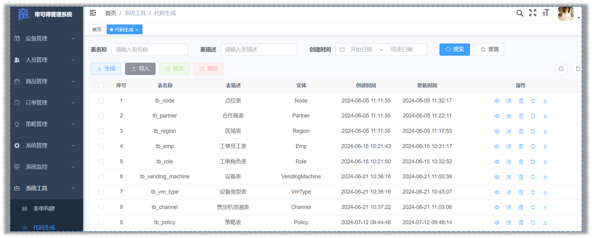 

### 表结构说明

若依提供了两张核心表来存储导入的业务表信息：

`gen_table`：存储业务表的基本信息    ，它对应于配置代码基本信息和生成信息的页面

`gen_table_column`：存储业务表的字段信息     它对应于配置代码字段信息的页面。

这两张表是一对多的关系，一张业务表可以有多个字段的信息，所以在字段信息表中有个外键table_id指向

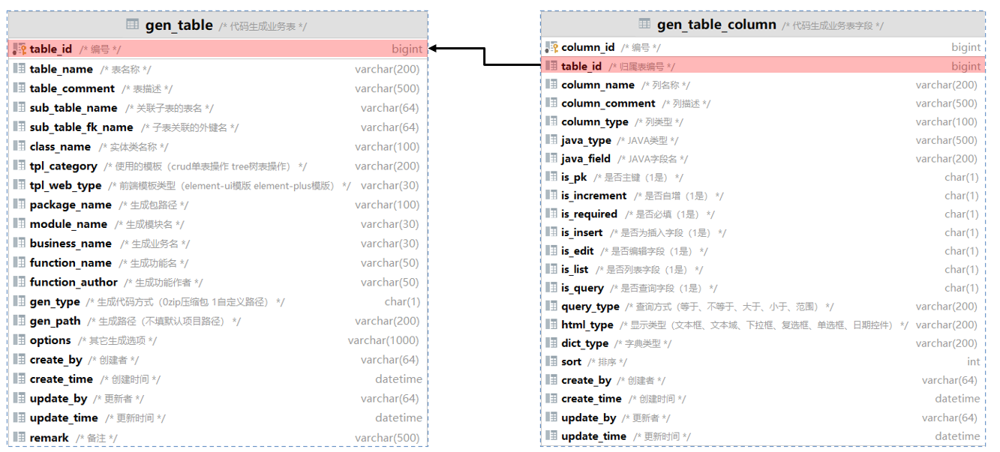 

### 目录结构

1）后端代码

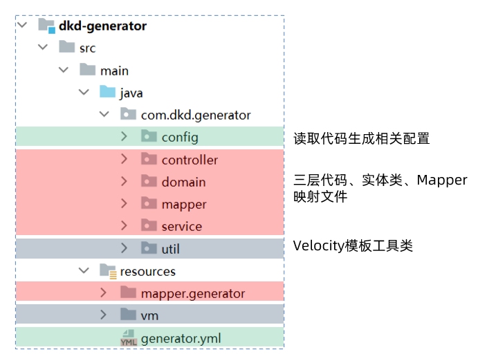  

2）前端代码

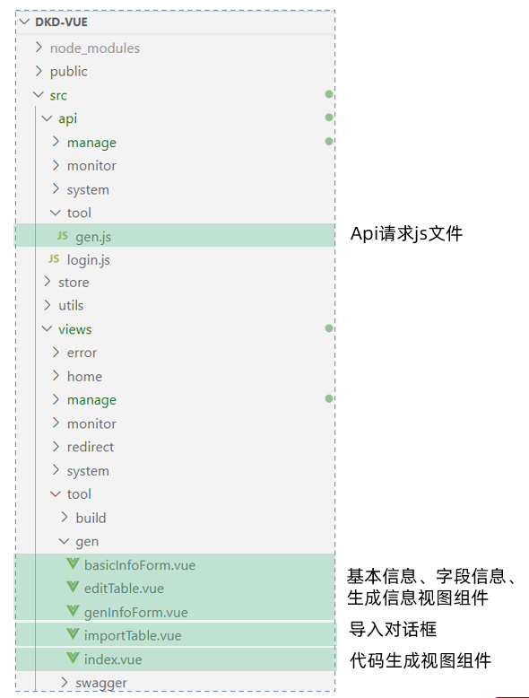  

### 查询数据库列表

当管理员在界面上点击导入按钮时，会弹出一个对话框，此时，前端需要向后端发送请求，查询数据库并返回到前端，展示当前项目库中所有待导入的业务表。

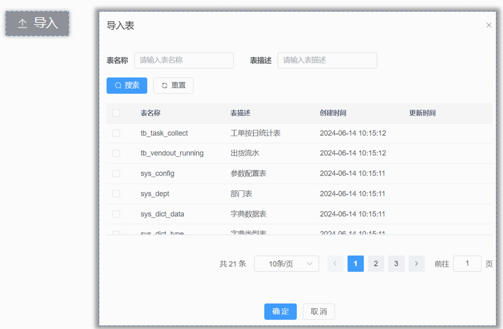 

此功能涉及前端相关的代码位于`views/tool/index.vue`这个视图组件中，负责实现导入业务表的用户界面和交互逻辑。

```js
/** 打开导入表弹窗 */
function openImportTable() {
  proxy.$refs["importRef"].show();
}
```

后端处理逻辑则在代码生成模块的`GenController`中，负责接收前端的请求，处理业务逻辑，并返回查询结果。

```java
/**
 * 查询数据库列表
 */
@PreAuthorize("@ss.hasPermi('tool:gen:list')")
@GetMapping("/db/list")
public TableDataInfo dataList(GenTable genTable)
{
    startPage();
    List<GenTable> list = genTableService.selectDbTableList(genTable);
    return getDataTable(list);
}
```

具体的执行的流程如下图：

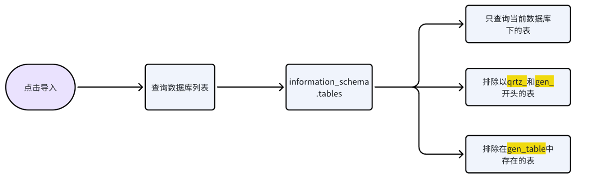 

### 导入表结构

当管理员对话框中选中需要导入的业务表，点击确定按钮，此时，前端需要向后端发送请求，保存业务表的基本信息和字段信息

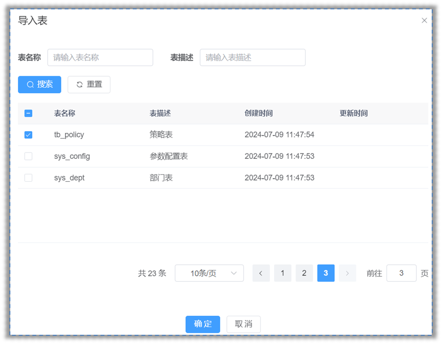 

此功能涉及前端相关的代码位于`views/tool/importTable.vue`这个视图组件中，负责实现导入业务表的用户界面和交互逻辑。

```js
/** 导入按钮操作 */
function handleImportTable() {
  const tableNames = tables.value.join(",");
  if (tableNames == "") {
    proxy.$modal.msgError("请选择要导入的表");
    return;
  }
  importTable({ tables: tableNames }).then(res => {
    proxy.$modal.msgSuccess(res.msg);
    if (res.code === 200) {
      visible.value = false;
      emit("ok");
    }
  });
}
```

后端处理逻辑则在代码生成模块的`GenController`中，负责接收前端的请求，处理业务逻辑，保存业务表的基本信息和字段信息

```java
/**
 * 导入表结构（保存）
 */
@PreAuthorize("@ss.hasPermi('tool:gen:import')")
@Log(title = "代码生成", businessType = BusinessType.IMPORT)
@PostMapping("/importTable")
public AjaxResult importTableSave(String tables)
{
    // 将表名字符串转换为数组 tb_task_collect,tb_vendout_running
    String[] tableNames = Convert.toStrArray(tables);
    // 查询表信息
    List<GenTable> tableList = genTableService.selectDbTableListByNames(tableNames);
    // 导入表结构（保存）
    genTableService.importGenTable(tableList, SecurityUtils.getUsername());
    return success();
}
```

具体的执行的流程如下图：

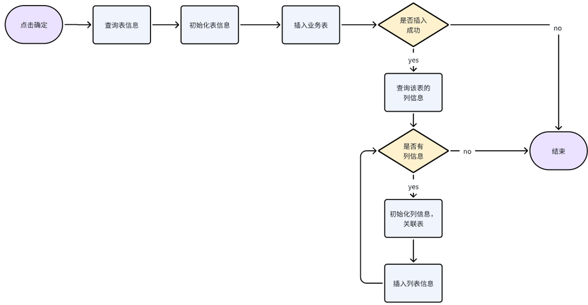 

### 生成代码

首先管理员，选中需要下载的业务表，并点击生成按钮来触发代码生成并下载的过程。

前端随后向后端发送请求，这个请求会告知服务器需要生成代码的业务表。

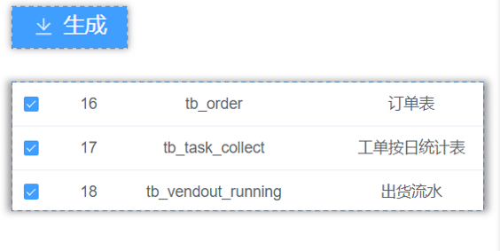 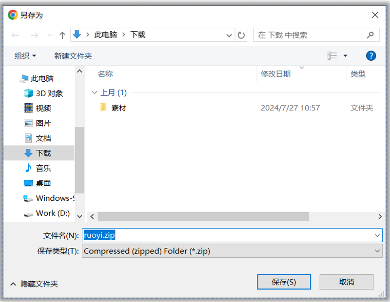 


负责实现这一功能的前端代码位于`views/tool/index.vue`这个视图组件中，负责实现生成业务表的用户界面和交互逻辑。

```js
/** 生成代码操作 */
function handleGenTable(row) {
  const tbNames = row.tableName || tableNames.value;
  if (tbNames == "") {
    proxy.$modal.msgError("请选择要生成的数据");
    return;
  }
  if (row.genType === "1") {
    genCode(row.tableName).then(response => {
      proxy.$modal.msgSuccess("成功生成到自定义路径：" + row.genPath);
    });
  } else {
    proxy.$download.zip("/tool/gen/batchGenCode?tables=" + tbNames, "ruoyi.zip");
  }
}
```

后端的逻辑处理则在代码生成模块的`GenController`中，这里是处理前端请求、执行代码生成逻辑，将生成的代码字节流通过HTTP响应返回给客户端。

```java
/**
 * 批量生成代码
 */
@PreAuthorize("@ss.hasPermi('tool:gen:code')")
@Log(title = "代码生成", businessType = BusinessType.GENCODE)
@GetMapping("/batchGenCode")
public void batchGenCode(HttpServletResponse response, String tables) throws IOException
{
    // 将表名字符串转换为数组 tb_task_collect,tb_vendout_running
    String[] tableNames = Convert.toStrArray(tables);
    // 根据表名下载生成的代码字节数组
    byte[] data = genTableService.downloadCode(tableNames);
    // 将生成的代码字节流通过HTTP响应返回给客户端
    genCode(response, data);
}
```

具体的执行的流程如下图：

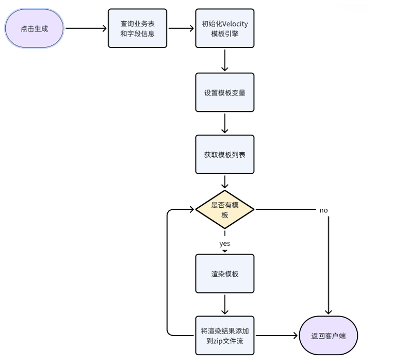 

### 问题分析

我们已经对代码生成器的工作原理有了一定的了解，接下来我们解决一些项目中使用的问题，比如：

每次生成代码都需要修改作者，去除实体类前缀过于繁琐，现在我们可以修改`generator.yml`配置文件来调整为自己项目的

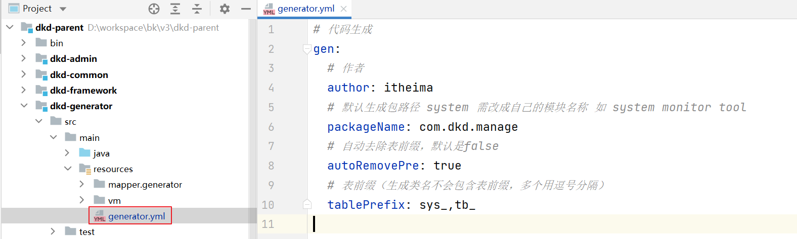 


```yaml
# 代码生成
gen:
  # 作者
  author: itheima
  # 默认生成包路径 system 需改成自己的模块名称 如 system monitor tool
  packageName: com.dkd.manage
  # 自动去除表前缀，默认是false
  autoRemovePre: true
  # 表前缀（生成类名不会包含表前缀，多个用逗号分隔）
  tablePrefix: sys_,tb_
```


我们还想在若依代码生成的基础上继续进行增强

- 实体类支持Lombok

  ```java
  @Data
  @NoArgsConstructor
  @AllArgsConstructor
  @Builder
  public class Order extends BaseEntity {
  	
      private Long id;
      private String orderNo;
      
      // 没有get、set、toString方法了
  }
  ```

  

- Controller类支持Swagger

  ```java
  @Api(tags = "订单管理Controller")
  public class OrderController extends BaseController{
  
      @ApiOperation("查询订单管理列表")
      public TableDataInfo list(...){
      	return success(...);
      }
      
      @ApiOperation("获取订单管理详细信息")
      public AjaxResult getInfo(...) {
         return success(...);
      }
  
  }
  ```

  

要实现这些增强功能，我们需要掌握Velocity模板引擎的使用。Velocity允许我们定制和优化代码生成模板。

在下一个小节中，我们将开始学习Velocity模板引擎，这将帮助我们更好地理解和改造代码生成器的模板。

## Velocity模版引擎

### 介绍

Velocity是一个基于Java的模板引擎，可以通过特定的语法获取在java对象的数据 , 填充到模板中，从而实现界面和java代码的分离 !

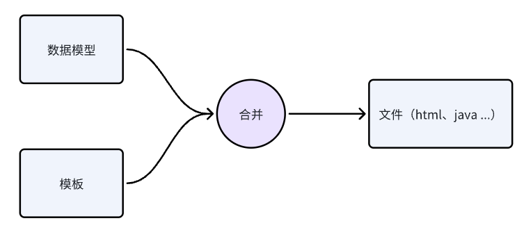 

常见的应用场景：

- Web内容生成 : 生成动态Web页面。
- 代码生成  : 生成Java源代码、SQL脚本、XML配置文件等。
- 网页静态化  : 生成静态网页。


### 入门

需求：根据下面html模板，完成对数据的填充

```html
<!DOCTYPE html>
<html lang="en">
<head>
    <meta charset="UTF-8">
    <meta name="viewport" content="width=device-width, initial-scale=1.0">
    <title>velocity快速入门</title>
</head>
<body>

    <h3>心怀梦想，坚持不懈，成功即在前方。加油少年！！</h3>
    
</body>
</html>
```

要求：**加油少年，**这几个字，需要动态填充进来

> 加油同学！！
>
> 加油女孩！！
>
> 加油朋友！！

#### 准备模板

```html
<!DOCTYPE html>
<html lang="en">
<head>
    <meta charset="UTF-8">
    <meta name="viewport" content="width=device-width, initial-scale=1.0">
    <title>velocity快速入门</title>
</head>
<body>

<h3>心怀梦想，坚持不懈，成功即在前方。${message}</h3>

</body>
</html>
```

> 上述代码中的 加油少年  修改为了  ${message}  这是一个动态变量（占位符），方便**动态**填充数据

#### 数据填充

编写java代码实现数据填充，并生成文件

```java
package com.dkd.test;

import com.dkd.generator.util.VelocityInitializer;
import org.apache.velocity.Template;
import org.apache.velocity.VelocityContext;
import org.apache.velocity.app.Velocity;

import java.io.FileWriter;
import java.util.List;

public class VelocityDemoTest {

    public static void main(String[] args) throws Exception {
        //1. 初始化模板引擎
        VelocityInitializer.initVelocity();
        //2. 准备数据模型
        VelocityContext velocityContext = new VelocityContext();
        velocityContext.put("message", "加油朋友！！");
        //3. 读取模板
        Template template = Velocity.getTemplate("vm/index.html.vm", "UTF-8");
        //4. 渲染模板
        FileWriter fileWriter = new FileWriter("D:\\workspace\\index.html");
        template.merge(velocityContext, fileWriter);
        fileWriter.close();
    }
}

```

#### 效果测试

在指定的目录中生成index.html文件

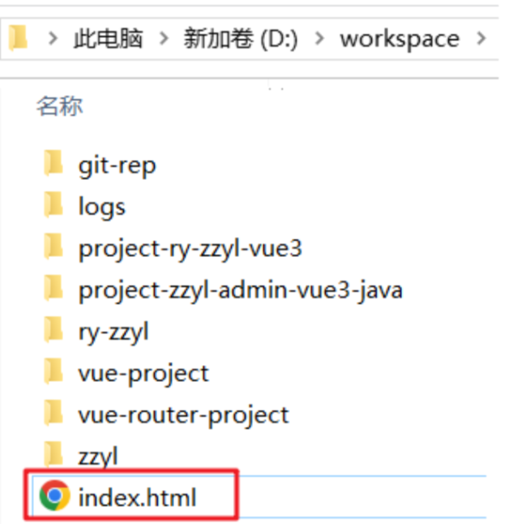 

打开之后的效果：

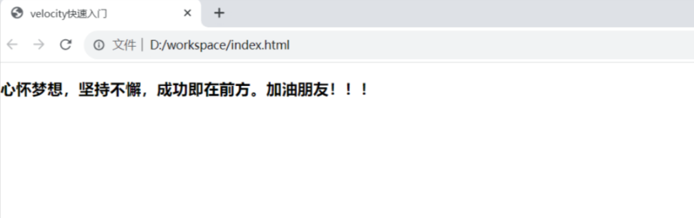 


### 基础语法

#### 变量

Velocity中的变量有两类

- 在模板中定义变量： `#set`开头，比如 `#set($name = "velocity")`
- 获取变量的的值：  `$name`  或者  `${name}`

下面是案例，基于刚才的入门案例模板改进

`##`双#号  是vm的注释

```velocity
<!DOCTYPE html>
<html lang="en">
<head>
    <meta charset="UTF-8">
    <meta name="viewport" content="width=device-width, initial-scale=1.0">
    <title>velocity快速入门</title>
</head>
<body>

<h3>心怀梦想，坚持不懈，成功即在前方。${message}</h3>

## 定义变量
#set($name = "velocity")


## 输出变量
第一种情况：${name} <br>
第二种情况：$name <br>

## 第三种情况：orderService
#set($column = "order")
字符串拼接：${column}Service <br>


</body>
</html>

```

对象的定义获取

在ruoyi-generator模块下新增一个区域的实体类

```java
package com.dkd.test;

import com.dkd.common.annotation.Excel;
import com.dkd.common.core.domain.BaseEntity;
import lombok.AllArgsConstructor;
import lombok.Data;
import lombok.NoArgsConstructor;

/**
 * 区域管理对象 tb_region
 *
 * @author itheima
 * @date 2024-06-05
 */
@Data
@NoArgsConstructor
@AllArgsConstructor
public class Region extends BaseEntity {
    private static final long serialVersionUID = 1L;

    /**
     * 主键ID
     */
    private Long id;

    /**
     * 区域名称
     */
    @Excel(name = "区域名称")
    private String regionName;

}
```

准备模型数据

```java
package com.dkd.test;

import com.dkd.generator.util.VelocityInitializer;
import org.apache.velocity.Template;
import org.apache.velocity.VelocityContext;
import org.apache.velocity.app.Velocity;

import java.io.FileWriter;
import java.util.List;

public class VelocityDemoTest {

    public static void main(String[] args) throws Exception {
        //1. 初始化模板引擎
        VelocityInitializer.initVelocity();
        //2. 准备数据模型
        VelocityContext velocityContext = new VelocityContext();
        velocityContext.put("message", "加油朋友！！");
        // 创建区域对象
        Region region = new Region(1L, "北京北五环");
        velocityContext.put("region", region);

        //3. 读取模板
        Template template = Velocity.getTemplate("vm/index.html.vm", "UTF-8");
        //4. 渲染模板
        FileWriter fileWriter = new FileWriter("D:\\workspace\\index.html");
        template.merge(velocityContext, fileWriter);
        fileWriter.close();
    }
}

```

动态模板展示数据

```velocity
<!DOCTYPE html>
<html lang="en">
<head>
    <meta charset="UTF-8">
    <meta name="viewport" content="width=device-width, initial-scale=1.0">
    <title>velocity快速入门</title>
</head>
<body>

<h3>心怀梦想，坚持不懈，成功即在前方。${message}</h3>

## 定义变量
#set($name = "velocity")

## 输出变量
第一种情况：${name} <br>
第二种情况：$name <br>

## 第三种情况：orderService
#set($column = "order")
字符串拼接：${column}Service <br>
<hr>

## 获取区域对象中的数据
区域ID:$region.id <br>
区域名称:${region.regionName} <br>
<hr>
</body>
</html>
```

#### 循环

循环的语法：`#foreach(...) ... #end`

```velocity
##定义一个集合
#set($list = ["春", "夏", "秋", "冬"])    

## 遍历循环
#foreach($item in $list)
   序号[$foreach.count] $item <br> ## count从1开始 index从0开始
#end
```

准备模型数据

```java
// 创建区域对象
Region region1 = new Region(1L, "北京北五环");
Region region2 = new Region(2L, "北京北四环");
velocityContext.put("region", region1);
List<Region> regionList = List.of(region1, region2);
velocityContext.put("regionList", regionList);
```

修改父工程的pom.xml文件，把jdk版本升级为11

```xml
<java.version>11</java.version>
```

动态模板展示数据

```velocity
## 遍历区域
#foreach($item in $regionList)
   序号[$foreach.count],区域ID:$item.id,区域名称:$item.regionName <br>
#end
</br>
```


#### if判断

判断的语法：`#if(condition) ... #elseif(condition) ... #else ... #end`

```velocity
##定义变量
#set($score=80)

## if判断
#if($score>=80)
    优秀
#elseif($score>=60)
    及格
#else
    不及格
#end
```

其他的判断条件：

```velocity
## 对象obj不为空才会执行里面的逻辑
#if($obj) ..... #end

## 对象obj为空才会执行里面的逻辑
#if(!$obj) ..... #end
```

在条件判断中，velocity支持常见的关系操作符，比如：`&&(与), ||(或), !(非)`


### 模板阅读

我们不需要使用velocity去开发新的模板，若依已经提供好了，在它基础上进行调整即可

下面这个是关于实体类的模板

```velocity
package ${packageName}.domain;

## 根据列类型获取导入包
#foreach ($import in $importList)
import ${import};
#end
## 导入Apache Commons Lang库，用于对象的toString方法
import org.apache.commons.lang3.builder.ToStringBuilder;
import org.apache.commons.lang3.builder.ToStringStyle;
## 导入项目自定义的Excel注解，用于生成Excel文档
import com.dkd.common.annotation.Excel;
#if($table.crud || $table.sub)
## 如果表具有CRUD操作或子表，继承BaseEntity
import com.dkd.common.core.domain.BaseEntity;
#elseif($table.tree)
## 如果表是树形结构，继承TreeEntity
import com.dkd.common.core.domain.TreeEntity;
#end

/**
 * ${functionName}对象 ${tableName}
 *
 * @author ${author}
 * @date ${datetime}
 */
#if($table.crud || $table.sub)
    #set($Entity="BaseEntity")
#elseif($table.tree)
    #set($Entity="TreeEntity")
#end
public class ${ClassName} extends ${Entity}
        {   ## 定义类的序列化版本ID
private static final long serialVersionUID = 1L;
## 根据表的列定义实体类的属性
#foreach ($column in $columns)
    ## 如果不是父类的属性，则生成属性
    #if(!$table.isSuperColumn($column.javaField))
    /** $column.columnComment */
        ## 如果字段需要在列表中展示，使用Excel注解标记
        #if($column.list)
            #set($parentheseIndex=$column.columnComment.indexOf("（"))
            #if($parentheseIndex != -1)
                #set($comment=$column.columnComment.substring(0, $parentheseIndex))
            #else
                #set($comment=$column.columnComment)
            #end
            #if($parentheseIndex != -1)
            @Excel(name = "${comment}", readConverterExp = "$column.readConverterExp()")
            #elseif($column.javaType == 'Date')
            @JsonFormat(pattern = "yyyy-MM-dd")
            @Excel(name = "${comment}", width = 30, dateFormat = "yyyy-MM-dd")
            #else
            @Excel(name = "${comment}")
            #end
        #end
    private $column.javaType $column.javaField;

    #end
#end
## 如果表有子表，定义子表信息的集合
#if($table.sub)
/** $table.subTable.functionName信息 */
private List<${subClassName}> ${subclassName}List;

#end
## 为每个属性字段生成getter和setter方法
#foreach ($column in $columns)
    #if(!$table.isSuperColumn($column.javaField))
        #if($column.javaField.length() > 2 && $column.javaField.substring(1,2).matches("[A-Z]"))
            #set($AttrName=$column.javaField)
        #else
            #set($AttrName=$column.javaField.substring(0,1).toUpperCase() + ${column.javaField.substring(1)})
        #end
    public void set${AttrName}($column.javaType $column.javaField)
            {
            this.$column.javaField = $column.javaField;
            }

    public $column.javaType get${AttrName}()
            {
            return $column.javaField;
            }
    #end
#end
## 如果表有子表，生成子表信息的getter和setter方法
#if($table.sub)
public List<${subClassName}> get${subClassName}List()
        {
        return ${subclassName}List;
        }

public void set${subClassName}List(List<${subClassName}> ${subclassName}List)
        {
        this.${subclassName}List = ${subclassName}List;
        }

#end
## 重写toString方法，使用Apache Commons Lang的ToStringBuilder
@Override
public String toString() {
        return new ToStringBuilder(this,ToStringStyle.MULTI_LINE_STYLE)
    #foreach ($column in $columns)
        #if($column.javaField.length() > 2 && $column.javaField.substring(1,2).matches("[A-Z]"))
            #set($AttrName=$column.javaField)
        #else
            #set($AttrName=$column.javaField.substring(0,1).toUpperCase() + ${column.javaField.substring(1)})
        #end
            .append("${column.javaField}", get${AttrName}())
    #end
    #if($table.sub)
            .append("${subclassName}List", get${subClassName}List())
    #end
        .toString();
        }
        }

```


## Lombok集成

目前，我们已经基本熟悉了velocity的作用和一些语法，那接下来，我们就通过这些知识来去改造若依框架的代码生成部分

### 导入坐标（已完成）

在`dkd-common`模块的`pom.xml`中添加lombok坐标

```xml
<!--  lombok工具-->
<dependency>
    <groupId>org.projectlombok</groupId>
    <artifactId>lombok</artifactId>
</dependency>
```

### 修改模板

在`dkd-generator`模块的`domain.java.vm`模板中添加lombok注解

```velocity
package ${packageName}.domain;

## 根据列类型获取导入包
#foreach ($import in $importList)
import ${import};
#end
## 导入项目自定义的Excel注解，用于生成Excel文档
import com.dkd.common.annotation.Excel;
#if($table.crud || $table.sub)
## 如果表具有CRUD操作或子表，继承BaseEntity
import com.dkd.common.core.domain.BaseEntity;
#elseif($table.tree)
## 如果表是树形结构，继承TreeEntity
import com.dkd.common.core.domain.TreeEntity;
#end
## 注意lombok导包
import lombok.AllArgsConstructor;
import lombok.Builder;
import lombok.Data;
import lombok.NoArgsConstructor;

/**
 * ${functionName}对象 ${tableName}
 *
 * @author ${author}
 * @date ${datetime}
 */
#if($table.crud || $table.sub)
#set($Entity="BaseEntity")
#elseif($table.tree)
#set($Entity="TreeEntity")
#end
@Data
@NoArgsConstructor
@AllArgsConstructor
@Builder
public class ${ClassName} extends ${Entity}
        {   ## 定义类的序列化版本ID
private static final long serialVersionUID=1L;
## 根据表的列定义实体类的属性
#foreach ($column in $columns)
    ## 如果不是父类的属性，则生成属性
    #if(!$table.isSuperColumn($column.javaField))
    /** $column.columnComment */
        ## 如果字段需要在列表中展示，使用Excel注解标记
        #if($column.list)
            #set($parentheseIndex=$column.columnComment.indexOf("（"))
            #if($parentheseIndex != -1)
                #set($comment=$column.columnComment.substring(0, $parentheseIndex))
            #else
                #set($comment=$column.columnComment)
            #end
            #if($parentheseIndex != -1)
            @Excel(name = "${comment}", readConverterExp = "$column.readConverterExp()")
            #elseif($column.javaType == 'Date')
            @JsonFormat(pattern = "yyyy-MM-dd")
            @Excel(name = "${comment}", width = 30, dateFormat = "yyyy-MM-dd")
            #else
            @Excel(name = "${comment}")
            #end
        #end
    private $column.javaType $column.javaField;

    #end
#end
## 如果表有子表，定义子表信息的集合
#if($table.sub)
/** $table.subTable.functionName信息 */
private List<${subClassName}> ${subclassName}List;

#end
}
```

### 生成后的效果

修改完成之后，重启项目，找到代码生成的功能，通过**代码预览**可以查看实体类的代码：

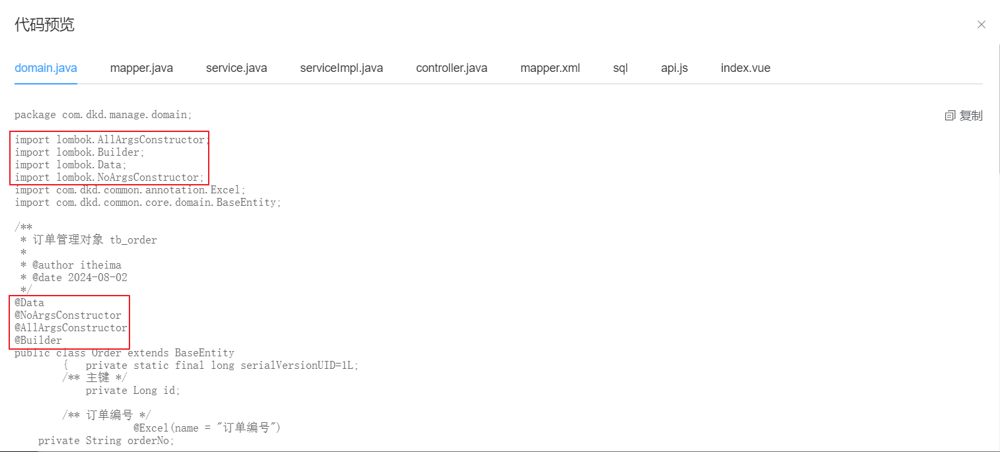 

> - 正常添加了关于lombok的注解
> - 删除了set 、 get  、toString 等方法

可以把生成后的代码，拷贝到项目中，如果订单管理能够正常访问和操作，就算修改成功了，后期再次生成的代码，全部都支持lombok


## Swagger集成

### 修改模板

在`dkd-generator`模块的 `controller.java.vm`模板中添加Swagger注解

```velocity
package ${packageName}.controller;

import java.util.List;
import javax.servlet.http.HttpServletResponse;
import org.springframework.security.access.prepost.PreAuthorize;
import org.springframework.beans.factory.annotation.Autowired;
import org.springframework.web.bind.annotation.GetMapping;
import org.springframework.web.bind.annotation.PostMapping;
import org.springframework.web.bind.annotation.PutMapping;
import org.springframework.web.bind.annotation.DeleteMapping;
import org.springframework.web.bind.annotation.PathVariable;
import org.springframework.web.bind.annotation.RequestBody;
import org.springframework.web.bind.annotation.RequestMapping;
import org.springframework.web.bind.annotation.RestController;
import com.dkd.common.annotation.Log;
import com.dkd.common.core.controller.BaseController;
import com.dkd.common.core.domain.AjaxResult;
import com.dkd.common.enums.BusinessType;
import ${packageName}.domain.${ClassName};
import ${packageName}.service.I${ClassName}Service;
import com.dkd.common.utils.poi.ExcelUtil;
#if($table.crud || $table.sub)
import com.dkd.common.core.page.TableDataInfo;
#elseif($table.tree)
#end
import io.swagger.annotations.Api;
import io.swagger.annotations.ApiOperation;

/**
 * ${functionName}Controller
 *
 * @author ${author}
 * @date ${datetime}
 */
@Api(tags = "${functionName}Controller")
@RestController
@RequestMapping("/${moduleName}/${businessName}")
public class ${ClassName}Controller extends BaseController
{
    @Autowired
    private I${ClassName}Service ${className}Service;

    /**
     * 查询${functionName}列表
     */
    @ApiOperation("查询${functionName}列表")
    @PreAuthorize("@ss.hasPermi('${permissionPrefix}:list')")
    @GetMapping("/list")
#if($table.crud || $table.sub)
    public TableDataInfo list(${ClassName} ${className})
    {
        startPage();
        List<${ClassName}> list = ${className}Service.select${ClassName}List(${className});
        return getDataTable(list);
    }
#elseif($table.tree)
    public AjaxResult list(${ClassName} ${className})
    {
        List<${ClassName}> list = ${className}Service.select${ClassName}List(${className});
        return success(list);
    }
#end

    /**
     * 导出${functionName}列表
     */
    @ApiOperation("导出${functionName}列表")
    @PreAuthorize("@ss.hasPermi('${permissionPrefix}:export')")
    @Log(title = "${functionName}", businessType = BusinessType.EXPORT)
    @PostMapping("/export")
    public void export(HttpServletResponse response, ${ClassName} ${className})
    {
        List<${ClassName}> list = ${className}Service.select${ClassName}List(${className});
        ExcelUtil<${ClassName}> util = new ExcelUtil<${ClassName}>(${ClassName}.class);
        util.exportExcel(response, list, "${functionName}数据");
    }

    /**
     * 获取${functionName}详细信息
     */
    @ApiOperation("获取${functionName}详细信息")
    @PreAuthorize("@ss.hasPermi('${permissionPrefix}:query')")
    @GetMapping(value = "/{${pkColumn.javaField}}")
    public AjaxResult getInfo(@PathVariable("${pkColumn.javaField}") ${pkColumn.javaType} ${pkColumn.javaField})
    {
        return success(${className}Service.select${ClassName}By${pkColumn.capJavaField}(${pkColumn.javaField}));
    }

    /**
     * 新增${functionName}
     */
    @ApiOperation("新增${functionName}")
    @PreAuthorize("@ss.hasPermi('${permissionPrefix}:add')")
    @Log(title = "${functionName}", businessType = BusinessType.INSERT)
    @PostMapping
    public AjaxResult add(@RequestBody ${ClassName} ${className})
    {
        return toAjax(${className}Service.insert${ClassName}(${className}));
    }

    /**
     * 修改${functionName}
     */
    @ApiOperation("修改${functionName}")
    @PreAuthorize("@ss.hasPermi('${permissionPrefix}:edit')")
    @Log(title = "${functionName}", businessType = BusinessType.UPDATE)
    @PutMapping
    public AjaxResult edit(@RequestBody ${ClassName} ${className})
    {
        return toAjax(${className}Service.update${ClassName}(${className}));
    }

    /**
     * 删除${functionName}
     */
    @ApiOperation("删除${functionName}")
    @PreAuthorize("@ss.hasPermi('${permissionPrefix}:remove')")
    @Log(title = "${functionName}", businessType = BusinessType.DELETE)
	@DeleteMapping("/{${pkColumn.javaField}s}")
    public AjaxResult remove(@PathVariable ${pkColumn.javaType}[] ${pkColumn.javaField}s)
    {
        return toAjax(${className}Service.delete${ClassName}By${pkColumn.capJavaField}s(${pkColumn.javaField}s));
    }
}
```

### 生成后的效果

修改完成之后，重启项目，找到代码生成的功能，通过**代码预览**可以查看Controller类的代码：

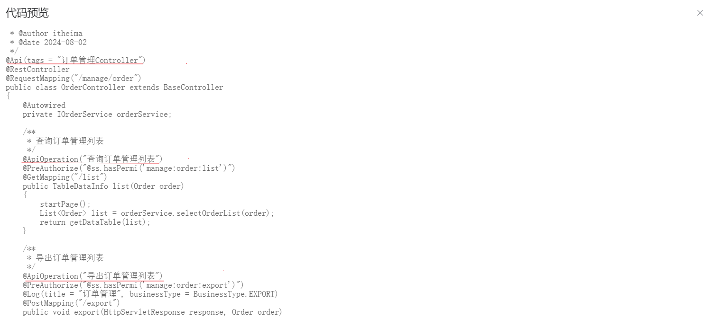 


可以把生成后的代码，拷贝到项目中，如果订单管理能够正常访问和操作，且系统接口显示工单管理就算修改成功了，后期再次生成的代码，全部都支持Swagger

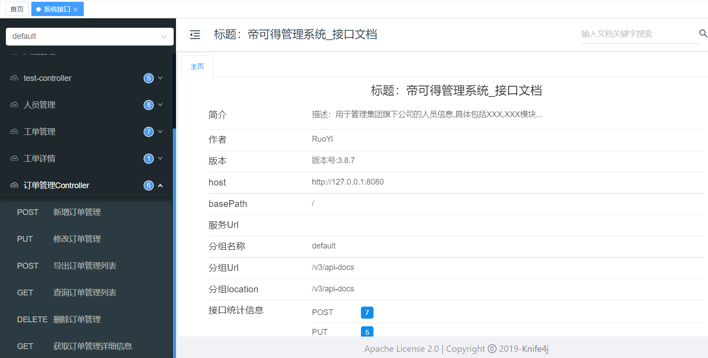 


